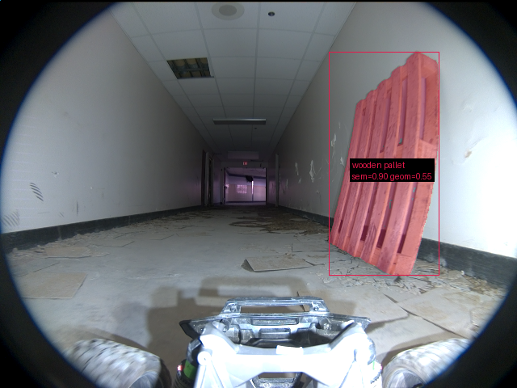

# Validação do pipeline real — 20260915T025343Z

Revisão: `adde096` · Frames: 1 · Pico de VRAM: 5.18 GB (budget: 8.0 GB) · Pico de RSS do host: 8.86 GB

Ver `manifest.json` para configuração completa e log de estágios.

## corridor-02-04288

**scene_type:** indoor · **regiões canônicas:** 1 (1 publicadas, 0 contexto estrutural) · **relações:** 0 · **falhas de interpretação:** 0 · **audit:** ✅ pass (0 warnings)
