# Validação do pipeline real — 20260915T151553Z

Revisão: `0766aaf` · Frames: 40 · Pico de VRAM: 6.98 GB (budget: 8.0 GB) · Pico de RSS do host: 10.47 GB

Ver `manifest.json` para configuração completa e log de estágios.

## corridor-02-00025

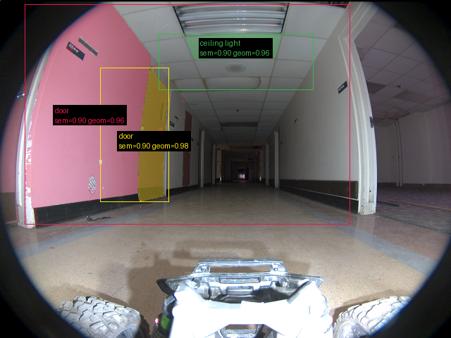

**scene_type:** corridor · **regiões canônicas:** 50 (3 publicadas, 47 contexto estrutural) · **relações:** 307 · **falhas de interpretação:** 0 · **audit:** ✅ pass (56 warnings)

## corridor-02-00031

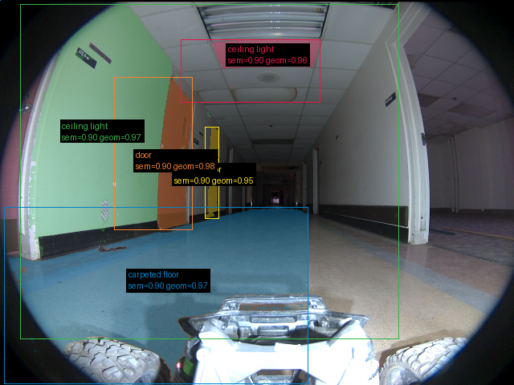

**scene_type:** corridor · **regiões canônicas:** 49 (5 publicadas, 44 contexto estrutural) · **relações:** 291 · **falhas de interpretação:** 0 · **audit:** ✅ pass (51 warnings)

## corridor-02-00037

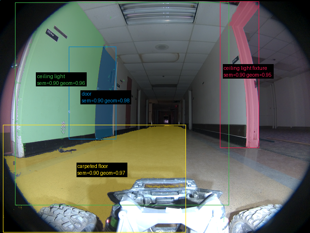

**scene_type:** corridor · **regiões canônicas:** 47 (4 publicadas, 43 contexto estrutural) · **relações:** 264 · **falhas de interpretação:** 0 · **audit:** ✅ pass (49 warnings)

## corridor-02-00050

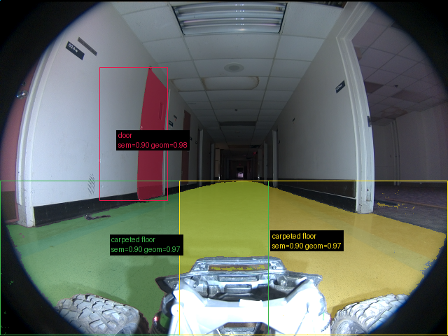

**scene_type:** corridor · **regiões canônicas:** 49 (3 publicadas, 46 contexto estrutural) · **relações:** 302 · **falhas de interpretação:** 0 · **audit:** ✅ pass (55 warnings)

## corridor-02-01443

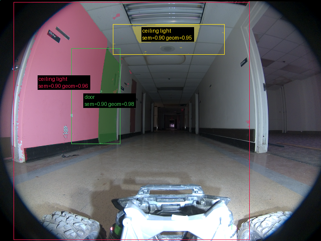

**scene_type:** corridor · **regiões canônicas:** 50 (3 publicadas, 47 contexto estrutural) · **relações:** 295 · **falhas de interpretação:** 0 · **audit:** ✅ pass (52 warnings)

## corridor-02-01450

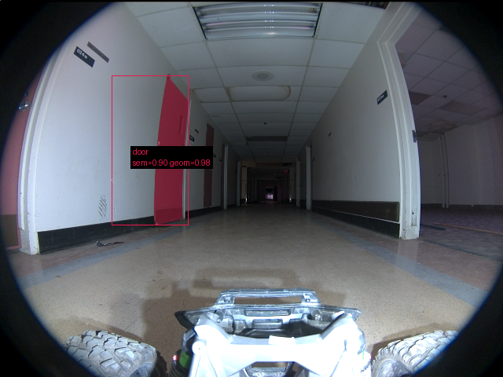

**scene_type:** corridor · **regiões canônicas:** 50 (1 publicadas, 49 contexto estrutural) · **relações:** 291 · **falhas de interpretação:** 0 · **audit:** ✅ pass (59 warnings)

## corridor-02-01455

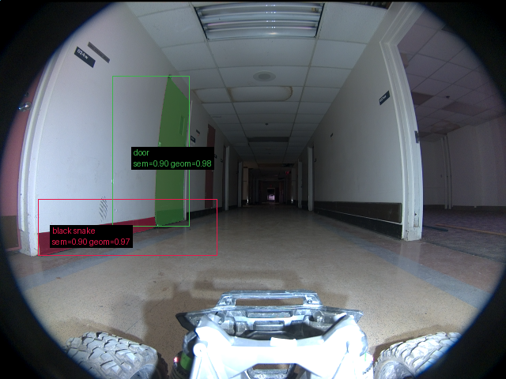

**scene_type:** corridor · **regiões canônicas:** 49 (2 publicadas, 47 contexto estrutural) · **relações:** 287 · **falhas de interpretação:** 0 · **audit:** ✅ pass (47 warnings)

## corridor-02-01467

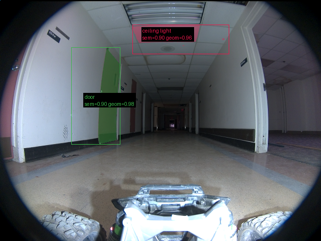

**scene_type:** corridor · **regiões canônicas:** 49 (2 publicadas, 47 contexto estrutural) · **relações:** 284 · **falhas de interpretação:** 0 · **audit:** ✅ pass (53 warnings)

## corridor-02-02883

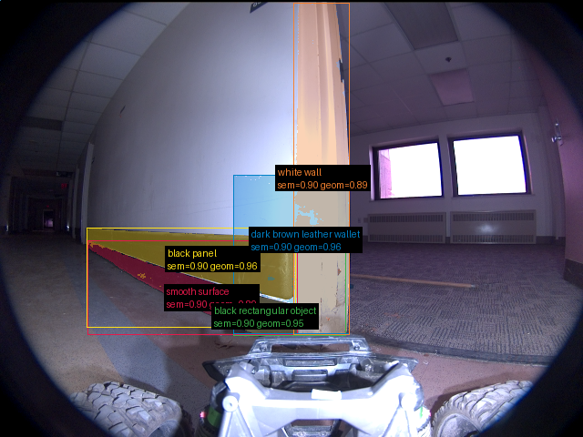

**scene_type:** corridor · **regiões canônicas:** 37 (5 publicadas, 32 contexto estrutural) · **relações:** 181 · **falhas de interpretação:** 0 · **audit:** ✅ pass (47 warnings)

## corridor-02-02889

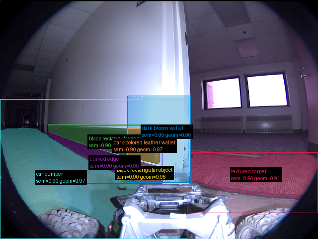

**scene_type:** corridor · **regiões canônicas:** 36 (7 publicadas, 29 contexto estrutural) · **relações:** 173 · **falhas de interpretação:** 0 · **audit:** ✅ pass (37 warnings)

## corridor-02-02896

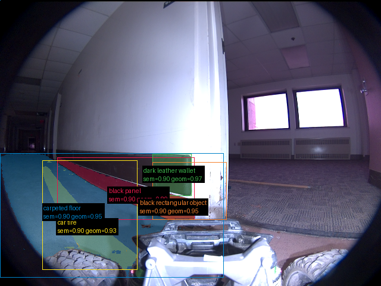

**scene_type:** corridor · **regiões canônicas:** 33 (5 publicadas, 28 contexto estrutural) · **relações:** 154 · **falhas de interpretação:** 0 · **audit:** ✅ pass (39 warnings)

## corridor-02-02907

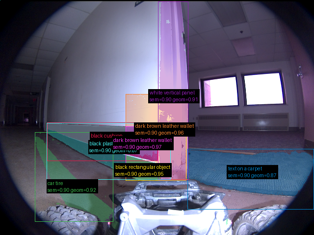

**scene_type:** corridor · **regiões canônicas:** 38 (8 publicadas, 30 contexto estrutural) · **relações:** 180 · **falhas de interpretação:** 0 · **audit:** ✅ pass (35 warnings)

## corridor-02-04323

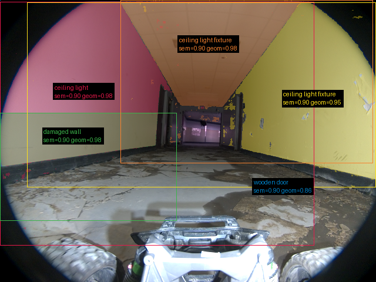

**scene_type:** corridor · **regiões canônicas:** 33 (5 publicadas, 28 contexto estrutural) · **relações:** 188 · **falhas de interpretação:** 0 · **audit:** ✅ pass (42 warnings)

## corridor-02-04329

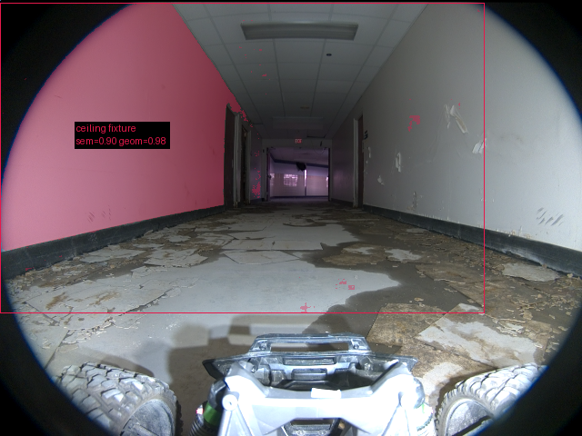

**scene_type:** corridor · **regiões canônicas:** 29 (1 publicadas, 28 contexto estrutural) · **relações:** 133 · **falhas de interpretação:** 0 · **audit:** ✅ pass (34 warnings)

## corridor-02-04335

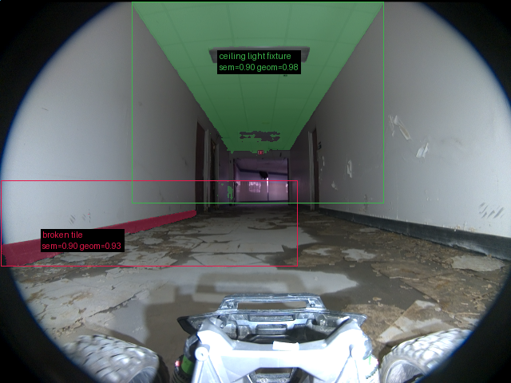

**scene_type:** corridor · **regiões canônicas:** 26 (2 publicadas, 24 contexto estrutural) · **relações:** 131 · **falhas de interpretação:** 0 · **audit:** ✅ pass (33 warnings)

## corridor-02-04348

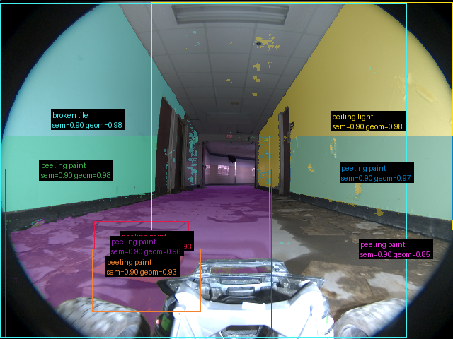

**scene_type:** corridor · **regiões canônicas:** 43 (8 publicadas, 35 contexto estrutural) · **relações:** 267 · **falhas de interpretação:** 0 · **audit:** ✅ pass (46 warnings)

## corridor-02-05403

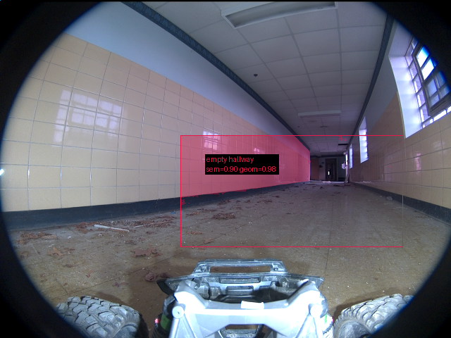

**scene_type:** corridor · **regiões canônicas:** 70 (1 publicadas, 69 contexto estrutural) · **relações:** 613 · **falhas de interpretação:** 0 · **audit:** ✅ pass (68 warnings)

## corridor-02-05409

**scene_type:** corridor · **regiões canônicas:** 73 (0 publicadas, 73 contexto estrutural) · **relações:** 680 · **falhas de interpretação:** 0 · **audit:** ✅ pass (71 warnings)

## corridor-02-05415

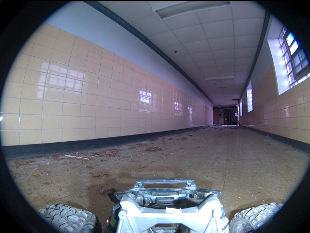

**scene_type:** corridor · **regiões canônicas:** 71 (0 publicadas, 71 contexto estrutural) · **relações:** 613 · **falhas de interpretação:** 0 · **audit:** ✅ pass (71 warnings)

## corridor-02-05427

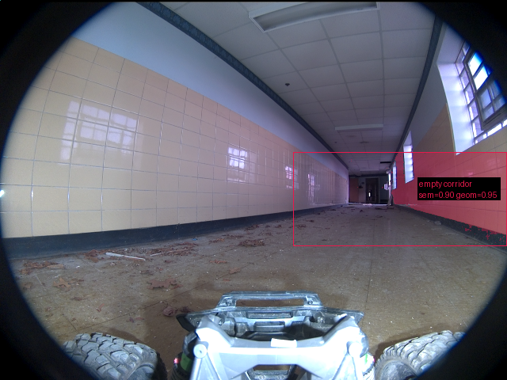

**scene_type:** corridor · **regiões canônicas:** 71 (1 publicadas, 70 contexto estrutural) · **relações:** 636 · **falhas de interpretação:** 1 · **audit:** ✅ pass (70 warnings)

## corridor-02-06484

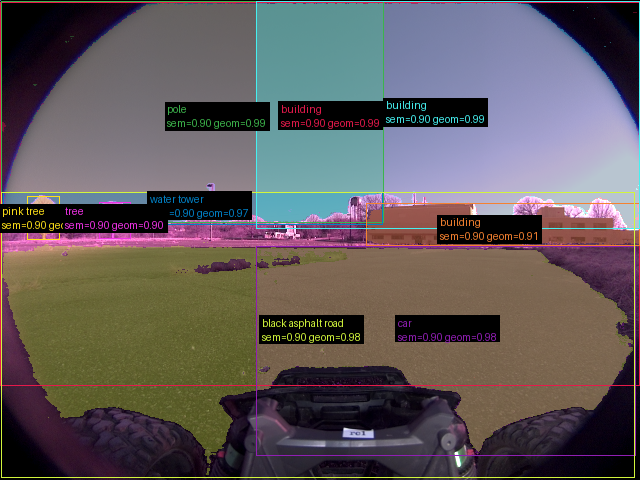

**scene_type:** open field · **regiões canônicas:** 12 (9 publicadas, 3 contexto estrutural) · **relações:** 53 · **falhas de interpretação:** 0 · **audit:** ✅ pass (9 warnings)

## corridor-02-06490

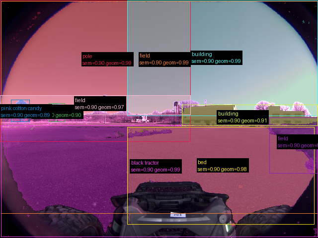

**scene_type:** agricultural · **regiões canônicas:** 12 (10 publicadas, 2 contexto estrutural) · **relações:** 51 · **falhas de interpretação:** 0 · **audit:** ✅ pass (9 warnings)

## corridor-02-06496

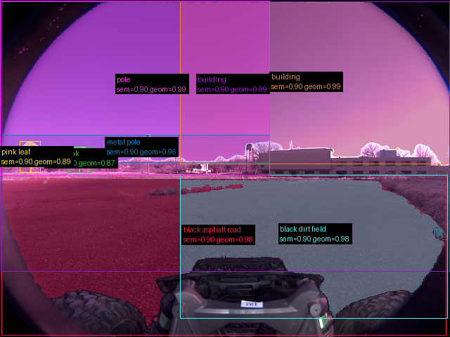

**scene_type:** industrial · **regiões canônicas:** 12 (8 publicadas, 4 contexto estrutural) · **relações:** 52 · **falhas de interpretação:** 0 · **audit:** ✅ pass (11 warnings)

## corridor-02-06507

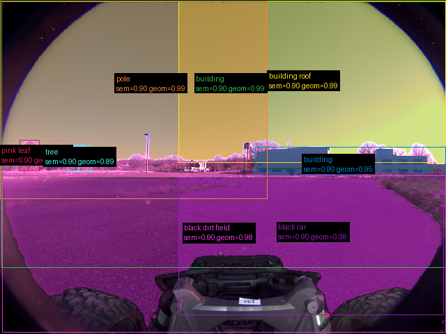

**scene_type:** industrial · **regiões canônicas:** 12 (8 publicadas, 4 contexto estrutural) · **relações:** 49 · **falhas de interpretação:** 0 · **audit:** ✅ pass (9 warnings)

## corridor-02-12844

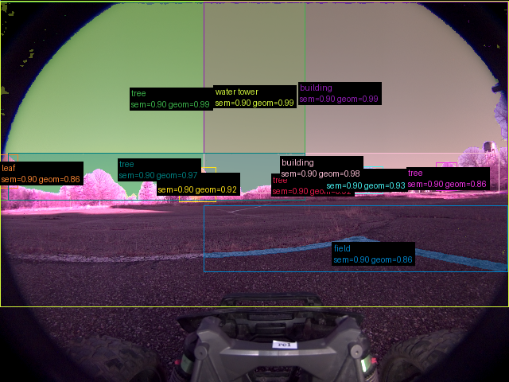

**scene_type:** rural · **regiões canônicas:** 13 (11 publicadas, 2 contexto estrutural) · **relações:** 44 · **falhas de interpretação:** 0 · **audit:** ✅ pass (4 warnings)

## corridor-02-12850

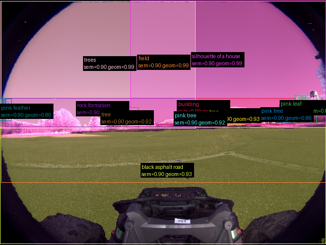

**scene_type:** rural · **regiões canônicas:** 16 (12 publicadas, 4 contexto estrutural) · **relações:** 62 · **falhas de interpretação:** 0 · **audit:** ✅ pass (12 warnings)

## corridor-02-12856

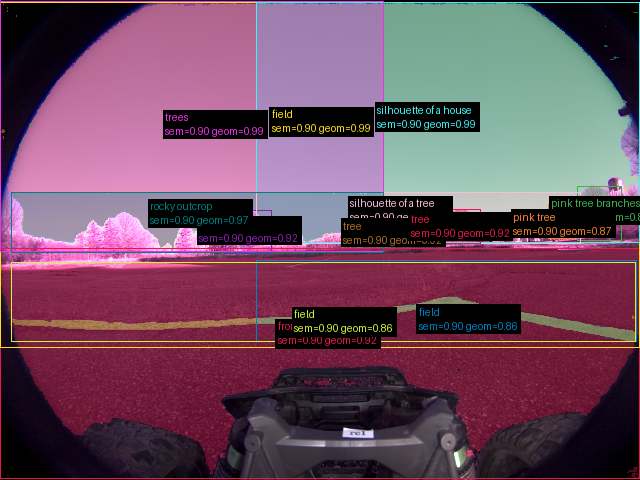

**scene_type:** rural · **regiões canônicas:** 16 (13 publicadas, 3 contexto estrutural) · **relações:** 65 · **falhas de interpretação:** 0 · **audit:** ✅ pass (7 warnings)

## corridor-02-12867

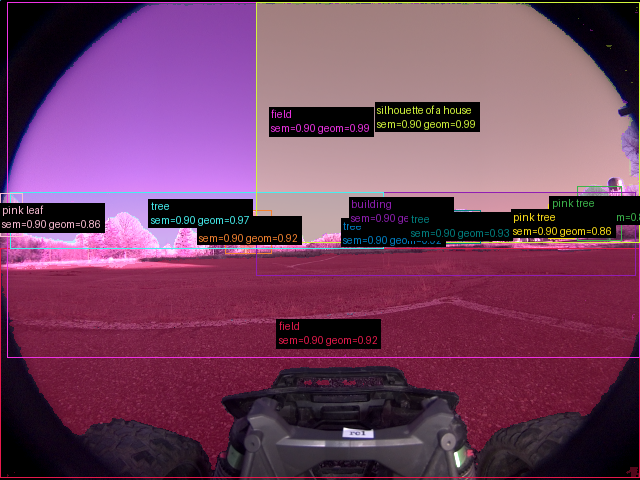

**scene_type:** rural · **regiões canônicas:** 15 (11 publicadas, 4 contexto estrutural) · **relações:** 62 · **falhas de interpretação:** 0 · **audit:** ✅ pass (5 warnings)

## corridor-02-15004

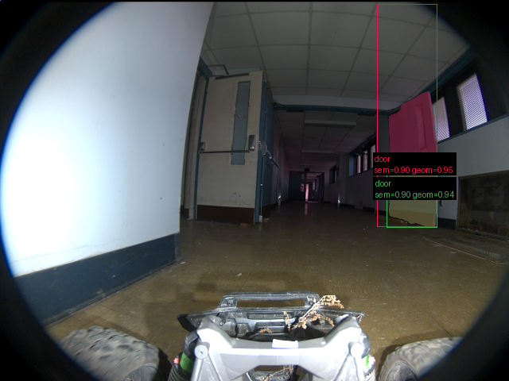

**scene_type:** indoor · **regiões canônicas:** 37 (2 publicadas, 35 contexto estrutural) · **relações:** 163 · **falhas de interpretação:** 0 · **audit:** ✅ pass (40 warnings)

## corridor-02-15009

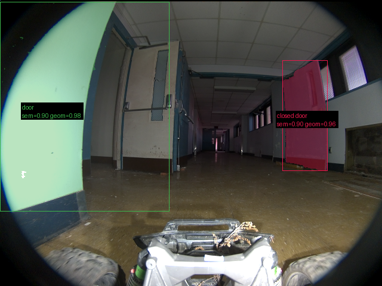

**scene_type:** indoor · **regiões canônicas:** 57 (2 publicadas, 55 contexto estrutural) · **relações:** 309 · **falhas de interpretação:** 0 · **audit:** ✅ pass (62 warnings)

## corridor-02-15015

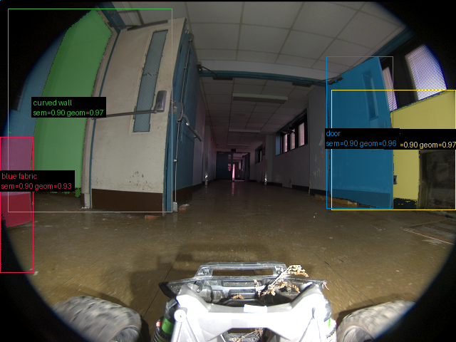

**scene_type:** corridor · **regiões canônicas:** 50 (4 publicadas, 46 contexto estrutural) · **relações:** 261 · **falhas de interpretação:** 0 · **audit:** ✅ pass (47 warnings)

## corridor-02-15027

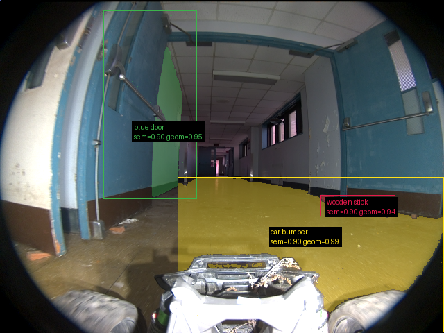

**scene_type:** corridor · **regiões canônicas:** 48 (3 publicadas, 45 contexto estrutural) · **relações:** 208 · **falhas de interpretação:** 0 · **audit:** ✅ pass (50 warnings)

## corridor-02-17163

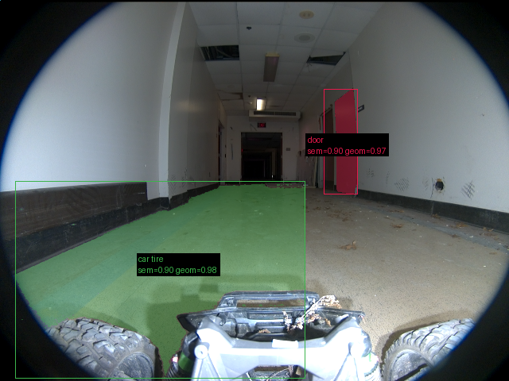

**scene_type:** corridor · **regiões canônicas:** 34 (2 publicadas, 32 contexto estrutural) · **relações:** 208 · **falhas de interpretação:** 0 · **audit:** ✅ pass (42 warnings)

## corridor-02-17169

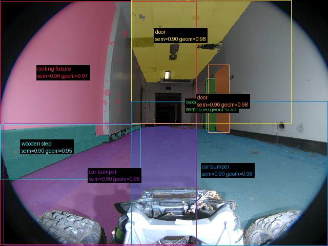

**scene_type:** corridor · **regiões canônicas:** 43 (7 publicadas, 36 contexto estrutural) · **relações:** 314 · **falhas de interpretação:** 0 · **audit:** ✅ pass (44 warnings)

## corridor-02-17175

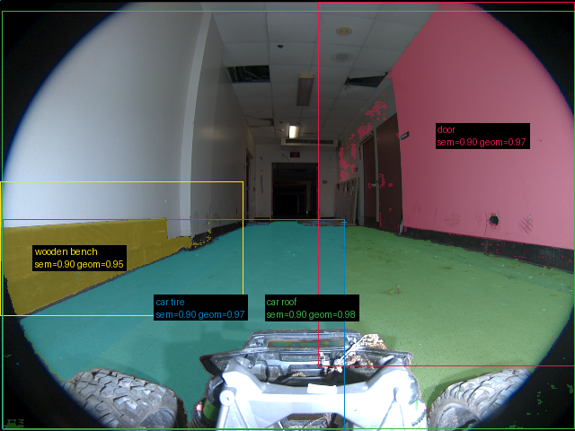

**scene_type:** corridor · **regiões canônicas:** 39 (4 publicadas, 35 contexto estrutural) · **relações:** 249 · **falhas de interpretação:** 0 · **audit:** ✅ pass (46 warnings)

## corridor-02-17187

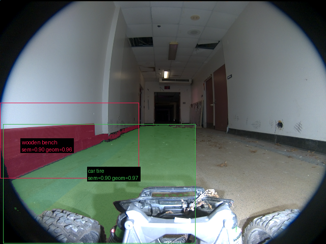

**scene_type:** corridor · **regiões canônicas:** 40 (2 publicadas, 38 contexto estrutural) · **relações:** 257 · **falhas de interpretação:** 0 · **audit:** ✅ pass (40 warnings)

## corridor-02-19323

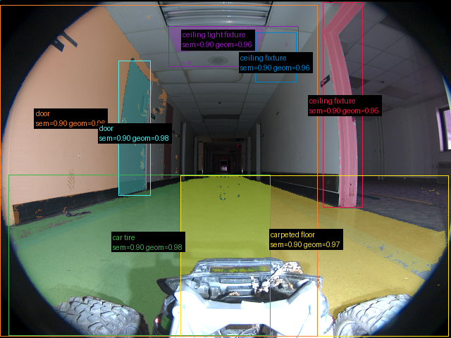

**scene_type:** corridor · **regiões canônicas:** 48 (7 publicadas, 41 contexto estrutural) · **relações:** 270 · **falhas de interpretação:** 0 · **audit:** ✅ pass (55 warnings)

## corridor-02-19329

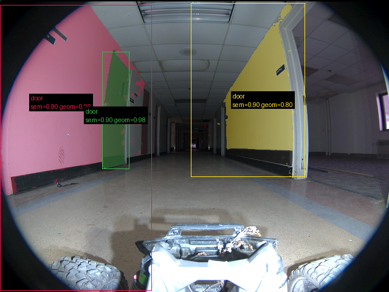

**scene_type:** corridor · **regiões canônicas:** 48 (3 publicadas, 45 contexto estrutural) · **relações:** 265 · **falhas de interpretação:** 0 · **audit:** ✅ pass (49 warnings)

## corridor-02-19335

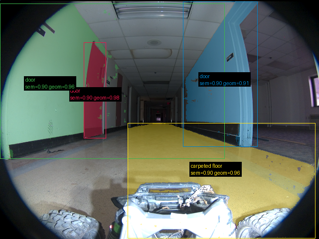

**scene_type:** corridor · **regiões canônicas:** 48 (4 publicadas, 44 contexto estrutural) · **relações:** 245 · **falhas de interpretação:** 0 · **audit:** ✅ pass (46 warnings)

## corridor-02-19348

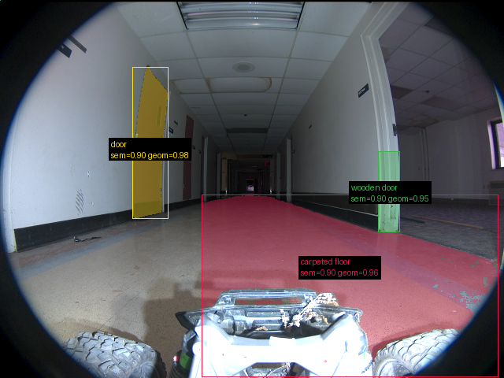

**scene_type:** corridor · **regiões canônicas:** 48 (3 publicadas, 45 contexto estrutural) · **relações:** 262 · **falhas de interpretação:** 0 · **audit:** ✅ pass (45 warnings)
