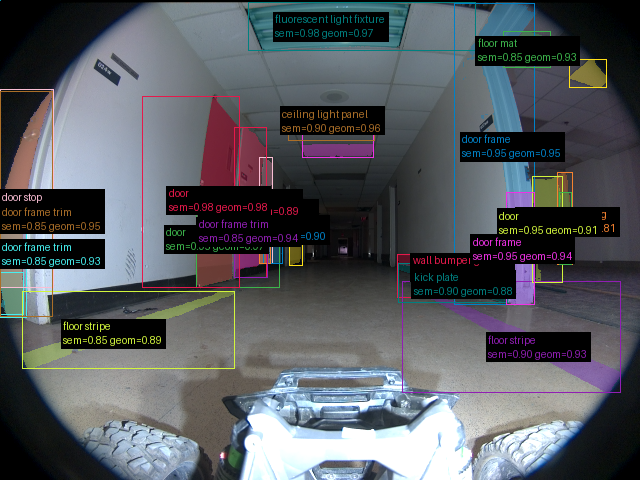
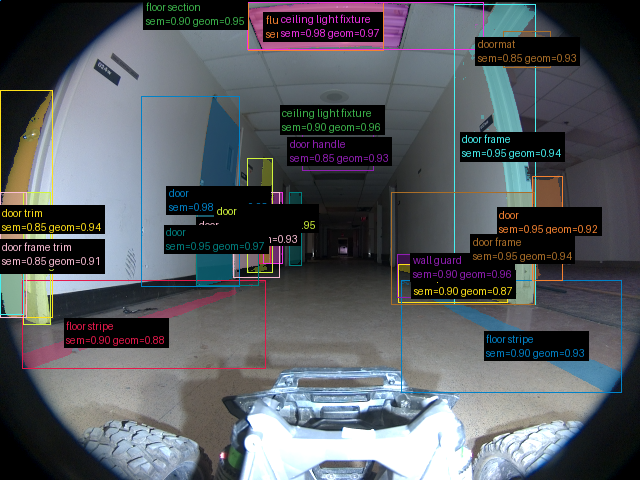
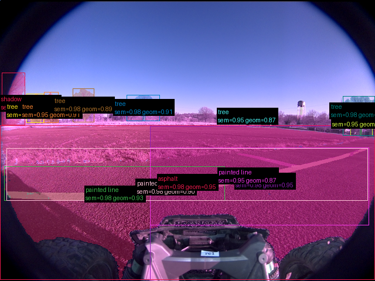
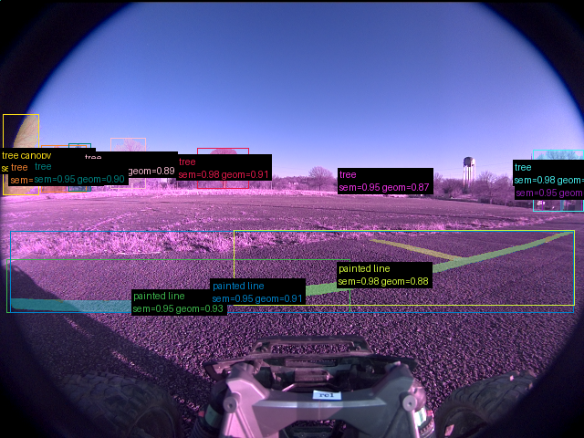
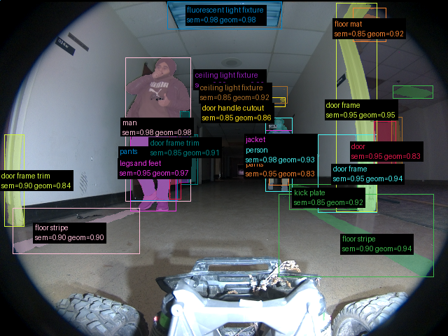
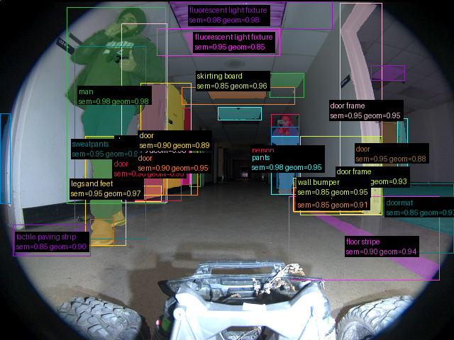

# Validação do pipeline real — 20260915T202805Z

Revisão: `ec3bacda` · Frames: 6 · Pico de VRAM: 5.52 GB (budget: 8.0 GB) · Pico de RSS do host: 4.34 GB

Ver `manifest.json` para configuração completa e log de estágios.

## corridor-02-00723

**scene_type:** hallway · **regiões canônicas:** 52 (26 publicadas, 26 contexto estrutural) · **relações:** 302 · **falhas de interpretação:** 1 · **audit:** ✅ pass (29 warnings)

## corridor-02-00735

**scene_type:** hallway · **regiões canônicas:** 48 (24 publicadas, 24 contexto estrutural) · **relações:** 280 · **falhas de interpretação:** 0 · **audit:** ✅ pass (32 warnings)

## corridor-02-09604

**scene_type:** parking lot · **regiões canônicas:** 16 (13 publicadas, 3 contexto estrutural) · **relações:** 70 · **falhas de interpretação:** 0 · **audit:** ✅ pass (0 warnings)

## corridor-02-09616

**scene_type:** parking lot · **regiões canônicas:** 15 (11 publicadas, 4 contexto estrutural) · **relações:** 58 · **falhas de interpretação:** 0 · **audit:** ✅ pass (1 warnings)

## corridor-02-18243

**scene_type:** hallway · **regiões canônicas:** 50 (26 publicadas, 24 contexto estrutural) · **relações:** 318 · **falhas de interpretação:** 0 · **audit:** ✅ pass (30 warnings)

## corridor-02-18255

**scene_type:** hallway · **regiões canônicas:** 56 (33 publicadas, 23 contexto estrutural) · **relações:** 399 · **falhas de interpretação:** 1 · **audit:** ✅ pass (28 warnings)
