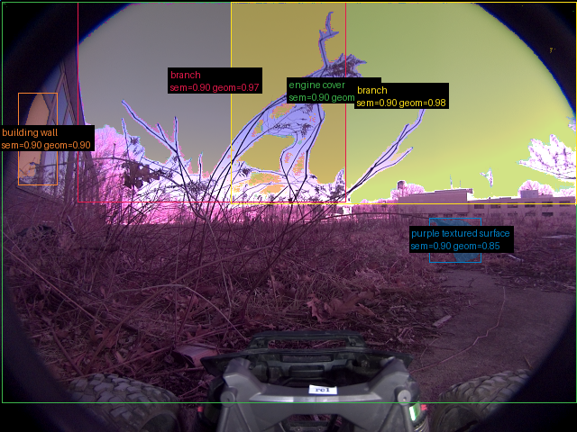
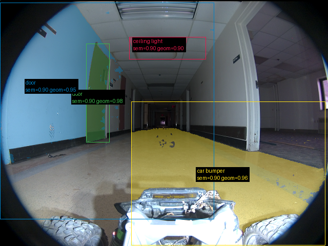

# Validação do pipeline real — 20260916T033414Z

Revisão: `6c6a1b44` · Frames: 2 · Pico de VRAM: 6.83 GB (budget: 8.0 GB) · Pico de RSS do host: 9.43 GB

Ver `manifest.json` para configuração completa e log de estágios.

## corridor-02-005

**scene_type:** urban · **regiões canônicas:** 8 (5 publicadas, 3 contexto estrutural) · **relações:** 16 · **falhas de interpretação:** 0 · **audit:** ✅ pass (6 warnings)

## corridor-02-017

**scene_type:** corridor · **regiões canônicas:** 47 (4 publicadas, 43 contexto estrutural) · **relações:** 276 · **falhas de interpretação:** 0 · **audit:** ✅ pass (49 warnings)
