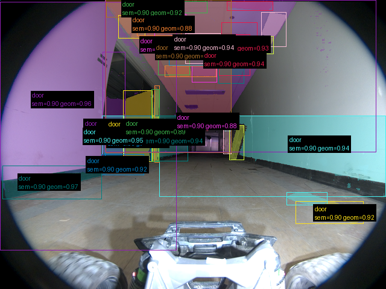
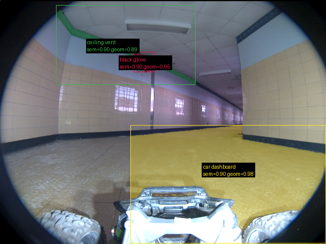
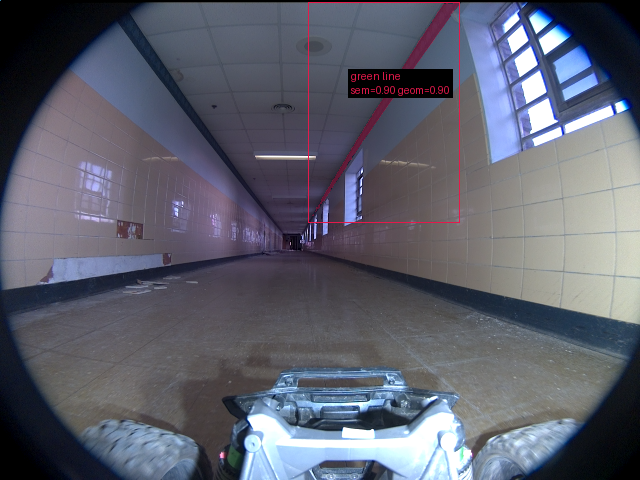

# Validação do pipeline real — 20260916T042613Z

Revisão: `6c6a1b44` · Frames: 3 · Pico de VRAM: 6.97 GB (budget: 8.0 GB) · Pico de RSS do host: 10.02 GB

Ver `manifest.json` para configuração completa e log de estágios.

## corridor-02-04234

**scene_type:** corridor · **regiões canônicas:** 41 (35 publicadas, 6 contexto estrutural) · **relações:** 331 · **falhas de interpretação:** 0 · **audit:** ✅ pass (32 warnings)

## corridor-02-04595

**scene_type:** indoor · **regiões canônicas:** 27 (3 publicadas, 24 contexto estrutural) · **relações:** 142 · **falhas de interpretação:** 0 · **audit:** ✅ pass (43 warnings)

## corridor-02-04955

**scene_type:** corridor · **regiões canônicas:** 59 (1 publicadas, 58 contexto estrutural) · **relações:** 550 · **falhas de interpretação:** 0 · **audit:** ✅ pass (81 warnings)
