# Validação do pipeline real — 20260916T050232Z

Revisão: `6c6a1b44` · Frames: 18 · Pico de VRAM: 6.97 GB (budget: 8.0 GB) · Pico de RSS do host: 10.37 GB

Ver `manifest.json` para configuração completa e log de estágios.

## corridor-02-000

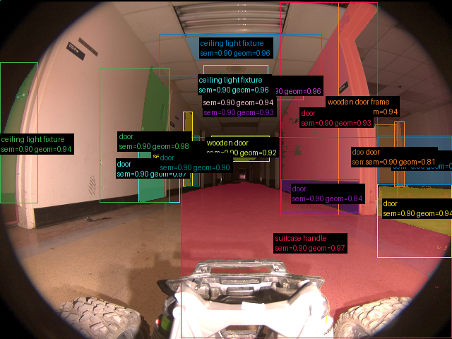

**scene_type:** corridor · **regiões canônicas:** 51 (19 publicadas, 32 contexto estrutural) · **relações:** 297 · **falhas de interpretação:** 0 · **audit:** ✅ pass (58 warnings)

## corridor-02-001

**scene_type:** corridor · **regiões canônicas:** 48 (35 publicadas, 13 contexto estrutural) · **relações:** 267 · **falhas de interpretação:** 0 · **audit:** ✅ pass (48 warnings)

## corridor-02-002

**scene_type:** corridor · **regiões canônicas:** 35 (15 publicadas, 20 contexto estrutural) · **relações:** 164 · **falhas de interpretação:** 0 · **audit:** ✅ pass (43 warnings)

## corridor-02-003

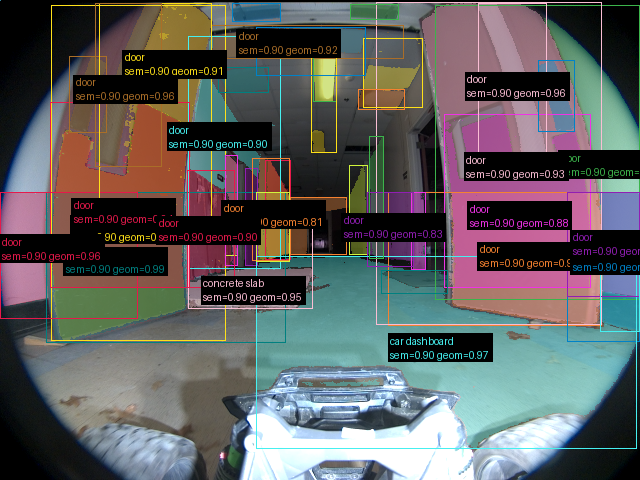

**scene_type:** corridor · **regiões canônicas:** 50 (41 publicadas, 9 contexto estrutural) · **relações:** 259 · **falhas de interpretação:** 0 · **audit:** ✅ pass (35 warnings)

## corridor-02-004

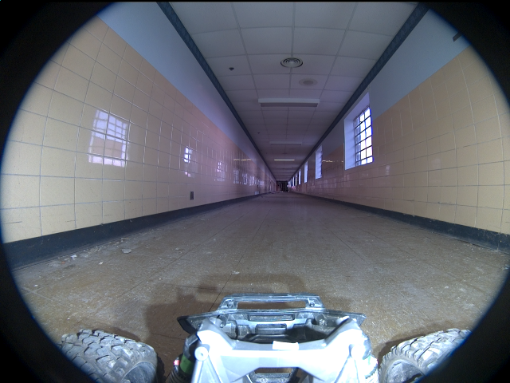

**scene_type:** corridor · **regiões canônicas:** 61 (0 publicadas, 61 contexto estrutural) · **relações:** 508 · **falhas de interpretação:** 0 · **audit:** ✅ pass (76 warnings)

## corridor-02-005

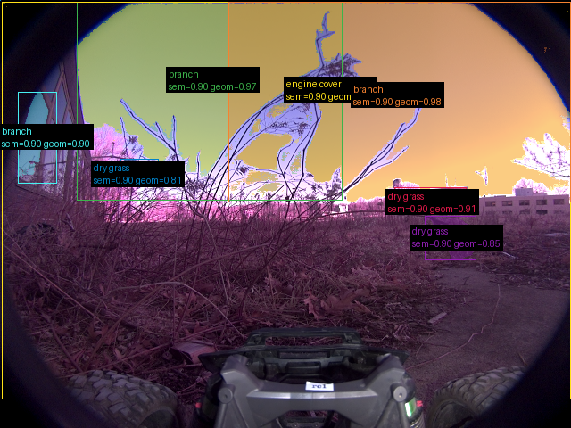

**scene_type:** urban · **regiões canônicas:** 8 (7 publicadas, 1 contexto estrutural) · **relações:** 16 · **falhas de interpretação:** 0 · **audit:** ✅ pass (11 warnings)

## corridor-02-006

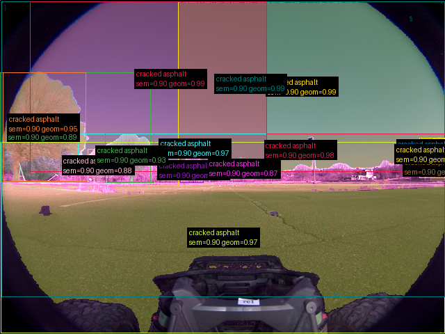

**scene_type:** park · **regiões canônicas:** 16 (15 publicadas, 1 contexto estrutural) · **relações:** 86 · **falhas de interpretação:** 0 · **audit:** ✅ pass (38 warnings)

## corridor-02-007

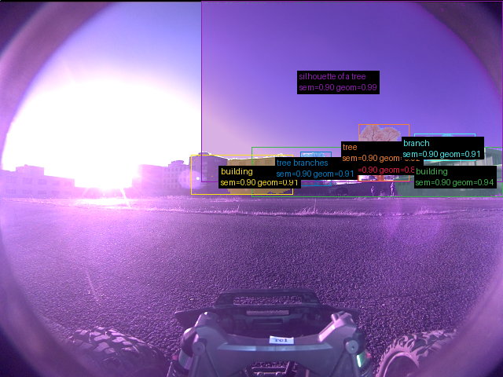

**scene_type:** urban · **regiões canônicas:** 15 (7 publicadas, 8 contexto estrutural) · **relações:** 68 · **falhas de interpretação:** 0 · **audit:** ✅ pass (11 warnings)

## corridor-02-008

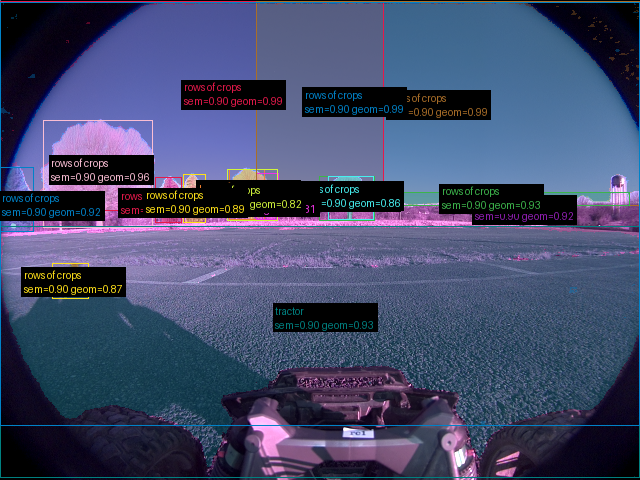

**scene_type:** agricultural field · **regiões canônicas:** 16 (16 publicadas, 0 contexto estrutural) · **relações:** 61 · **falhas de interpretação:** 0 · **audit:** ✅ pass (18 warnings)

## corridor-02-009

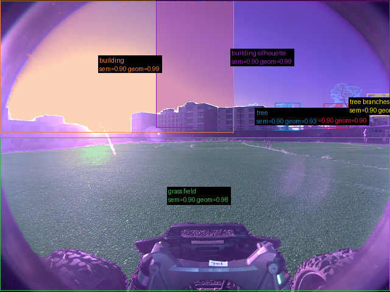

**scene_type:** park · **regiões canônicas:** 15 (6 publicadas, 9 contexto estrutural) · **relações:** 50 · **falhas de interpretação:** 0 · **audit:** ✅ pass (25 warnings)

## corridor-02-010

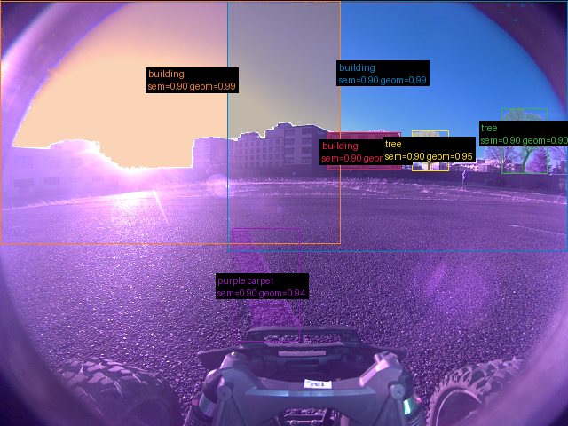

**scene_type:** urban · **regiões canônicas:** 13 (6 publicadas, 7 contexto estrutural) · **relações:** 49 · **falhas de interpretação:** 0 · **audit:** ✅ pass (15 warnings)

## corridor-02-011

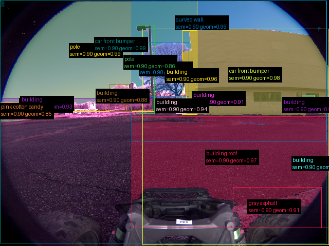

**scene_type:** industrial · **regiões canônicas:** 21 (19 publicadas, 2 contexto estrutural) · **relações:** 108 · **falhas de interpretação:** 0 · **audit:** ✅ pass (21 warnings)

## corridor-02-012

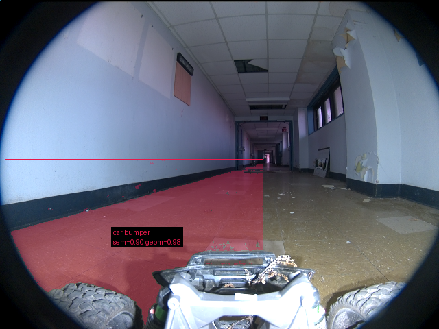

**scene_type:** corridor · **regiões canônicas:** 41 (1 publicadas, 40 contexto estrutural) · **relações:** 258 · **falhas de interpretação:** 0 · **audit:** ✅ pass (52 warnings)

## corridor-02-013

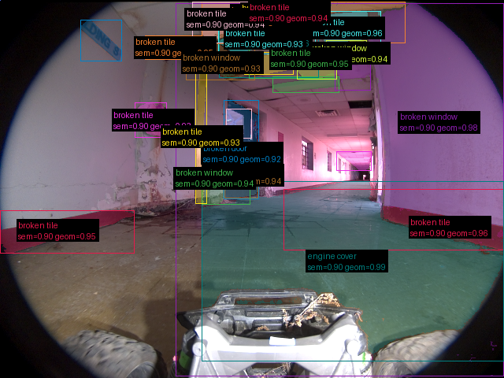

**scene_type:** abandoned building · **regiões canônicas:** 33 (27 publicadas, 6 contexto estrutural) · **relações:** 168 · **falhas de interpretação:** 0 · **audit:** ✅ pass (55 warnings)

## corridor-02-014

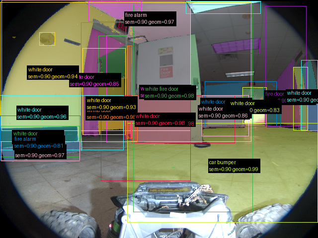

**scene_type:** indoor · **regiões canônicas:** 36 (34 publicadas, 2 contexto estrutural) · **relações:** 237 · **falhas de interpretação:** 0 · **audit:** ✅ pass (34 warnings)

## corridor-02-015

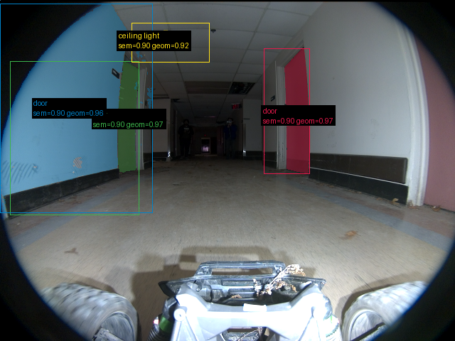

**scene_type:** corridor · **regiões canônicas:** 40 (4 publicadas, 36 contexto estrutural) · **relações:** 246 · **falhas de interpretação:** 0 · **audit:** ✅ pass (60 warnings)

## corridor-02-016

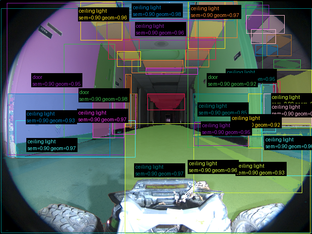

**scene_type:** corridor · **regiões canônicas:** 43 (42 publicadas, 1 contexto estrutural) · **relações:** 227 · **falhas de interpretação:** 0 · **audit:** ✅ pass (39 warnings)

## corridor-02-017

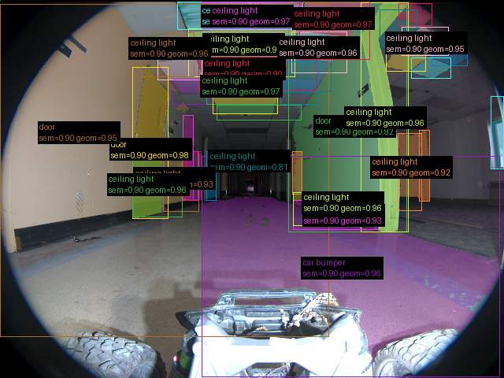

**scene_type:** corridor · **regiões canônicas:** 47 (38 publicadas, 9 contexto estrutural) · **relações:** 269 · **falhas de interpretação:** 0 · **audit:** ✅ pass (38 warnings)
