# Validação do pipeline real — 20260913T011003Z

Revisão: `d947b60` · Frames: 25 · Pico de VRAM: 4.57 GB (budget: 8.0 GB) · Pico de RSS do host: 10.64 GB

Ver `manifest.json` para configuração completa e log de estágios.

## corridor-02-04210

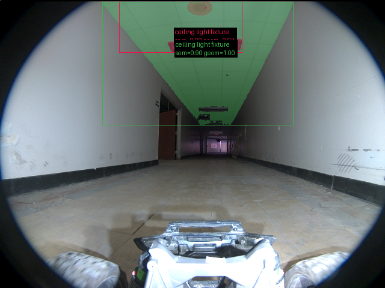

**scene_type:** corridor · **regiões canônicas:** 26 (2 publicadas, 24 contexto estrutural) · **relações:** 122 · **falhas de interpretação:** 0 · **audit:** ✅ pass (27 warnings)

## corridor-02-04217

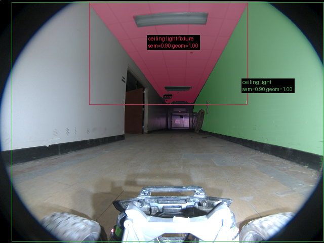

**scene_type:** corridor · **regiões canônicas:** 27 (2 publicadas, 25 contexto estrutural) · **relações:** 152 · **falhas de interpretação:** 0 · **audit:** ✅ pass (36 warnings)

## corridor-02-04222

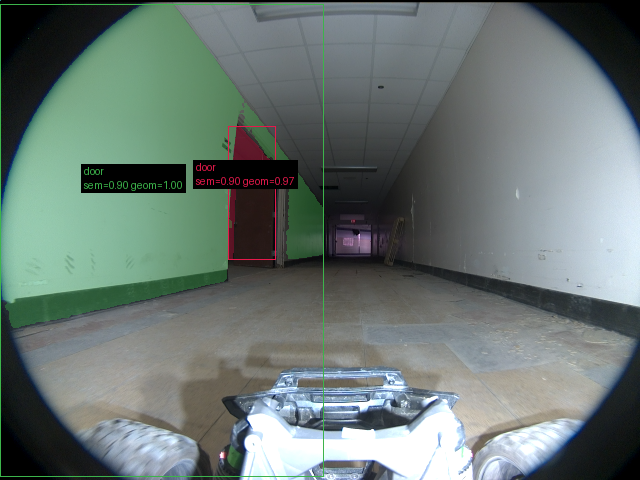

**scene_type:** corridor · **regiões canônicas:** 31 (2 publicadas, 29 contexto estrutural) · **relações:** 193 · **falhas de interpretação:** 0 · **audit:** ✅ pass (38 warnings)

## corridor-02-04228

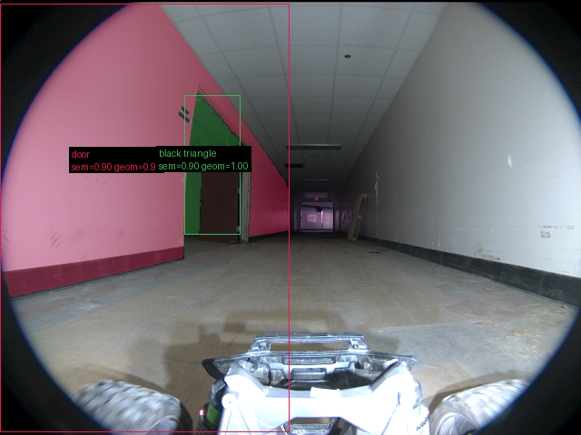

**scene_type:** corridor · **regiões canônicas:** 32 (2 publicadas, 30 contexto estrutural) · **relações:** 188 · **falhas de interpretação:** 0 · **audit:** ✅ pass (43 warnings)

## corridor-02-04234

**scene_type:** corridor · **regiões canônicas:** 35 (1 publicadas, 34 contexto estrutural) · **relações:** 224 · **falhas de interpretação:** 0 · **audit:** ✅ pass (42 warnings)

## corridor-02-04240

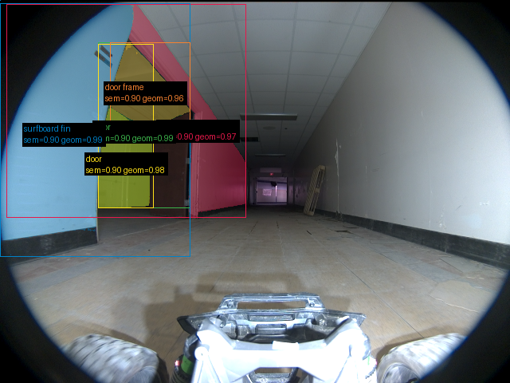

**scene_type:** corridor · **regiões canônicas:** 27 (5 publicadas, 22 contexto estrutural) · **relações:** 165 · **falhas de interpretação:** 0 · **audit:** ✅ pass (28 warnings)

## corridor-02-04246

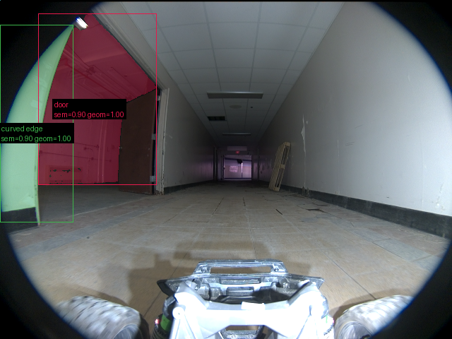

**scene_type:** indoor · **regiões canônicas:** 26 (2 publicadas, 24 contexto estrutural) · **relações:** 134 · **falhas de interpretação:** 0 · **audit:** ✅ pass (32 warnings)

## corridor-02-04252

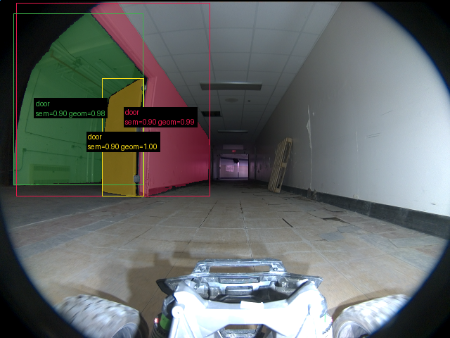

**scene_type:** indoor · **regiões canônicas:** 30 (3 publicadas, 27 contexto estrutural) · **relações:** 177 · **falhas de interpretação:** 0 · **audit:** ✅ pass (32 warnings)

## corridor-02-04258

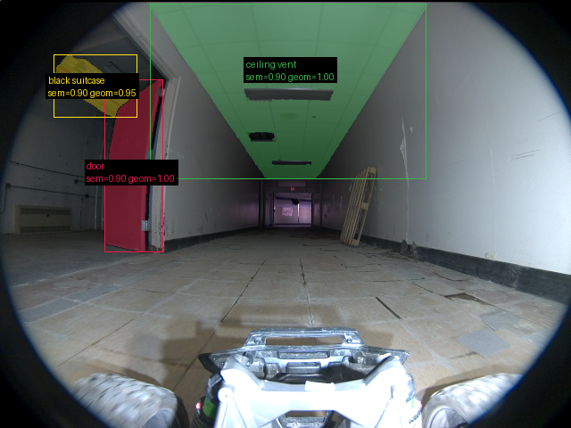

**scene_type:** indoor · **regiões canônicas:** 33 (3 publicadas, 30 contexto estrutural) · **relações:** 187 · **falhas de interpretação:** 0 · **audit:** ✅ pass (32 warnings)

## corridor-02-04264

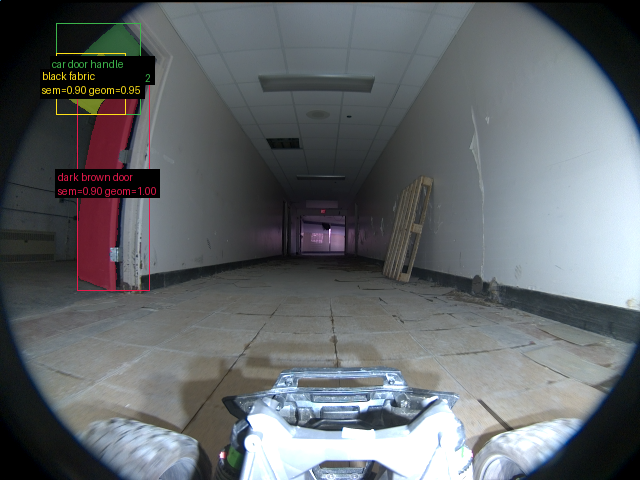

**scene_type:** indoor · **regiões canônicas:** 34 (3 publicadas, 31 contexto estrutural) · **relações:** 182 · **falhas de interpretação:** 0 · **audit:** ✅ pass (36 warnings)

## corridor-02-04270

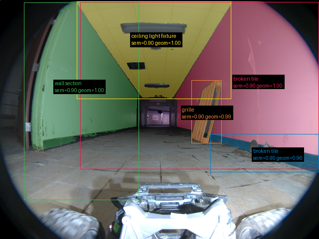

**scene_type:** corridor · **regiões canônicas:** 27 (5 publicadas, 22 contexto estrutural) · **relações:** 114 · **falhas de interpretação:** 0 · **audit:** ✅ pass (37 warnings)

## corridor-02-04276

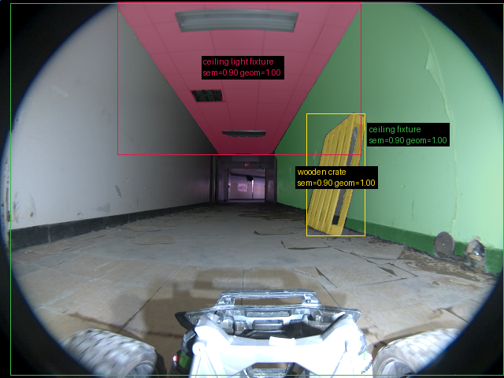

**scene_type:** corridor · **regiões canônicas:** 31 (3 publicadas, 28 contexto estrutural) · **relações:** 138 · **falhas de interpretação:** 0 · **audit:** ✅ pass (37 warnings)

## corridor-02-04282

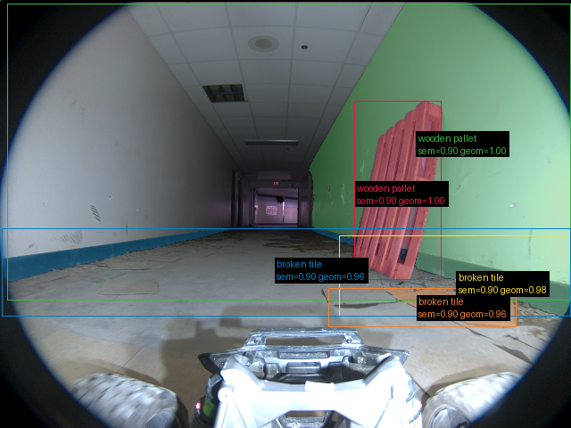

**scene_type:** corridor · **regiões canônicas:** 37 (5 publicadas, 32 contexto estrutural) · **relações:** 198 · **falhas de interpretação:** 0 · **audit:** ✅ pass (42 warnings)

## corridor-02-04288

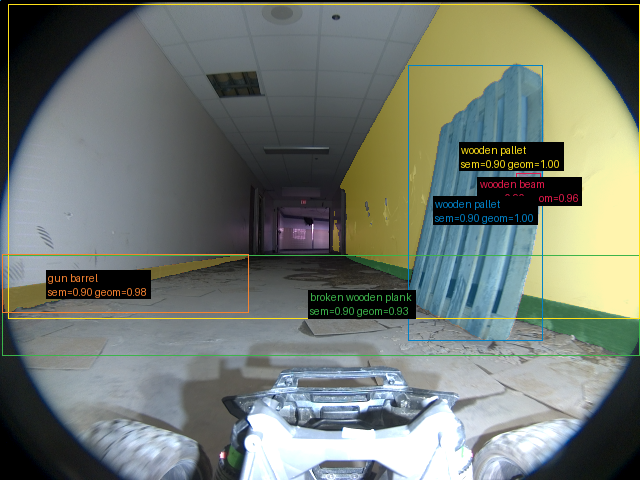

**scene_type:** indoor · **regiões canônicas:** 38 (5 publicadas, 33 contexto estrutural) · **relações:** 206 · **falhas de interpretação:** 0 · **audit:** ✅ pass (34 warnings)

## corridor-02-04294

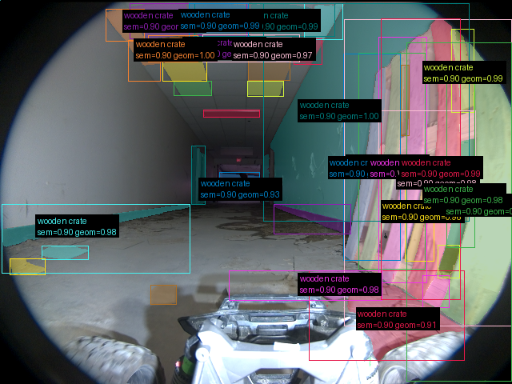

**scene_type:** corridor · **regiões canônicas:** 45 (38 publicadas, 7 contexto estrutural) · **relações:** 286 · **falhas de interpretação:** 0 · **audit:** ✅ pass (12 warnings)

## corridor-02-04300

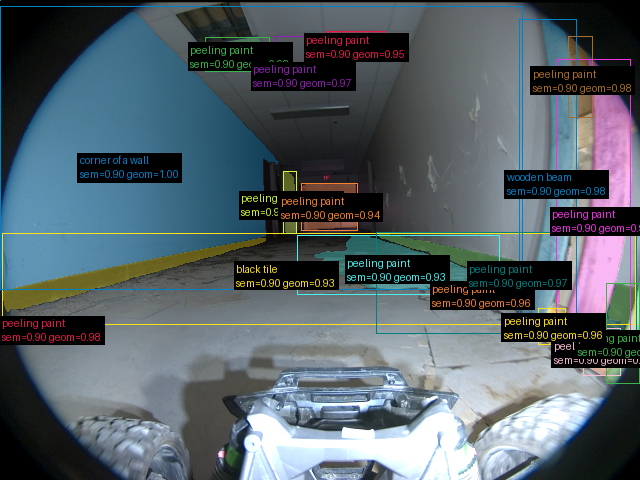

**scene_type:** corridor · **regiões canônicas:** 40 (17 publicadas, 23 contexto estrutural) · **relações:** 229 · **falhas de interpretação:** 0 · **audit:** ✅ pass (60 warnings)

## corridor-02-04307

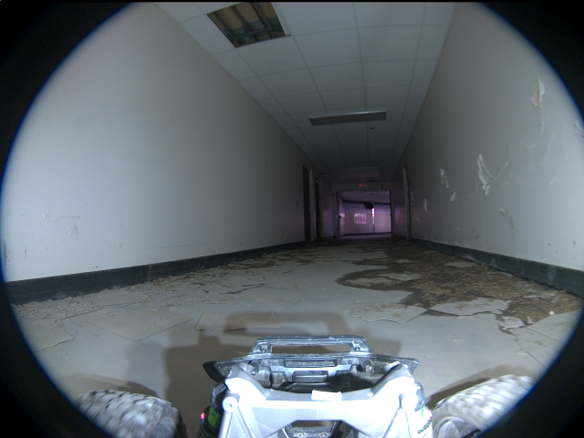

**scene_type:** corridor · **regiões canônicas:** 39 (0 publicadas, 39 contexto estrutural) · **relações:** 193 · **falhas de interpretação:** 0 · **audit:** ✅ pass (43 warnings)

## corridor-02-04312

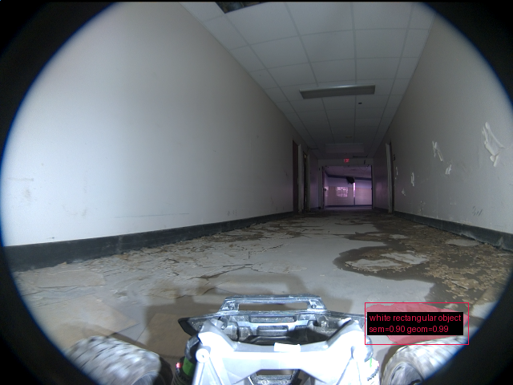

**scene_type:** corridor · **regiões canônicas:** 36 (1 publicadas, 35 contexto estrutural) · **relações:** 173 · **falhas de interpretação:** 0 · **audit:** ✅ pass (43 warnings)

## corridor-02-04318

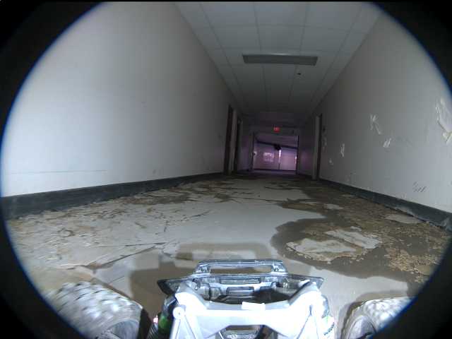

**scene_type:** corridor · **regiões canônicas:** 31 (0 publicadas, 31 contexto estrutural) · **relações:** 153 · **falhas de interpretação:** 0 · **audit:** ✅ pass (38 warnings)

## corridor-02-04324

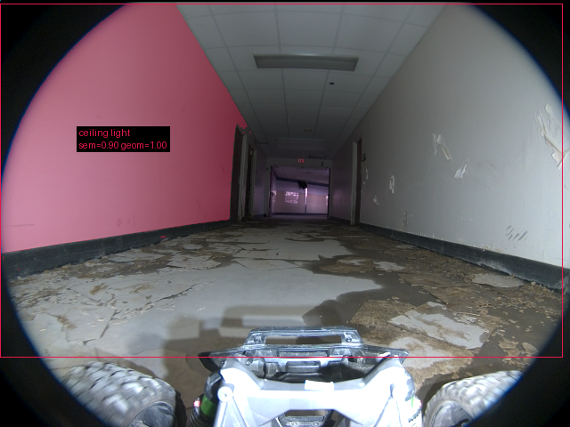

**scene_type:** corridor · **regiões canônicas:** 32 (1 publicadas, 31 contexto estrutural) · **relações:** 153 · **falhas de interpretação:** 0 · **audit:** ✅ pass (38 warnings)

## corridor-02-04330

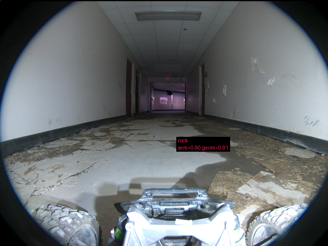

**scene_type:** corridor · **regiões canônicas:** 35 (1 publicadas, 34 contexto estrutural) · **relações:** 177 · **falhas de interpretação:** 0 · **audit:** ✅ pass (46 warnings)

## corridor-02-04336

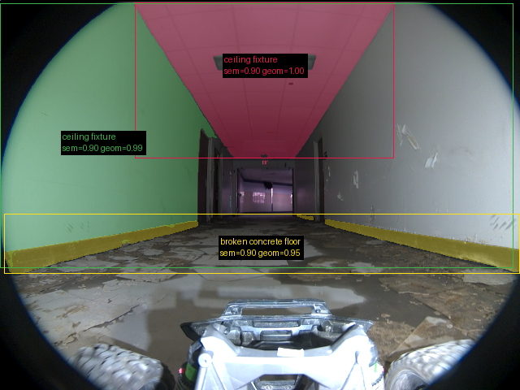

**scene_type:** corridor · **regiões canônicas:** 42 (3 publicadas, 39 contexto estrutural) · **relações:** 200 · **falhas de interpretação:** 0 · **audit:** ✅ pass (46 warnings)

## corridor-02-04342

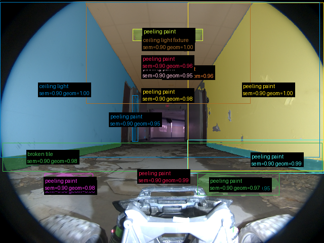

**scene_type:** corridor · **regiões canônicas:** 41 (16 publicadas, 25 contexto estrutural) · **relações:** 181 · **falhas de interpretação:** 0 · **audit:** ✅ pass (50 warnings)

## corridor-02-04349

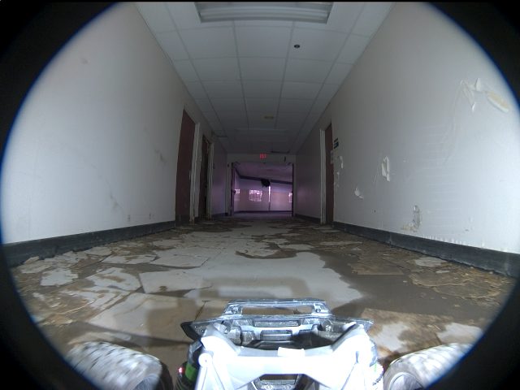

**scene_type:** corridor · **regiões canônicas:** 41 (0 publicadas, 41 contexto estrutural) · **relações:** 203 · **falhas de interpretação:** 0 · **audit:** ✅ pass (46 warnings)

## corridor-02-04354

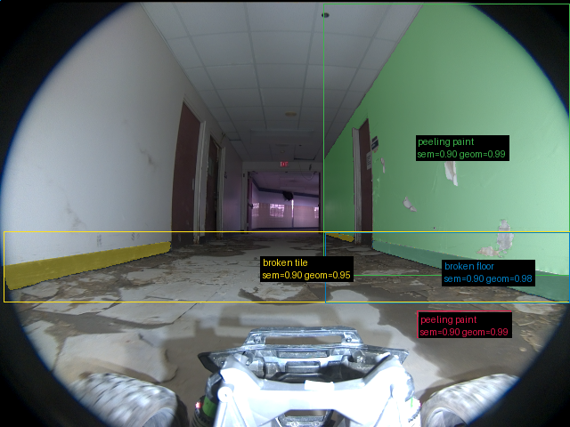

**scene_type:** corridor · **regiões canônicas:** 44 (4 publicadas, 40 contexto estrutural) · **relações:** 204 · **falhas de interpretação:** 0 · **audit:** ✅ pass (52 warnings)
