# Validação do pipeline real — 20260913T033030Z

Revisão: `d947b60` · Frames: 37 · Pico de VRAM: 4.57 GB (budget: 8.0 GB) · Pico de RSS do host: 11.39 GB

Ver `manifest.json` para configuração completa e log de estágios.

## corridor-02-09604

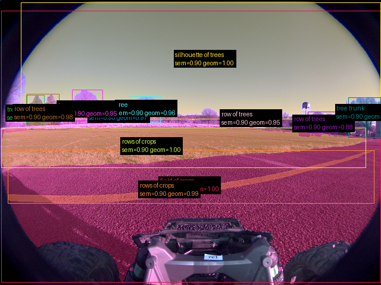

**scene_type:** agricultural field · **regiões canônicas:** 15 (12 publicadas, 3 contexto estrutural) · **relações:** 47 · **falhas de interpretação:** 0 · **audit:** ✅ pass (6 warnings)

## corridor-02-09610

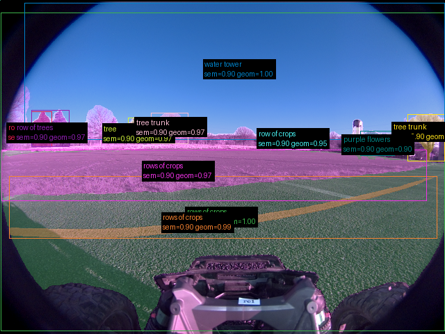

**scene_type:** agricultural field · **regiões canônicas:** 15 (11 publicadas, 4 contexto estrutural) · **relações:** 47 · **falhas de interpretação:** 0 · **audit:** ✅ pass (10 warnings)

## corridor-02-09616

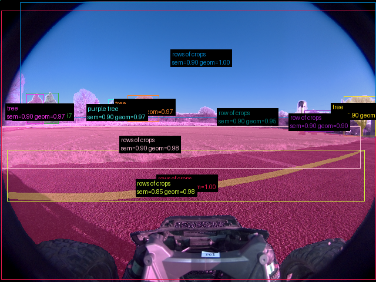

**scene_type:** agricultural field · **regiões canônicas:** 15 (11 publicadas, 4 contexto estrutural) · **relações:** 47 · **falhas de interpretação:** 0 · **audit:** ✅ pass (10 warnings)

## corridor-02-09621

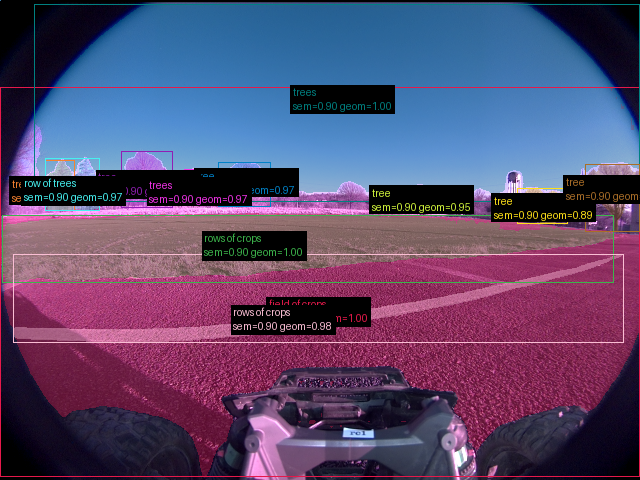

**scene_type:** agricultural field · **regiões canônicas:** 15 (12 publicadas, 3 contexto estrutural) · **relações:** 47 · **falhas de interpretação:** 0 · **audit:** ✅ pass (3 warnings)

## corridor-02-09627

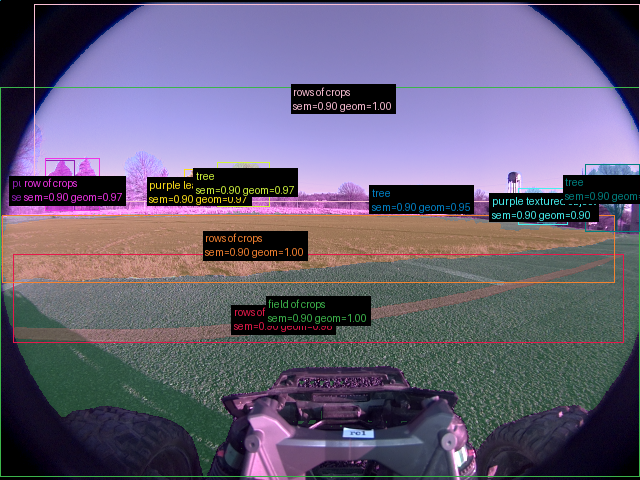

**scene_type:** agricultural field · **regiões canônicas:** 15 (11 publicadas, 4 contexto estrutural) · **relações:** 47 · **falhas de interpretação:** 0 · **audit:** ✅ pass (9 warnings)

## corridor-02-09633

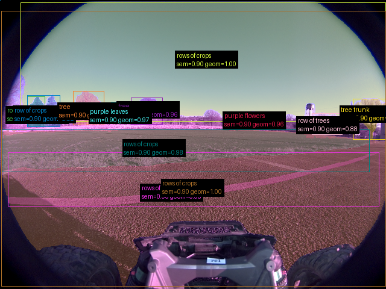

**scene_type:** agricultural field · **regiões canônicas:** 15 (12 publicadas, 3 contexto estrutural) · **relações:** 47 · **falhas de interpretação:** 0 · **audit:** ✅ pass (8 warnings)

## corridor-02-09639

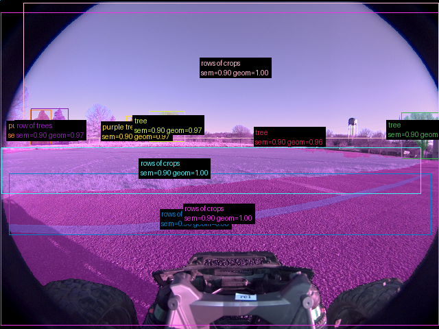

**scene_type:** agricultural field · **regiões canônicas:** 14 (10 publicadas, 4 contexto estrutural) · **relações:** 43 · **falhas de interpretação:** 0 · **audit:** ✅ pass (7 warnings)

## corridor-02-09646

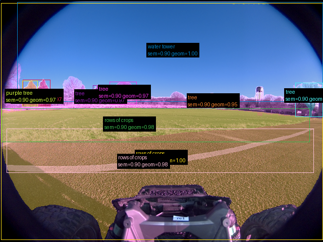

**scene_type:** agricultural field · **regiões canônicas:** 14 (10 publicadas, 4 contexto estrutural) · **relações:** 42 · **falhas de interpretação:** 0 · **audit:** ✅ pass (7 warnings)

## corridor-02-09652

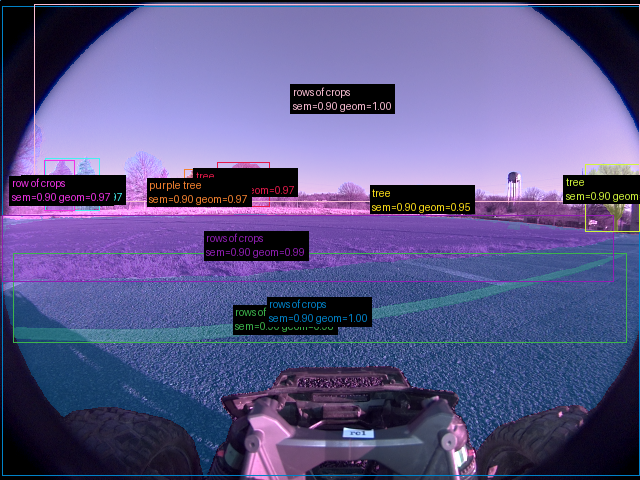

**scene_type:** agricultural field · **regiões canônicas:** 14 (10 publicadas, 4 contexto estrutural) · **relações:** 42 · **falhas de interpretação:** 0 · **audit:** ✅ pass (5 warnings)

## corridor-02-09657

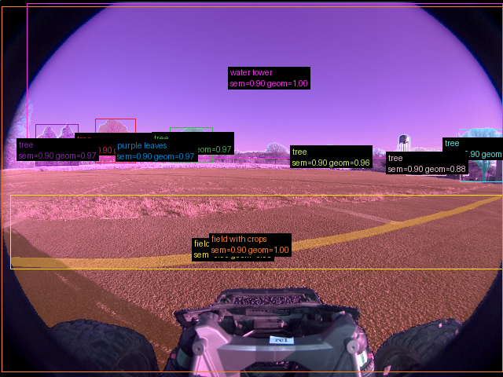

**scene_type:** rural · **regiões canônicas:** 14 (10 publicadas, 4 contexto estrutural) · **relações:** 35 · **falhas de interpretação:** 0 · **audit:** ✅ pass (3 warnings)

## corridor-02-09663

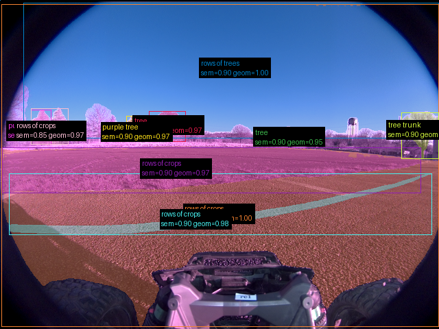

**scene_type:** agricultural field · **regiões canônicas:** 14 (10 publicadas, 4 contexto estrutural) · **relações:** 42 · **falhas de interpretação:** 0 · **audit:** ✅ pass (8 warnings)

## corridor-02-09669

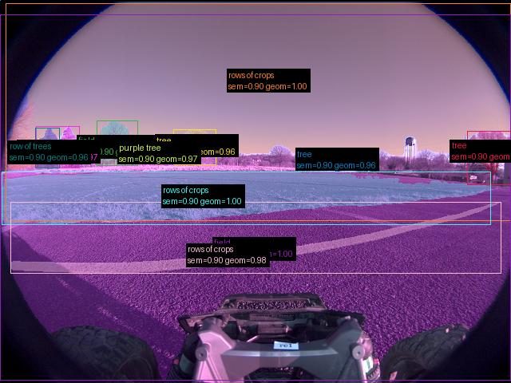

**scene_type:** agricultural field · **regiões canônicas:** 14 (11 publicadas, 3 contexto estrutural) · **relações:** 46 · **falhas de interpretação:** 0 · **audit:** ✅ pass (5 warnings)

## corridor-02-09675

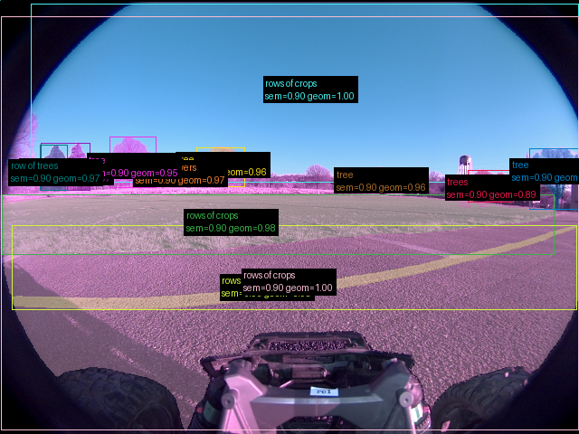

**scene_type:** agricultural field · **regiões canônicas:** 15 (12 publicadas, 3 contexto estrutural) · **relações:** 45 · **falhas de interpretação:** 0 · **audit:** ✅ pass (8 warnings)

## corridor-02-09681

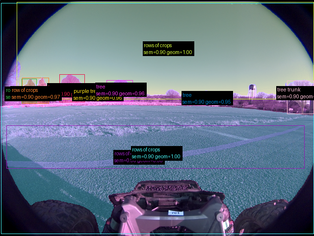

**scene_type:** agricultural field · **regiões canônicas:** 14 (10 publicadas, 4 contexto estrutural) · **relações:** 35 · **falhas de interpretação:** 0 · **audit:** ✅ pass (7 warnings)

## corridor-02-09688

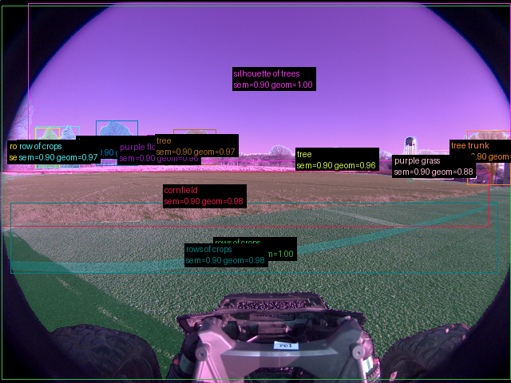

**scene_type:** agricultural field · **regiões canônicas:** 15 (12 publicadas, 3 contexto estrutural) · **relações:** 45 · **falhas de interpretação:** 0 · **audit:** ✅ pass (15 warnings)

## corridor-02-09694

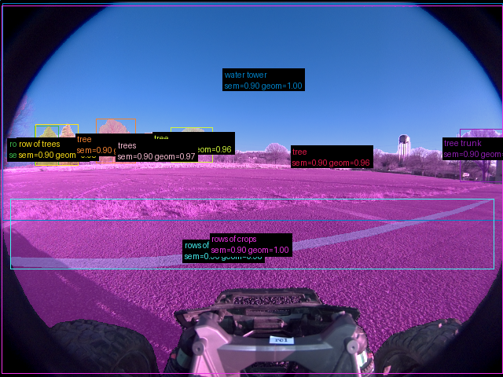

**scene_type:** agricultural field · **regiões canônicas:** 13 (10 publicadas, 3 contexto estrutural) · **relações:** 34 · **falhas de interpretação:** 0 · **audit:** ✅ pass (4 warnings)

## corridor-02-09699

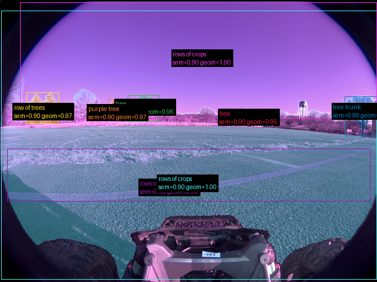

**scene_type:** agricultural field · **regiões canônicas:** 13 (8 publicadas, 5 contexto estrutural) · **relações:** 34 · **falhas de interpretação:** 0 · **audit:** ✅ pass (5 warnings)

## corridor-02-09705

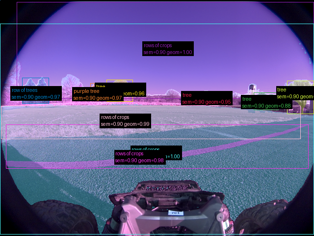

**scene_type:** agricultural field · **regiões canônicas:** 16 (10 publicadas, 6 contexto estrutural) · **relações:** 51 · **falhas de interpretação:** 0 · **audit:** ✅ pass (5 warnings)

## corridor-02-09711

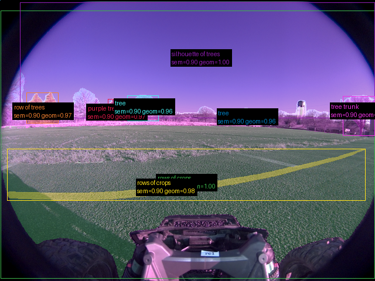

**scene_type:** agricultural field · **regiões canônicas:** 13 (8 publicadas, 5 contexto estrutural) · **relações:** 33 · **falhas de interpretação:** 0 · **audit:** ✅ pass (4 warnings)

## corridor-02-09717

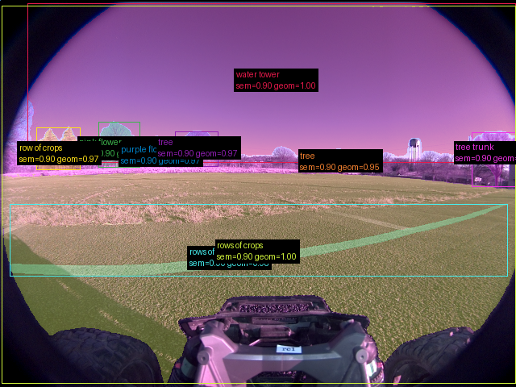

**scene_type:** rural · **regiões canônicas:** 13 (9 publicadas, 4 contexto estrutural) · **relações:** 33 · **falhas de interpretação:** 0 · **audit:** ✅ pass (5 warnings)

## corridor-02-09723

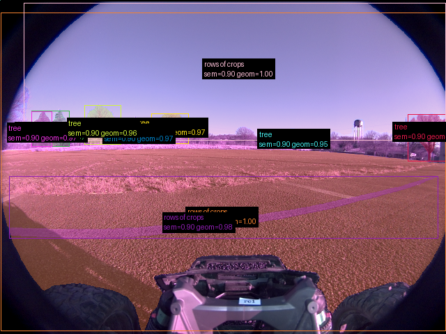

**scene_type:** agricultural field · **regiões canônicas:** 13 (10 publicadas, 3 contexto estrutural) · **relações:** 33 · **falhas de interpretação:** 0 · **audit:** ✅ pass (3 warnings)

## corridor-02-09730

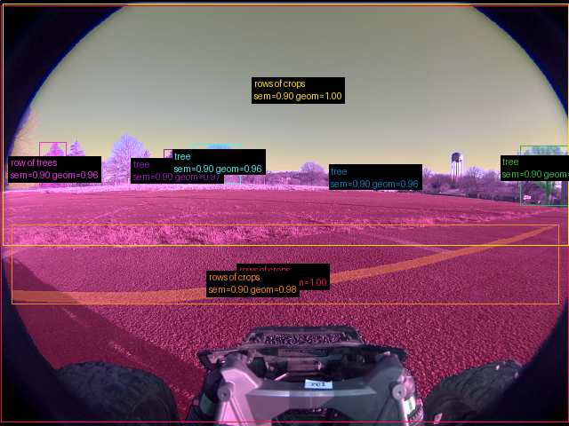

**scene_type:** agricultural field · **regiões canônicas:** 12 (8 publicadas, 4 contexto estrutural) · **relações:** 32 · **falhas de interpretação:** 0 · **audit:** ✅ pass (4 warnings)

## corridor-02-09736

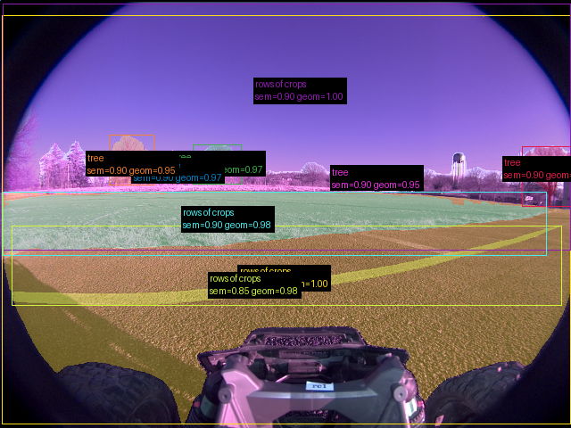

**scene_type:** agricultural field · **regiões canônicas:** 14 (9 publicadas, 5 contexto estrutural) · **relações:** 46 · **falhas de interpretação:** 0 · **audit:** ✅ pass (5 warnings)

## corridor-02-09742

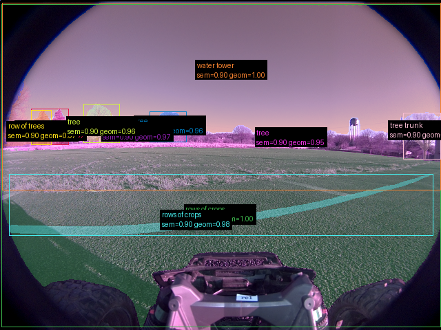

**scene_type:** agricultural field · **regiões canônicas:** 13 (10 publicadas, 3 contexto estrutural) · **relações:** 34 · **falhas de interpretação:** 0 · **audit:** ✅ pass (8 warnings)

## corridor-02-09748

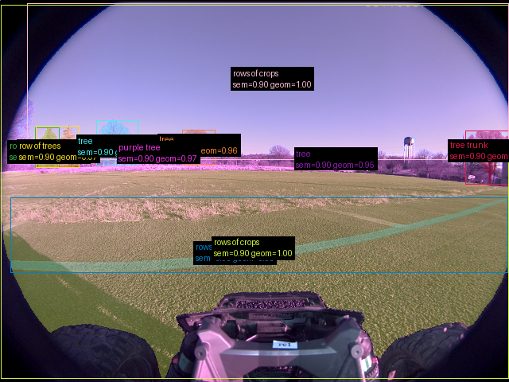

**scene_type:** agricultural field · **regiões canônicas:** 13 (10 publicadas, 3 contexto estrutural) · **relações:** 33 · **falhas de interpretação:** 0 · **audit:** ✅ pass (6 warnings)

## corridor-02-09753

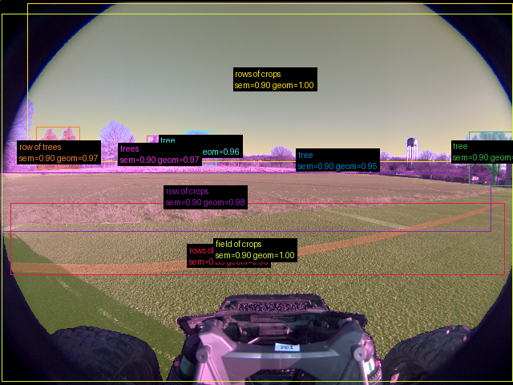

**scene_type:** agricultural field · **regiões canônicas:** 14 (9 publicadas, 5 contexto estrutural) · **relações:** 44 · **falhas de interpretação:** 0 · **audit:** ✅ pass (5 warnings)

## corridor-02-09759

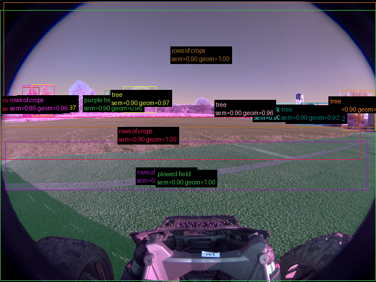

**scene_type:** agricultural field · **regiões canônicas:** 15 (14 publicadas, 1 contexto estrutural) · **relações:** 48 · **falhas de interpretação:** 0 · **audit:** ✅ pass (8 warnings)

## corridor-02-09765

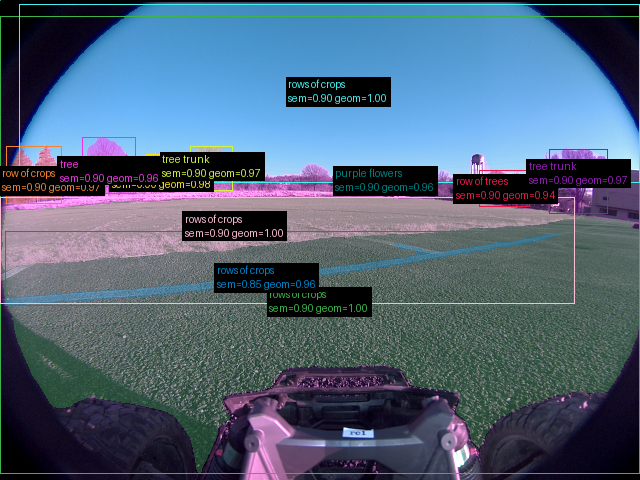

**scene_type:** agricultural field · **regiões canônicas:** 14 (11 publicadas, 3 contexto estrutural) · **relações:** 40 · **falhas de interpretação:** 0 · **audit:** ✅ pass (8 warnings)

## corridor-02-09771

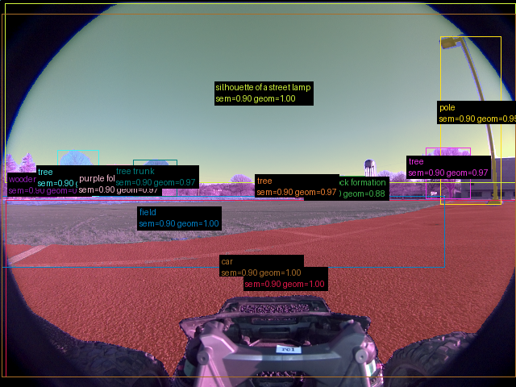

**scene_type:** rural · **regiões canônicas:** 16 (12 publicadas, 4 contexto estrutural) · **relações:** 69 · **falhas de interpretação:** 0 · **audit:** ✅ pass (11 warnings)

## corridor-02-09778

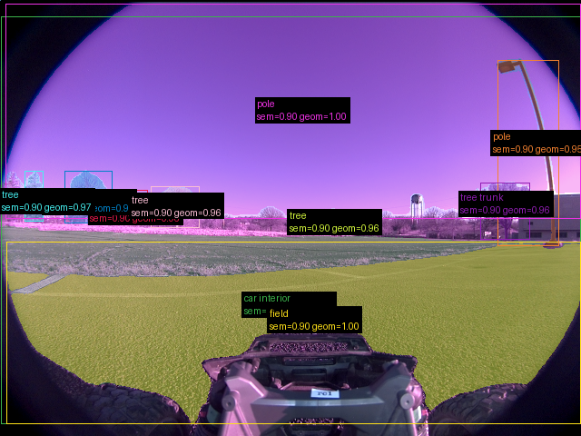

**scene_type:** open field · **regiões canônicas:** 14 (10 publicadas, 4 contexto estrutural) · **relações:** 46 · **falhas de interpretação:** 0 · **audit:** ✅ pass (1 warnings)

## corridor-02-09784

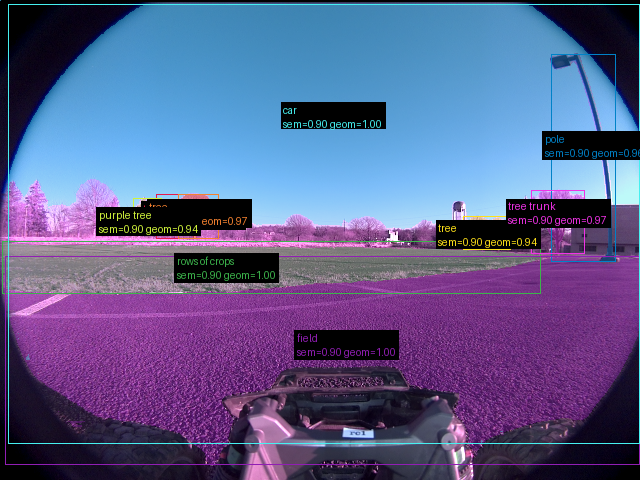

**scene_type:** open field · **regiões canônicas:** 17 (9 publicadas, 8 contexto estrutural) · **relações:** 50 · **falhas de interpretação:** 0 · **audit:** ✅ pass (10 warnings)

## corridor-02-09789

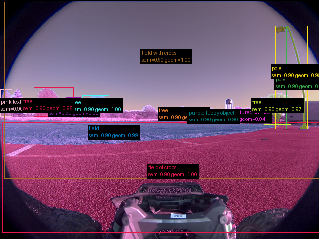

**scene_type:** rural · **regiões canônicas:** 17 (13 publicadas, 4 contexto estrutural) · **relações:** 47 · **falhas de interpretação:** 0 · **audit:** ✅ pass (9 warnings)

## corridor-02-09795

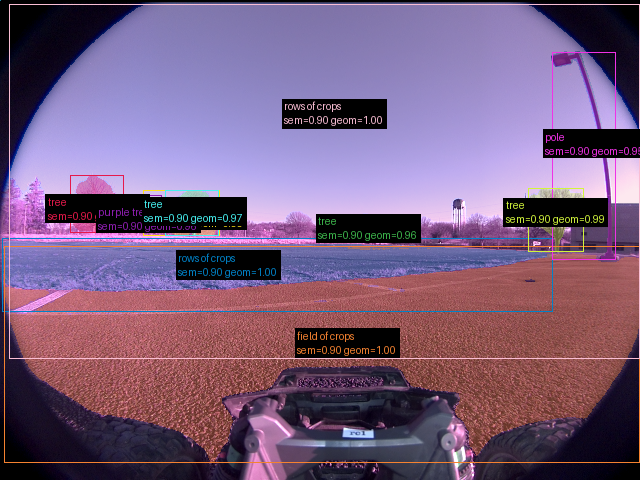

**scene_type:** agricultural field · **regiões canônicas:** 17 (10 publicadas, 7 contexto estrutural) · **relações:** 52 · **falhas de interpretação:** 0 · **audit:** ✅ pass (5 warnings)

## corridor-02-09801

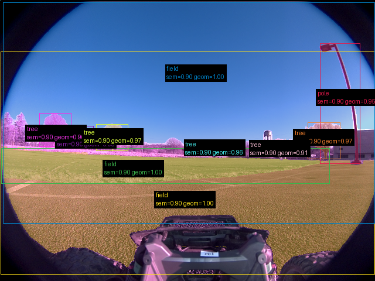

**scene_type:** rural · **regiões canônicas:** 15 (10 publicadas, 5 contexto estrutural) · **relações:** 52 · **falhas de interpretação:** 0 · **audit:** ✅ pass (6 warnings)

## corridor-02-09807

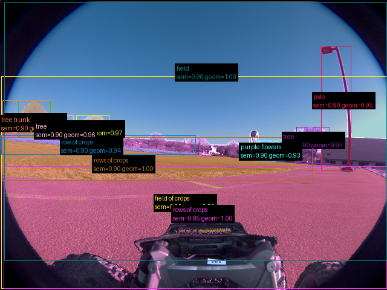

**scene_type:** agricultural field · **regiões canônicas:** 17 (12 publicadas, 5 contexto estrutural) · **relações:** 72 · **falhas de interpretação:** 0 · **audit:** ✅ pass (7 warnings)

## corridor-02-09813

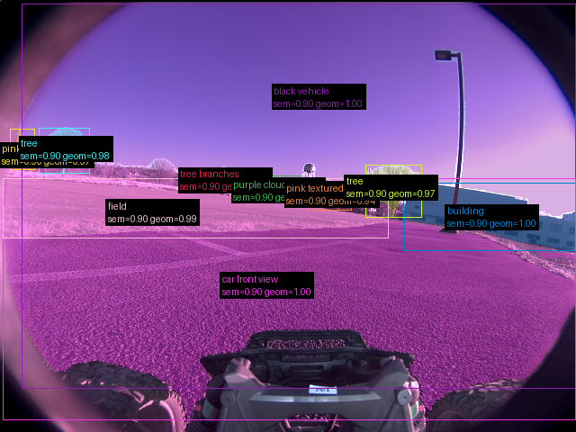

**scene_type:** open field · **regiões canônicas:** 16 (10 publicadas, 6 contexto estrutural) · **relações:** 58 · **falhas de interpretação:** 0 · **audit:** ✅ pass (9 warnings)

## corridor-02-09820

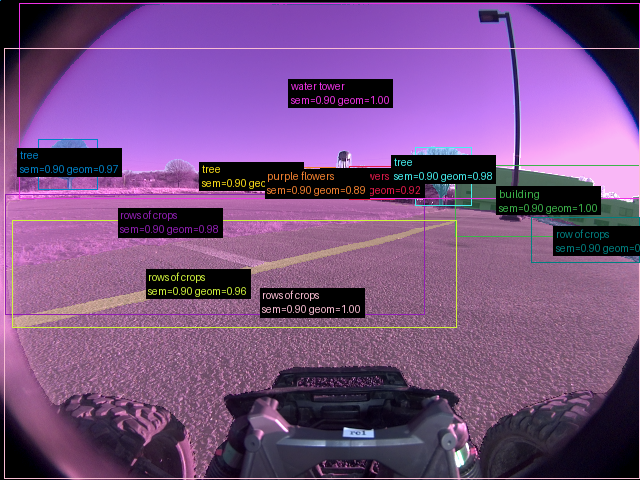

**scene_type:** agricultural field · **regiões canônicas:** 18 (11 publicadas, 7 contexto estrutural) · **relações:** 65 · **falhas de interpretação:** 0 · **audit:** ✅ pass (13 warnings)
