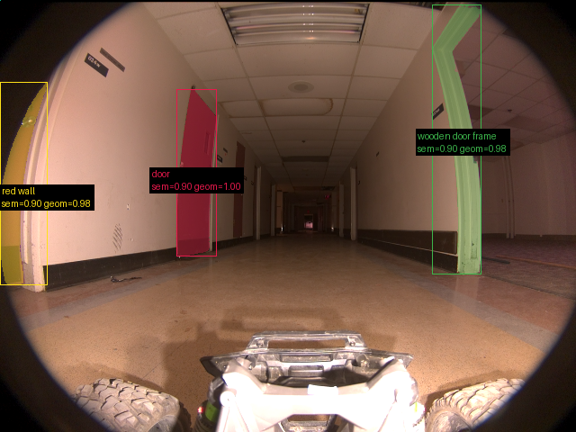
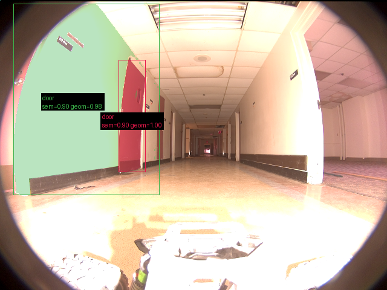
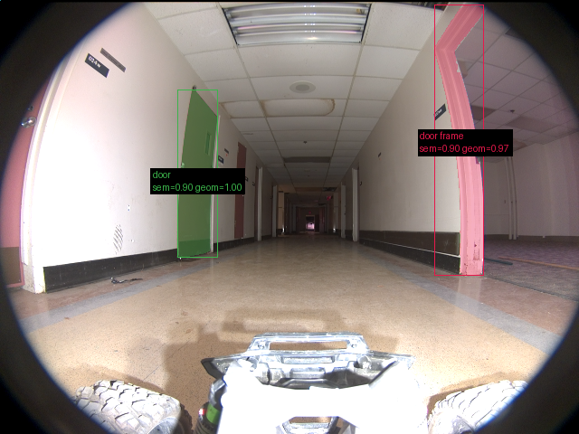
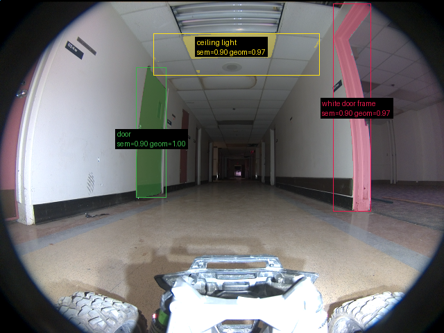
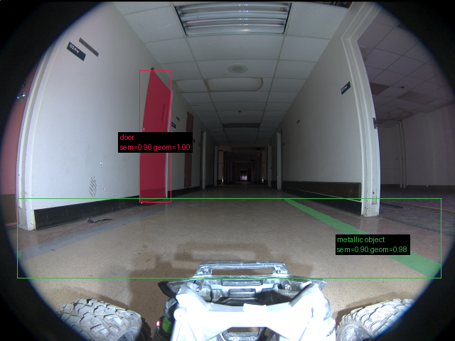
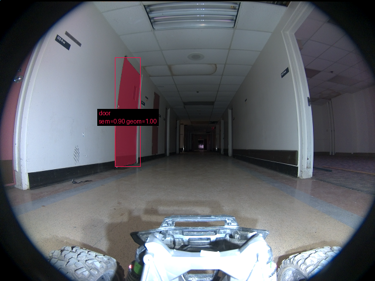

# Validação do pipeline real — 20260913T144138Z

Revisão: `d947b60` · Frames: 31 · Pico de VRAM: 6.86 GB (budget: 8.0 GB) · Pico de RSS do host: 10.62 GB

Ver `manifest.json` para configuração completa e log de estágios.

## corridor-02-00000

**scene_type:** corridor · **regiões canônicas:** 40 (3 publicadas, 37 contexto estrutural) · **relações:** 217 · **falhas de interpretação:** 0 · **audit:** ✅ pass (44 warnings)

## corridor-02-00008

**scene_type:** corridor · **regiões canônicas:** 42 (2 publicadas, 40 contexto estrutural) · **relações:** 216 · **falhas de interpretação:** 0 · **audit:** ✅ pass (43 warnings)

## corridor-02-00017

**scene_type:** corridor · **regiões canônicas:** 41 (2 publicadas, 39 contexto estrutural) · **relações:** 217 · **falhas de interpretação:** 0 · **audit:** ✅ pass (44 warnings)

## corridor-02-00025

**scene_type:** corridor · **regiões canônicas:** 41 (3 publicadas, 38 contexto estrutural) · **relações:** 253 · **falhas de interpretação:** 0 · **audit:** ✅ pass (44 warnings)

## corridor-02-00033

**scene_type:** corridor · **regiões canônicas:** 40 (2 publicadas, 38 contexto estrutural) · **relações:** 210 · **falhas de interpretação:** 0 · **audit:** ✅ pass (44 warnings)

## corridor-02-00042

**scene_type:** corridor · **regiões canônicas:** 42 (1 publicadas, 41 contexto estrutural) · **relações:** 262 · **falhas de interpretação:** 0 · **audit:** ✅ pass (48 warnings)

## corridor-02-00050

**FALHOU:** `BackendExecutionError("Out of memory while running 'region_discovery:facebook/sam-vit-huge:cuda'.")`

## corridor-02-00058

**FALHOU:** `BackendExecutionError("Out of memory while running 'region_discovery:facebook/sam-vit-huge:cuda'.")`

## corridor-02-00066

**FALHOU:** `BackendExecutionError("Out of memory while running 'region_discovery:facebook/sam-vit-huge:cuda'.")`

## corridor-02-00074

**FALHOU:** `BackendExecutionError("Out of memory while running 'region_discovery:facebook/sam-vit-huge:cuda'.")`

## corridor-02-00082

**FALHOU:** `BackendExecutionError("Out of memory while running 'region_discovery:facebook/sam-vit-huge:cuda'.")`

## corridor-02-00091

**FALHOU:** `BackendExecutionError("Out of memory while running 'region_discovery:facebook/sam-vit-huge:cuda'.")`

## corridor-02-00099

**FALHOU:** `BackendExecutionError("Out of memory while running 'region_discovery:facebook/sam-vit-huge:cuda'.")`

## corridor-02-00107

**FALHOU:** `BackendExecutionError("Out of memory while running 'region_discovery:facebook/sam-vit-huge:cuda'.")`

## corridor-02-00115

**FALHOU:** `BackendExecutionError("Out of memory while running 'region_discovery:facebook/sam-vit-huge:cuda'.")`

## corridor-02-00123

**FALHOU:** `BackendExecutionError("Out of memory while running 'region_discovery:facebook/sam-vit-huge:cuda'.")`

## corridor-02-00132

**FALHOU:** `BackendExecutionError("Out of memory while running 'region_discovery:facebook/sam-vit-huge:cuda'.")`

## corridor-02-00139

**FALHOU:** `BackendExecutionError("Out of memory while running 'region_discovery:facebook/sam-vit-huge:cuda'.")`

## corridor-02-00147

**FALHOU:** `BackendExecutionError("Out of memory while running 'region_discovery:facebook/sam-vit-huge:cuda'.")`

## corridor-02-00155

**FALHOU:** `BackendExecutionError("Out of memory while running 'region_discovery:facebook/sam-vit-huge:cuda'.")`

## corridor-02-00163

**FALHOU:** `BackendExecutionError("Out of memory while running 'region_discovery:facebook/sam-vit-huge:cuda'.")`

## corridor-02-00171

**FALHOU:** `BackendExecutionError("Out of memory while running 'region_discovery:facebook/sam-vit-huge:cuda'.")`

## corridor-02-00180

**FALHOU:** `BackendExecutionError("Out of memory while running 'region_discovery:facebook/sam-vit-huge:cuda'.")`

## corridor-02-00187

**FALHOU:** `BackendExecutionError("Out of memory while running 'region_discovery:facebook/sam-vit-huge:cuda'.")`

## corridor-02-00195

**FALHOU:** `BackendExecutionError("Out of memory while running 'region_discovery:facebook/sam-vit-huge:cuda'.")`

## corridor-02-00203

**FALHOU:** `BackendExecutionError("Out of memory while running 'region_discovery:facebook/sam-vit-huge:cuda'.")`

## corridor-02-00211

**FALHOU:** `BackendExecutionError("Out of memory while running 'region_discovery:facebook/sam-vit-huge:cuda'.")`

## corridor-02-00220

**FALHOU:** `BackendExecutionError("Out of memory while running 'region_discovery:facebook/sam-vit-huge:cuda'.")`

## corridor-02-00228

**FALHOU:** `BackendExecutionError("Out of memory while running 'region_discovery:facebook/sam-vit-huge:cuda'.")`

## corridor-02-00235

**FALHOU:** `BackendExecutionError("Out of memory while running 'region_discovery:facebook/sam-vit-huge:cuda'.")`

## corridor-02-00243

**FALHOU:** `BackendExecutionError("Out of memory while running 'region_discovery:facebook/sam-vit-huge:cuda'.")`
