# Validação do pipeline real — 20260913T151411Z

Revisão: `d947b60` · Frames: 31 · Pico de VRAM: 6.83 GB (budget: 8.0 GB) · Pico de RSS do host: 10.26 GB

Ver `manifest.json` para configuração completa e log de estágios.

## corridor-02-02148

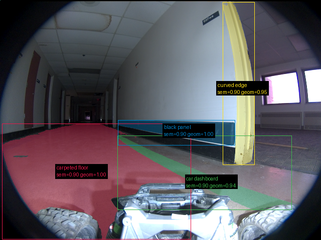

**scene_type:** corridor · **regiões canônicas:** 43 (4 publicadas, 39 contexto estrutural) · **relações:** 210 · **falhas de interpretação:** 0 · **audit:** ✅ pass (47 warnings)

## corridor-02-02156

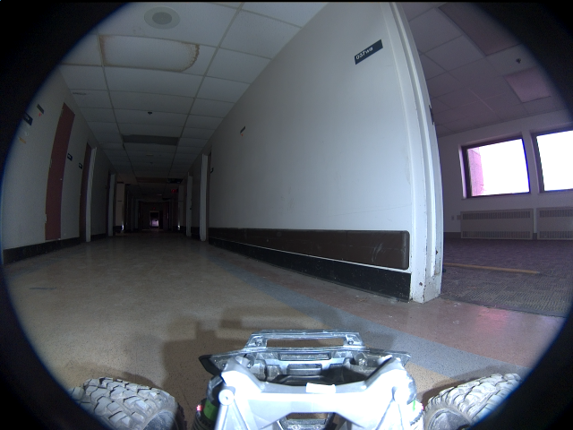

**scene_type:** corridor · **regiões canônicas:** 0 (0 publicadas, 0 contexto estrutural) · **relações:** 0 · **falhas de interpretação:** 0 · **audit:** ✅ pass (0 warnings)

## corridor-02-02163

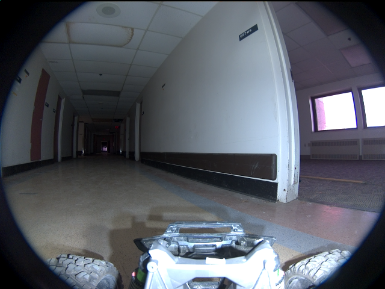

**scene_type:** corridor · **regiões canônicas:** 0 (0 publicadas, 0 contexto estrutural) · **relações:** 0 · **falhas de interpretação:** 0 · **audit:** ✅ pass (0 warnings)

## corridor-02-02171

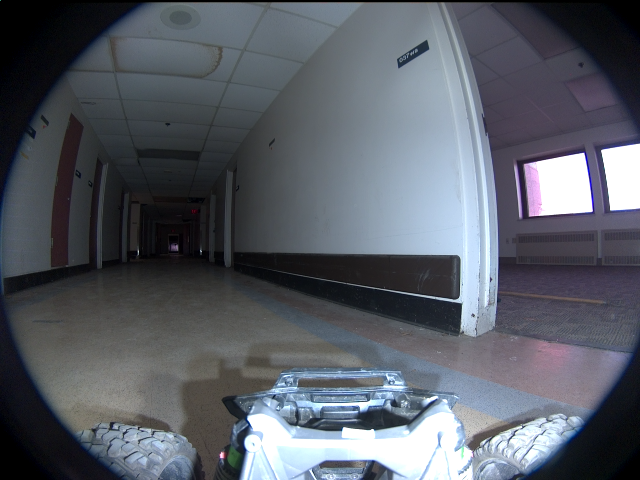

**scene_type:** corridor · **regiões canônicas:** 0 (0 publicadas, 0 contexto estrutural) · **relações:** 0 · **falhas de interpretação:** 0 · **audit:** ✅ pass (0 warnings)

## corridor-02-02179

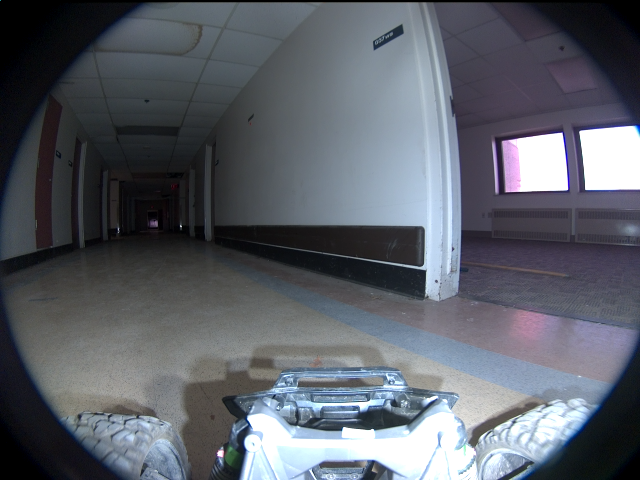

**scene_type:** corridor · **regiões canônicas:** 0 (0 publicadas, 0 contexto estrutural) · **relações:** 0 · **falhas de interpretação:** 0 · **audit:** ✅ pass (0 warnings)

## corridor-02-02188

**scene_type:** corridor · **regiões canônicas:** 0 (0 publicadas, 0 contexto estrutural) · **relações:** 0 · **falhas de interpretação:** 0 · **audit:** ✅ pass (0 warnings)

## corridor-02-02196

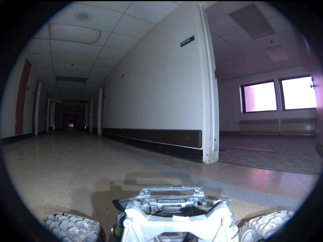

**scene_type:** corridor · **regiões canônicas:** 0 (0 publicadas, 0 contexto estrutural) · **relações:** 0 · **falhas de interpretação:** 0 · **audit:** ✅ pass (0 warnings)

## corridor-02-02203

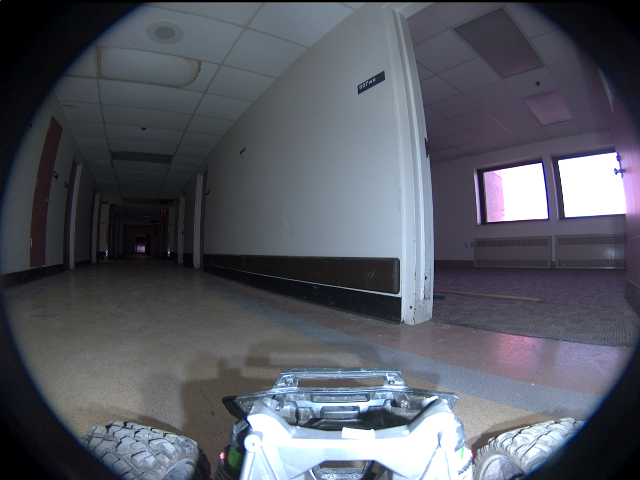

**scene_type:** corridor · **regiões canônicas:** 0 (0 publicadas, 0 contexto estrutural) · **relações:** 0 · **falhas de interpretação:** 0 · **audit:** ✅ pass (0 warnings)

## corridor-02-02211

**scene_type:** corridor · **regiões canônicas:** 0 (0 publicadas, 0 contexto estrutural) · **relações:** 0 · **falhas de interpretação:** 0 · **audit:** ✅ pass (0 warnings)

## corridor-02-02219

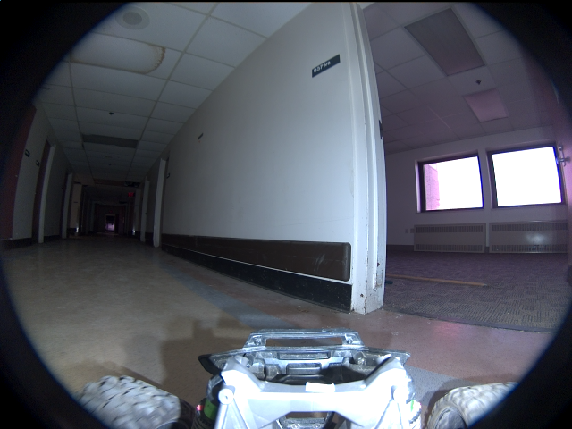

**scene_type:** corridor · **regiões canônicas:** 0 (0 publicadas, 0 contexto estrutural) · **relações:** 0 · **falhas de interpretação:** 0 · **audit:** ✅ pass (0 warnings)

## corridor-02-02228

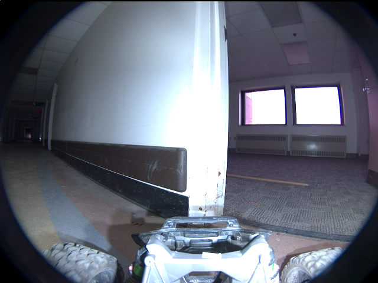

**scene_type:** corridor · **regiões canônicas:** 0 (0 publicadas, 0 contexto estrutural) · **relações:** 0 · **falhas de interpretação:** 0 · **audit:** ✅ pass (0 warnings)

## corridor-02-02236

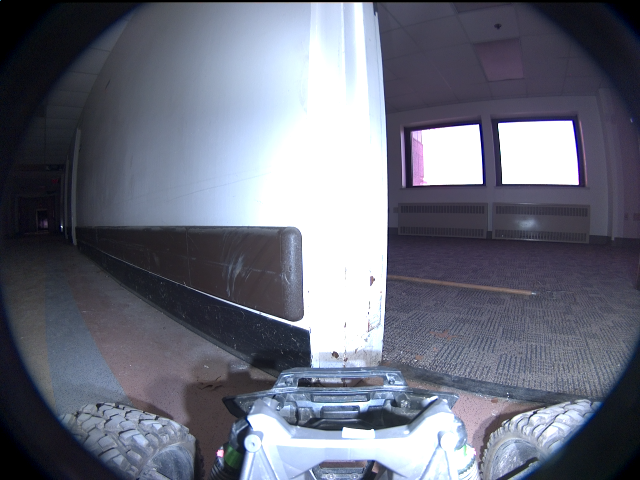

**scene_type:** office · **regiões canônicas:** 0 (0 publicadas, 0 contexto estrutural) · **relações:** 0 · **falhas de interpretação:** 0 · **audit:** ✅ pass (0 warnings)

## corridor-02-02244

**scene_type:** corridor · **regiões canônicas:** 0 (0 publicadas, 0 contexto estrutural) · **relações:** 0 · **falhas de interpretação:** 0 · **audit:** ✅ pass (0 warnings)

## corridor-02-02251

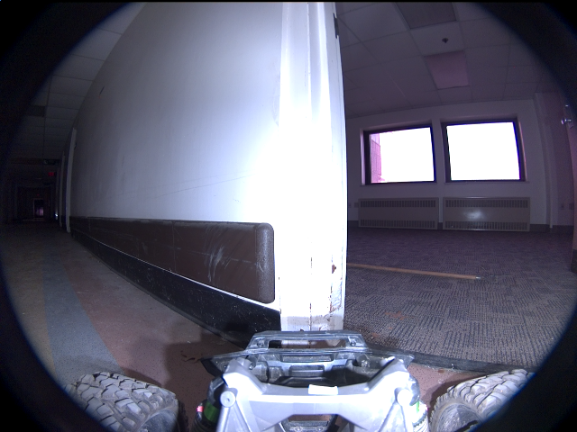

**scene_type:** airport · **regiões canônicas:** 0 (0 publicadas, 0 contexto estrutural) · **relações:** 0 · **falhas de interpretação:** 0 · **audit:** ✅ pass (0 warnings)

## corridor-02-02259

**scene_type:** corridor · **regiões canônicas:** 0 (0 publicadas, 0 contexto estrutural) · **relações:** 0 · **falhas de interpretação:** 0 · **audit:** ✅ pass (0 warnings)

## corridor-02-02267

**scene_type:** corridor · **regiões canônicas:** 0 (0 publicadas, 0 contexto estrutural) · **relações:** 0 · **falhas de interpretação:** 0 · **audit:** ✅ pass (0 warnings)

## corridor-02-02276

**scene_type:** corridor · **regiões canônicas:** 0 (0 publicadas, 0 contexto estrutural) · **relações:** 0 · **falhas de interpretação:** 0 · **audit:** ✅ pass (0 warnings)

## corridor-02-02284

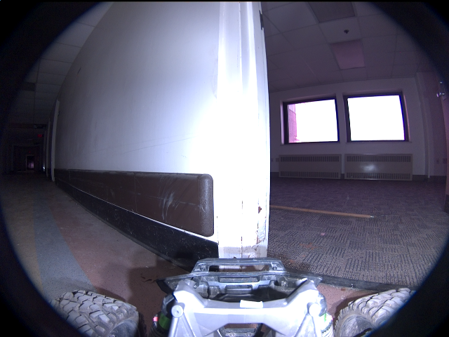

**scene_type:** corridor · **regiões canônicas:** 0 (0 publicadas, 0 contexto estrutural) · **relações:** 0 · **falhas de interpretação:** 0 · **audit:** ✅ pass (0 warnings)

## corridor-02-02291

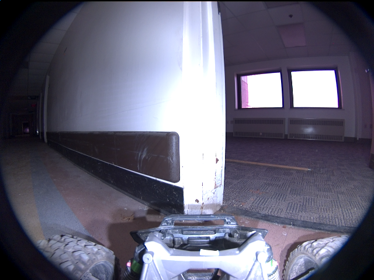

**scene_type:** corridor · **regiões canônicas:** 0 (0 publicadas, 0 contexto estrutural) · **relações:** 0 · **falhas de interpretação:** 0 · **audit:** ✅ pass (0 warnings)

## corridor-02-02299

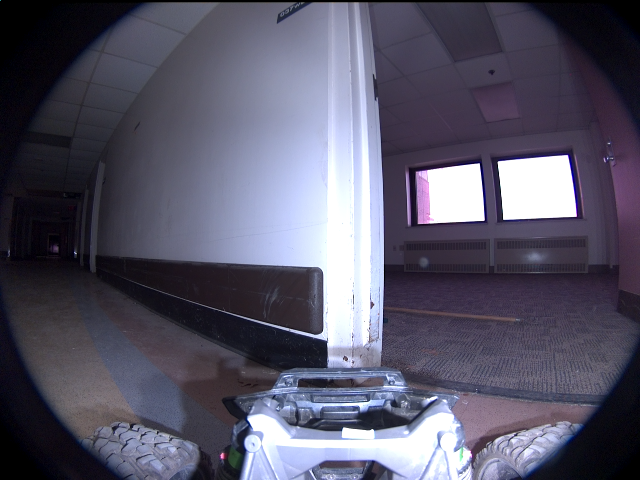

**scene_type:** corridor · **regiões canônicas:** 0 (0 publicadas, 0 contexto estrutural) · **relações:** 0 · **falhas de interpretação:** 0 · **audit:** ✅ pass (0 warnings)

## corridor-02-02307

**scene_type:** corridor · **regiões canônicas:** 0 (0 publicadas, 0 contexto estrutural) · **relações:** 0 · **falhas de interpretação:** 0 · **audit:** ✅ pass (0 warnings)

## corridor-02-02316

**scene_type:** corridor · **regiões canônicas:** 0 (0 publicadas, 0 contexto estrutural) · **relações:** 0 · **falhas de interpretação:** 0 · **audit:** ✅ pass (0 warnings)

## corridor-02-02324

**scene_type:** corridor · **regiões canônicas:** 0 (0 publicadas, 0 contexto estrutural) · **relações:** 0 · **falhas de interpretação:** 0 · **audit:** ✅ pass (0 warnings)

## corridor-02-02332

**scene_type:** corridor · **regiões canônicas:** 0 (0 publicadas, 0 contexto estrutural) · **relações:** 0 · **falhas de interpretação:** 0 · **audit:** ✅ pass (0 warnings)

## corridor-02-02339

**scene_type:** corridor · **regiões canônicas:** 0 (0 publicadas, 0 contexto estrutural) · **relações:** 0 · **falhas de interpretação:** 0 · **audit:** ✅ pass (0 warnings)

## corridor-02-02347

**scene_type:** corridor · **regiões canônicas:** 0 (0 publicadas, 0 contexto estrutural) · **relações:** 0 · **falhas de interpretação:** 0 · **audit:** ✅ pass (0 warnings)

## corridor-02-02355

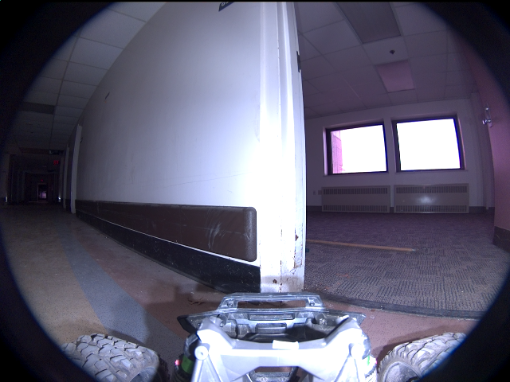

**scene_type:** corridor · **regiões canônicas:** 0 (0 publicadas, 0 contexto estrutural) · **relações:** 0 · **falhas de interpretação:** 0 · **audit:** ✅ pass (0 warnings)

## corridor-02-02364

**scene_type:** corridor · **regiões canônicas:** 0 (0 publicadas, 0 contexto estrutural) · **relações:** 0 · **falhas de interpretação:** 0 · **audit:** ✅ pass (0 warnings)

## corridor-02-02371

**scene_type:** corridor · **regiões canônicas:** 0 (0 publicadas, 0 contexto estrutural) · **relações:** 0 · **falhas de interpretação:** 0 · **audit:** ✅ pass (0 warnings)

## corridor-02-02379

**scene_type:** corridor · **regiões canônicas:** 0 (0 publicadas, 0 contexto estrutural) · **relações:** 0 · **falhas de interpretação:** 0 · **audit:** ✅ pass (0 warnings)

## corridor-02-02387

**scene_type:** corridor · **regiões canônicas:** 0 (0 publicadas, 0 contexto estrutural) · **relações:** 0 · **falhas de interpretação:** 0 · **audit:** ✅ pass (0 warnings)
