# Validação do pipeline real — 20260913T152945Z

Revisão: `d947b60` · Frames: 31 · Pico de VRAM: 6.01 GB (budget: 8.0 GB) · Pico de RSS do host: 9.94 GB

Ver `manifest.json` para configuração completa e log de estágios.

## corridor-02-04292

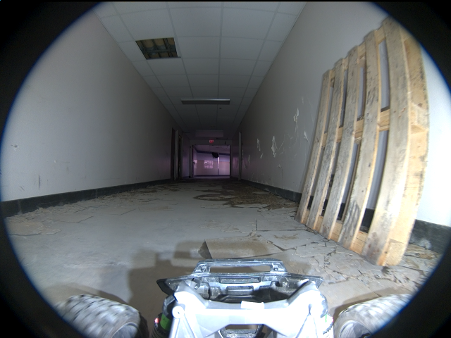

**scene_type:** corridor · **regiões canônicas:** 0 (0 publicadas, 0 contexto estrutural) · **relações:** 0 · **falhas de interpretação:** 0 · **audit:** ✅ pass (0 warnings)

## corridor-02-04300

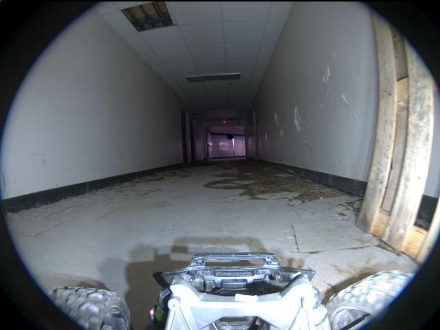

**scene_type:** corridor · **regiões canônicas:** 0 (0 publicadas, 0 contexto estrutural) · **relações:** 0 · **falhas de interpretação:** 0 · **audit:** ✅ pass (0 warnings)

## corridor-02-04308

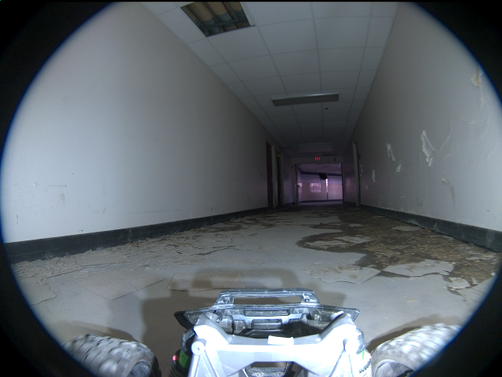

**scene_type:** corridor · **regiões canônicas:** 0 (0 publicadas, 0 contexto estrutural) · **relações:** 0 · **falhas de interpretação:** 0 · **audit:** ✅ pass (0 warnings)

## corridor-02-04315

**scene_type:** corridor · **regiões canônicas:** 0 (0 publicadas, 0 contexto estrutural) · **relações:** 0 · **falhas de interpretação:** 0 · **audit:** ✅ pass (0 warnings)

## corridor-02-04324

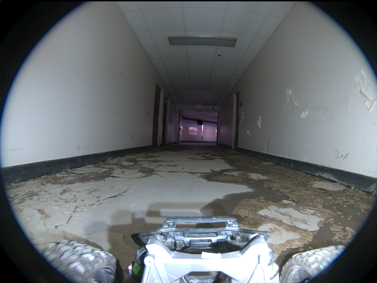

**scene_type:** corridor · **regiões canônicas:** 0 (0 publicadas, 0 contexto estrutural) · **relações:** 0 · **falhas de interpretação:** 0 · **audit:** ✅ pass (0 warnings)

## corridor-02-04332

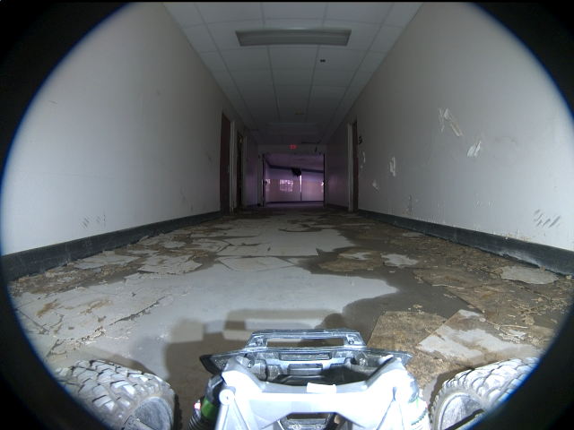

**scene_type:** corridor · **regiões canônicas:** 0 (0 publicadas, 0 contexto estrutural) · **relações:** 0 · **falhas de interpretação:** 0 · **audit:** ✅ pass (0 warnings)

## corridor-02-04340

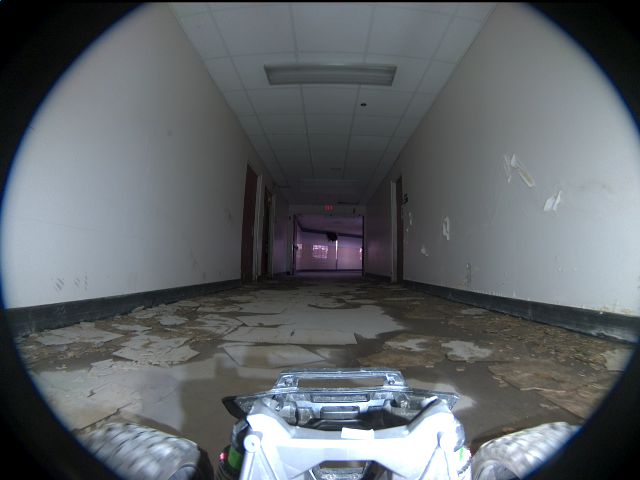

**scene_type:** corridor · **regiões canônicas:** 0 (0 publicadas, 0 contexto estrutural) · **relações:** 0 · **falhas de interpretação:** 0 · **audit:** ✅ pass (0 warnings)

## corridor-02-04348

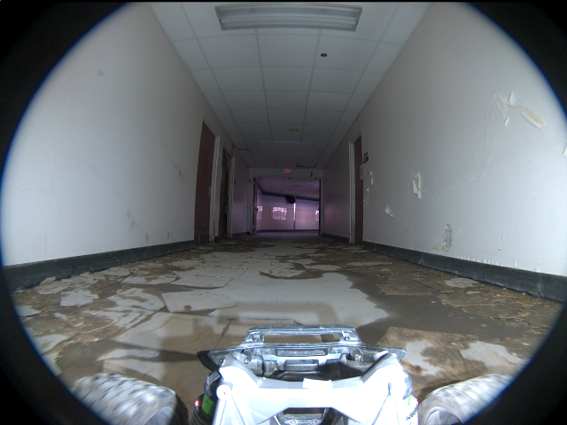

**scene_type:** corridor · **regiões canônicas:** 0 (0 publicadas, 0 contexto estrutural) · **relações:** 0 · **falhas de interpretação:** 0 · **audit:** ✅ pass (0 warnings)

## corridor-02-04355

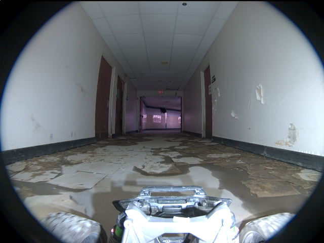

**scene_type:** corridor · **regiões canônicas:** 0 (0 publicadas, 0 contexto estrutural) · **relações:** 0 · **falhas de interpretação:** 0 · **audit:** ✅ pass (0 warnings)

## corridor-02-04363

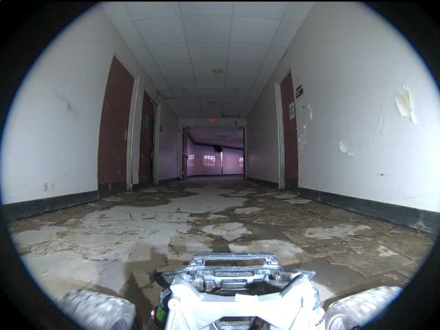

**scene_type:** corridor · **regiões canônicas:** 0 (0 publicadas, 0 contexto estrutural) · **relações:** 0 · **falhas de interpretação:** 0 · **audit:** ✅ pass (0 warnings)

## corridor-02-04372

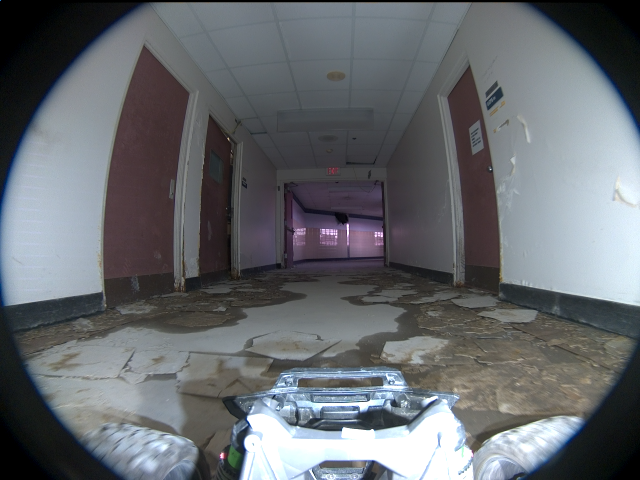

**scene_type:** corridor · **regiões canônicas:** 0 (0 publicadas, 0 contexto estrutural) · **relações:** 0 · **falhas de interpretação:** 0 · **audit:** ✅ pass (0 warnings)

## corridor-02-04380

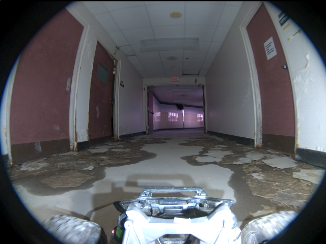

**scene_type:** corridor · **regiões canônicas:** 0 (0 publicadas, 0 contexto estrutural) · **relações:** 0 · **falhas de interpretação:** 0 · **audit:** ✅ pass (0 warnings)

## corridor-02-04388

**scene_type:** corridor · **regiões canônicas:** 0 (0 publicadas, 0 contexto estrutural) · **relações:** 0 · **falhas de interpretação:** 0 · **audit:** ✅ pass (0 warnings)

## corridor-02-04395

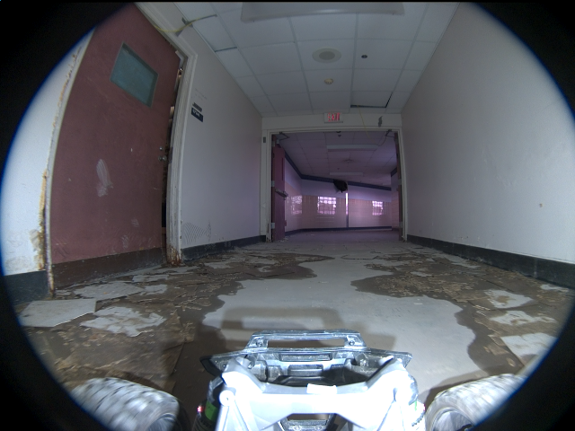

**scene_type:** indoor · **regiões canônicas:** 0 (0 publicadas, 0 contexto estrutural) · **relações:** 0 · **falhas de interpretação:** 0 · **audit:** ✅ pass (0 warnings)

## corridor-02-04403

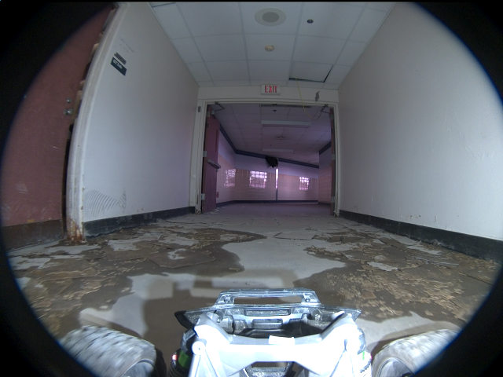

**scene_type:** indoor · **regiões canônicas:** 0 (0 publicadas, 0 contexto estrutural) · **relações:** 0 · **falhas de interpretação:** 0 · **audit:** ✅ pass (0 warnings)

## corridor-02-04412

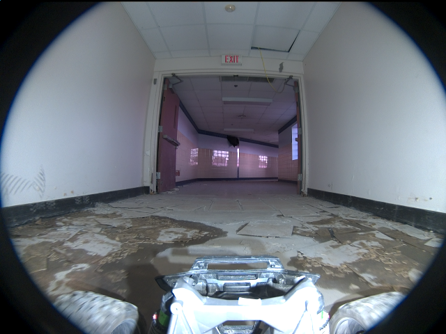

**scene_type:** indoor · **regiões canônicas:** 0 (0 publicadas, 0 contexto estrutural) · **relações:** 0 · **falhas de interpretação:** 0 · **audit:** ✅ pass (0 warnings)

## corridor-02-04420

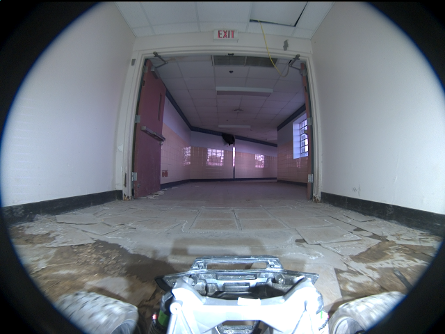

**scene_type:** indoor · **regiões canônicas:** 0 (0 publicadas, 0 contexto estrutural) · **relações:** 0 · **falhas de interpretação:** 0 · **audit:** ✅ pass (0 warnings)

## corridor-02-04427

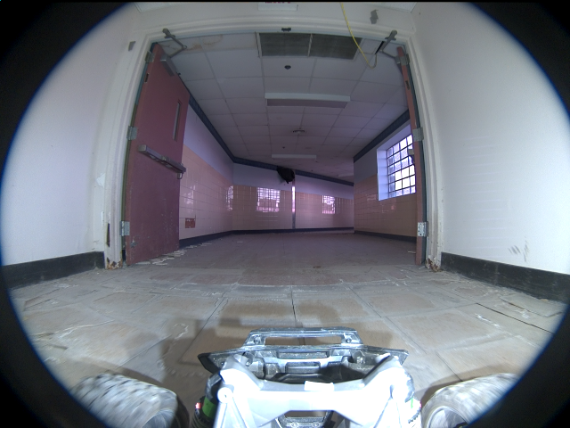

**scene_type:** indoor · **regiões canônicas:** 0 (0 publicadas, 0 contexto estrutural) · **relações:** 0 · **falhas de interpretação:** 0 · **audit:** ✅ pass (0 warnings)

## corridor-02-04435

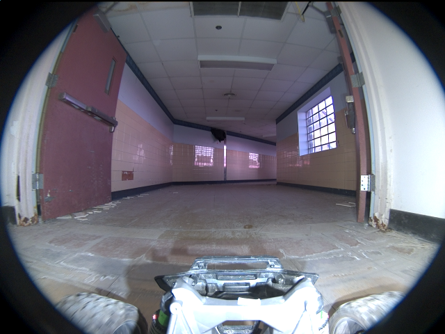

**scene_type:** indoor · **regiões canônicas:** 0 (0 publicadas, 0 contexto estrutural) · **relações:** 0 · **falhas de interpretação:** 0 · **audit:** ✅ pass (0 warnings)

## corridor-02-04443

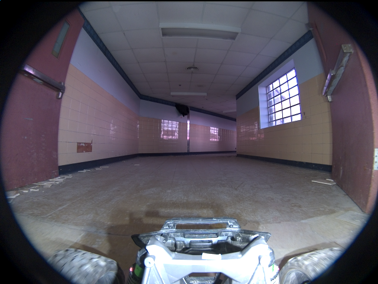

**scene_type:** indoor · **regiões canônicas:** 0 (0 publicadas, 0 contexto estrutural) · **relações:** 0 · **falhas de interpretação:** 0 · **audit:** ✅ pass (0 warnings)

## corridor-02-04451

**scene_type:** indoor · **regiões canônicas:** 0 (0 publicadas, 0 contexto estrutural) · **relações:** 0 · **falhas de interpretação:** 0 · **audit:** ✅ pass (0 warnings)

## corridor-02-04460

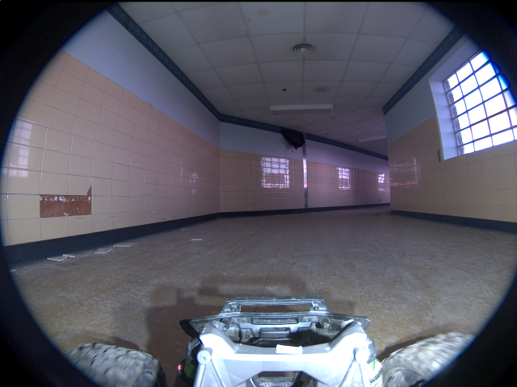

**scene_type:** indoor · **regiões canônicas:** 0 (0 publicadas, 0 contexto estrutural) · **relações:** 0 · **falhas de interpretação:** 0 · **audit:** ✅ pass (0 warnings)

## corridor-02-04468

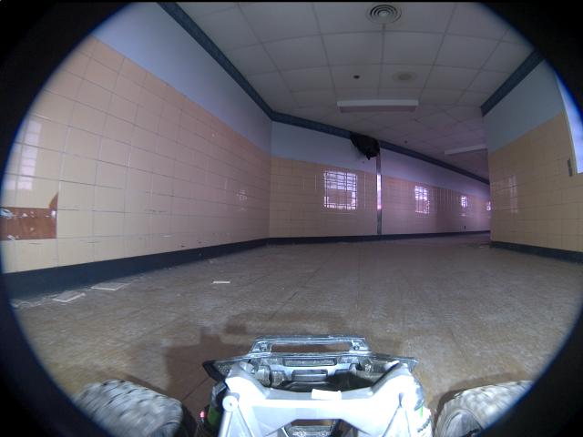

**scene_type:** indoor · **regiões canônicas:** 0 (0 publicadas, 0 contexto estrutural) · **relações:** 0 · **falhas de interpretação:** 0 · **audit:** ✅ pass (0 warnings)

## corridor-02-04476

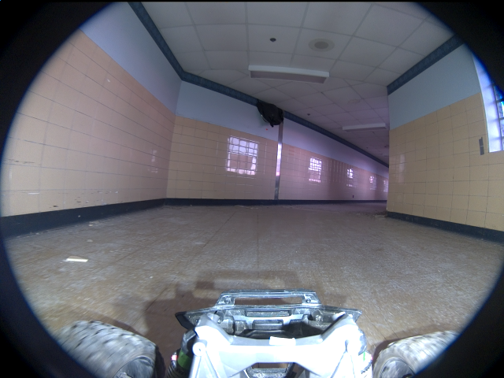

**scene_type:** indoor · **regiões canônicas:** 0 (0 publicadas, 0 contexto estrutural) · **relações:** 0 · **falhas de interpretação:** 0 · **audit:** ✅ pass (0 warnings)

## corridor-02-04483

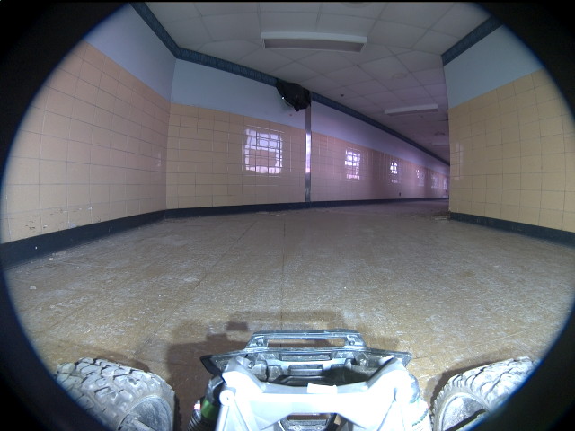

**scene_type:** indoor · **regiões canônicas:** 0 (0 publicadas, 0 contexto estrutural) · **relações:** 0 · **falhas de interpretação:** 0 · **audit:** ✅ pass (0 warnings)

## corridor-02-04491

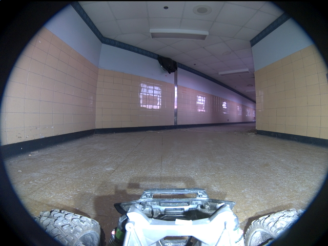

**scene_type:** indoor · **regiões canônicas:** 0 (0 publicadas, 0 contexto estrutural) · **relações:** 0 · **falhas de interpretação:** 0 · **audit:** ✅ pass (0 warnings)

## corridor-02-04500

**scene_type:** indoor · **regiões canônicas:** 0 (0 publicadas, 0 contexto estrutural) · **relações:** 0 · **falhas de interpretação:** 0 · **audit:** ✅ pass (0 warnings)

## corridor-02-04508

**scene_type:** indoor · **regiões canônicas:** 0 (0 publicadas, 0 contexto estrutural) · **relações:** 0 · **falhas de interpretação:** 0 · **audit:** ✅ pass (0 warnings)

## corridor-02-04516

**scene_type:** indoor · **regiões canônicas:** 0 (0 publicadas, 0 contexto estrutural) · **relações:** 0 · **falhas de interpretação:** 0 · **audit:** ✅ pass (0 warnings)

## corridor-02-04524

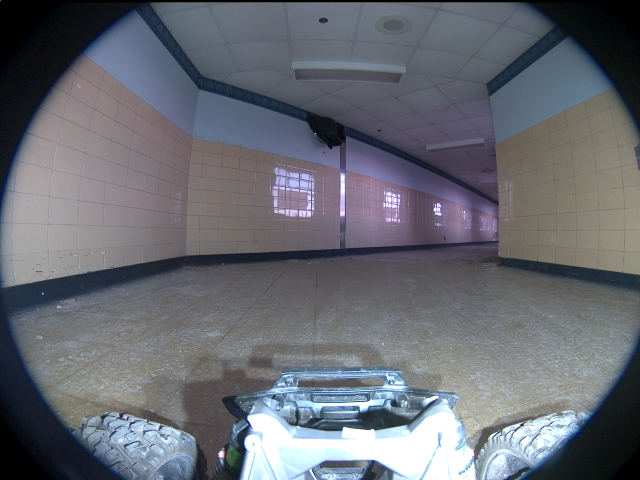

**scene_type:** indoor · **regiões canônicas:** 0 (0 publicadas, 0 contexto estrutural) · **relações:** 0 · **falhas de interpretação:** 0 · **audit:** ✅ pass (0 warnings)

## corridor-02-04531

**scene_type:** indoor · **regiões canônicas:** 0 (0 publicadas, 0 contexto estrutural) · **relações:** 0 · **falhas de interpretação:** 0 · **audit:** ✅ pass (0 warnings)
