# Validação do pipeline real — 20260913T154046Z

Revisão: `d947b60` · Frames: 31 · Pico de VRAM: 6.01 GB (budget: 8.0 GB) · Pico de RSS do host: 9.94 GB

Ver `manifest.json` para configuração completa e log de estágios.

## corridor-02-06436

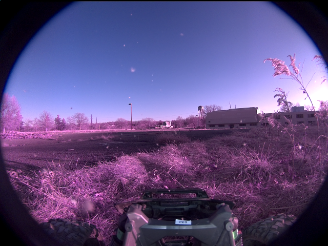

**scene_type:** rural · **regiões canônicas:** 0 (0 publicadas, 0 contexto estrutural) · **relações:** 0 · **falhas de interpretação:** 0 · **audit:** ✅ pass (0 warnings)

## corridor-02-06444

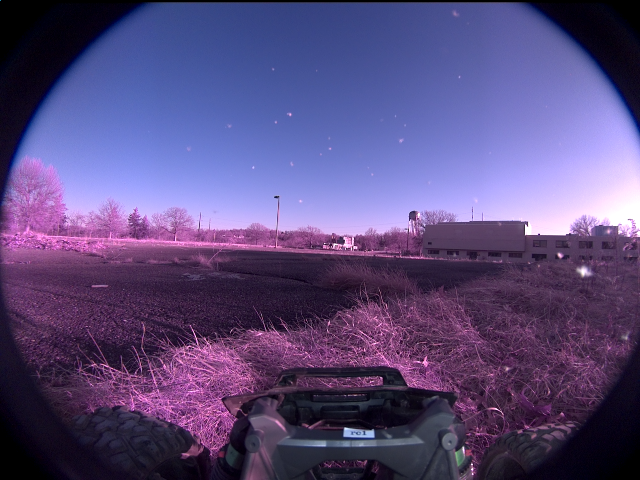

**scene_type:** rural · **regiões canônicas:** 0 (0 publicadas, 0 contexto estrutural) · **relações:** 0 · **falhas de interpretação:** 0 · **audit:** ✅ pass (0 warnings)

## corridor-02-06452

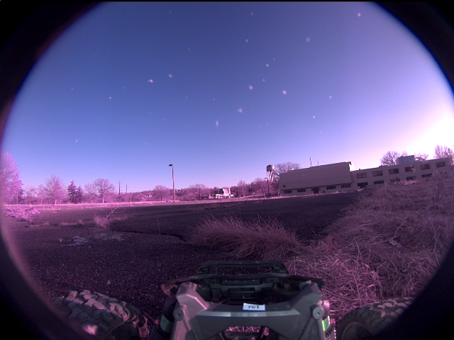

**scene_type:** rural · **regiões canônicas:** 0 (0 publicadas, 0 contexto estrutural) · **relações:** 0 · **falhas de interpretação:** 0 · **audit:** ✅ pass (0 warnings)

## corridor-02-06460

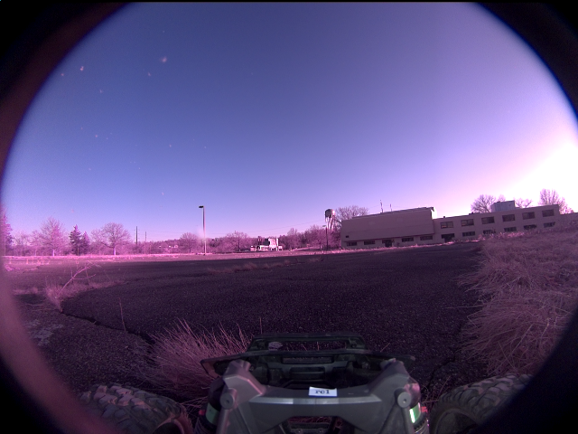

**scene_type:** rural · **regiões canônicas:** 0 (0 publicadas, 0 contexto estrutural) · **relações:** 0 · **falhas de interpretação:** 0 · **audit:** ✅ pass (0 warnings)

## corridor-02-06468

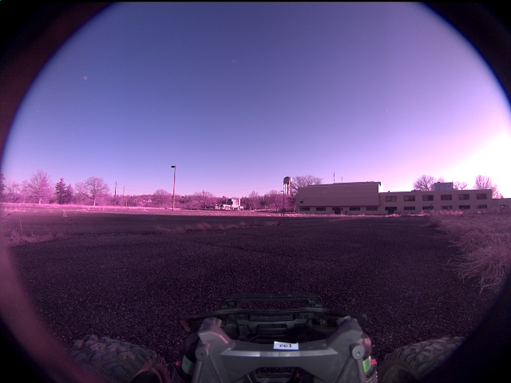

**scene_type:** rural · **regiões canônicas:** 0 (0 publicadas, 0 contexto estrutural) · **relações:** 0 · **falhas de interpretação:** 0 · **audit:** ✅ pass (0 warnings)

## corridor-02-06476

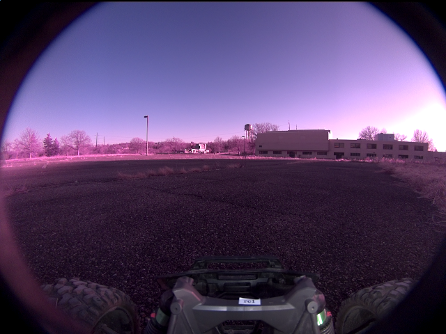

**scene_type:** industrial · **regiões canônicas:** 0 (0 publicadas, 0 contexto estrutural) · **relações:** 0 · **falhas de interpretação:** 0 · **audit:** ✅ pass (0 warnings)

## corridor-02-06484

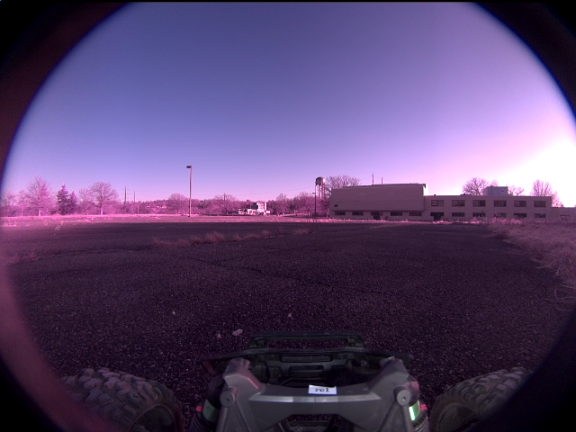

**scene_type:** open field · **regiões canônicas:** 0 (0 publicadas, 0 contexto estrutural) · **relações:** 0 · **falhas de interpretação:** 0 · **audit:** ✅ pass (0 warnings)

## corridor-02-06492

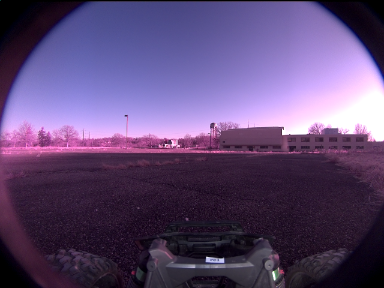

**scene_type:** industrial · **regiões canônicas:** 0 (0 publicadas, 0 contexto estrutural) · **relações:** 0 · **falhas de interpretação:** 0 · **audit:** ✅ pass (0 warnings)

## corridor-02-06499

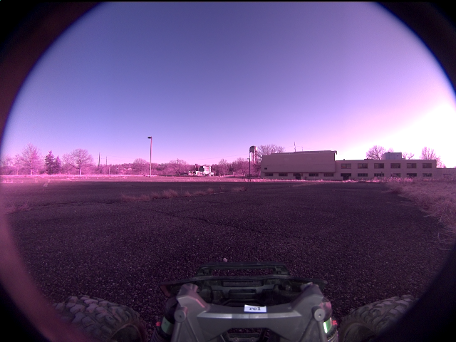

**scene_type:** open field · **regiões canônicas:** 0 (0 publicadas, 0 contexto estrutural) · **relações:** 0 · **falhas de interpretação:** 0 · **audit:** ✅ pass (0 warnings)

## corridor-02-06508

**scene_type:** rural · **regiões canônicas:** 0 (0 publicadas, 0 contexto estrutural) · **relações:** 0 · **falhas de interpretação:** 0 · **audit:** ✅ pass (0 warnings)

## corridor-02-06516

**scene_type:** agricultural · **regiões canônicas:** 0 (0 publicadas, 0 contexto estrutural) · **relações:** 0 · **falhas de interpretação:** 0 · **audit:** ✅ pass (0 warnings)

## corridor-02-06524

**scene_type:** agricultural · **regiões canônicas:** 0 (0 publicadas, 0 contexto estrutural) · **relações:** 0 · **falhas de interpretação:** 0 · **audit:** ✅ pass (0 warnings)

## corridor-02-06532

**scene_type:** rural · **regiões canônicas:** 0 (0 publicadas, 0 contexto estrutural) · **relações:** 0 · **falhas de interpretação:** 0 · **audit:** ✅ pass (0 warnings)

## corridor-02-06540

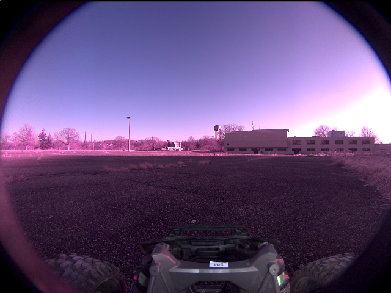

**scene_type:** rural · **regiões canônicas:** 0 (0 publicadas, 0 contexto estrutural) · **relações:** 0 · **falhas de interpretação:** 0 · **audit:** ✅ pass (0 warnings)

## corridor-02-06547

**scene_type:** agricultural · **regiões canônicas:** 0 (0 publicadas, 0 contexto estrutural) · **relações:** 0 · **falhas de interpretação:** 0 · **audit:** ✅ pass (0 warnings)

## corridor-02-06556

**scene_type:** rural · **regiões canônicas:** 0 (0 publicadas, 0 contexto estrutural) · **relações:** 0 · **falhas de interpretação:** 0 · **audit:** ✅ pass (0 warnings)

## corridor-02-06564

**scene_type:** industrial · **regiões canônicas:** 0 (0 publicadas, 0 contexto estrutural) · **relações:** 0 · **falhas de interpretação:** 0 · **audit:** ✅ pass (0 warnings)

## corridor-02-06572

**scene_type:** agricultural · **regiões canônicas:** 0 (0 publicadas, 0 contexto estrutural) · **relações:** 0 · **falhas de interpretação:** 0 · **audit:** ✅ pass (0 warnings)

## corridor-02-06580

**scene_type:** industrial · **regiões canônicas:** 0 (0 publicadas, 0 contexto estrutural) · **relações:** 0 · **falhas de interpretação:** 0 · **audit:** ✅ pass (0 warnings)

## corridor-02-06587

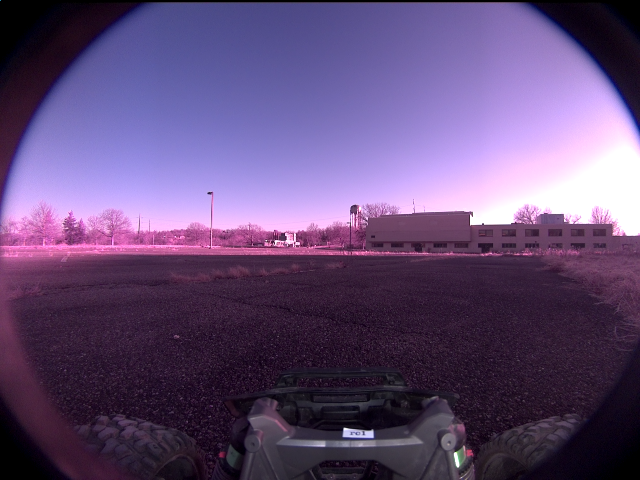

**scene_type:** rural · **regiões canônicas:** 0 (0 publicadas, 0 contexto estrutural) · **relações:** 0 · **falhas de interpretação:** 0 · **audit:** ✅ pass (0 warnings)

## corridor-02-06596

**scene_type:** industrial · **regiões canônicas:** 0 (0 publicadas, 0 contexto estrutural) · **relações:** 0 · **falhas de interpretação:** 0 · **audit:** ✅ pass (0 warnings)

## corridor-02-06604

**scene_type:** agricultural · **regiões canônicas:** 0 (0 publicadas, 0 contexto estrutural) · **relações:** 0 · **falhas de interpretação:** 0 · **audit:** ✅ pass (0 warnings)

## corridor-02-06612

**scene_type:** industrial · **regiões canônicas:** 0 (0 publicadas, 0 contexto estrutural) · **relações:** 0 · **falhas de interpretação:** 0 · **audit:** ✅ pass (0 warnings)

## corridor-02-06620

**scene_type:** industrial · **regiões canônicas:** 0 (0 publicadas, 0 contexto estrutural) · **relações:** 0 · **falhas de interpretação:** 0 · **audit:** ✅ pass (0 warnings)

## corridor-02-06628

**scene_type:** industrial · **regiões canônicas:** 0 (0 publicadas, 0 contexto estrutural) · **relações:** 0 · **falhas de interpretação:** 0 · **audit:** ✅ pass (0 warnings)

## corridor-02-06635

**scene_type:** rural · **regiões canônicas:** 0 (0 publicadas, 0 contexto estrutural) · **relações:** 0 · **falhas de interpretação:** 0 · **audit:** ✅ pass (0 warnings)

## corridor-02-06644

**scene_type:** agricultural · **regiões canônicas:** 0 (0 publicadas, 0 contexto estrutural) · **relações:** 0 · **falhas de interpretação:** 0 · **audit:** ✅ pass (0 warnings)

## corridor-02-06652

**scene_type:** agricultural · **regiões canônicas:** 0 (0 publicadas, 0 contexto estrutural) · **relações:** 0 · **falhas de interpretação:** 0 · **audit:** ✅ pass (0 warnings)

## corridor-02-06660

**scene_type:** rural · **regiões canônicas:** 0 (0 publicadas, 0 contexto estrutural) · **relações:** 0 · **falhas de interpretação:** 0 · **audit:** ✅ pass (0 warnings)

## corridor-02-06668

**scene_type:** agricultural · **regiões canônicas:** 0 (0 publicadas, 0 contexto estrutural) · **relações:** 0 · **falhas de interpretação:** 0 · **audit:** ✅ pass (0 warnings)

## corridor-02-06675

**scene_type:** rural · **regiões canônicas:** 0 (0 publicadas, 0 contexto estrutural) · **relações:** 0 · **falhas de interpretação:** 0 · **audit:** ✅ pass (0 warnings)
