# Validação do pipeline real — 20260913T155117Z

Revisão: `d947b60` · Frames: 31 · Pico de VRAM: 6.01 GB (budget: 8.0 GB) · Pico de RSS do host: 9.95 GB

Ver `manifest.json` para configuração completa e log de estágios.

## corridor-02-08580

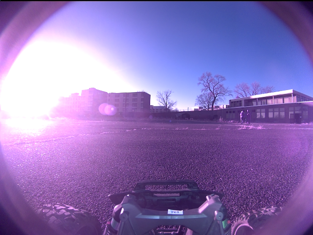

**scene_type:** urban · **regiões canônicas:** 0 (0 publicadas, 0 contexto estrutural) · **relações:** 0 · **falhas de interpretação:** 0 · **audit:** ✅ pass (0 warnings)

## corridor-02-08588

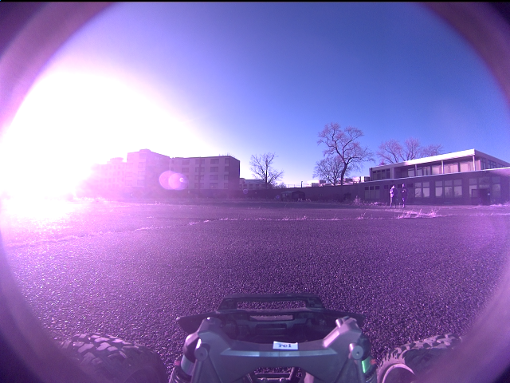

**scene_type:** urban · **regiões canônicas:** 0 (0 publicadas, 0 contexto estrutural) · **relações:** 0 · **falhas de interpretação:** 0 · **audit:** ✅ pass (0 warnings)

## corridor-02-08596

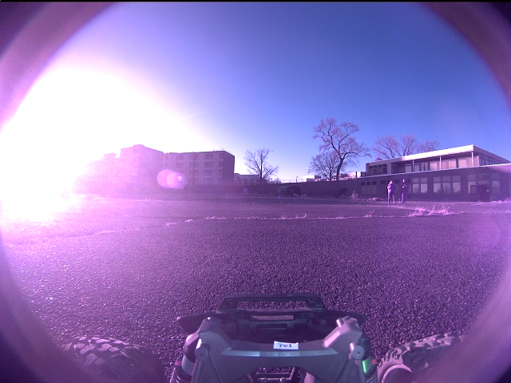

**scene_type:** urban · **regiões canônicas:** 0 (0 publicadas, 0 contexto estrutural) · **relações:** 0 · **falhas de interpretação:** 0 · **audit:** ✅ pass (0 warnings)

## corridor-02-08604

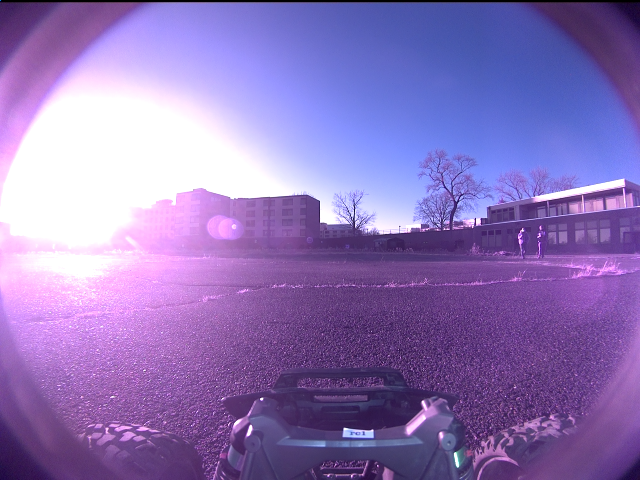

**scene_type:** urban · **regiões canônicas:** 0 (0 publicadas, 0 contexto estrutural) · **relações:** 0 · **falhas de interpretação:** 0 · **audit:** ✅ pass (0 warnings)

## corridor-02-08612

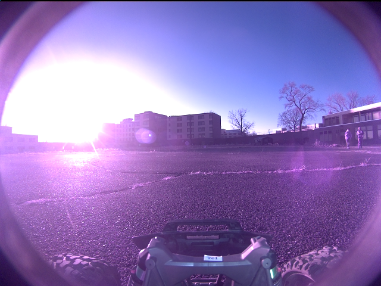

**scene_type:** urban · **regiões canônicas:** 0 (0 publicadas, 0 contexto estrutural) · **relações:** 0 · **falhas de interpretação:** 0 · **audit:** ✅ pass (0 warnings)

## corridor-02-08620

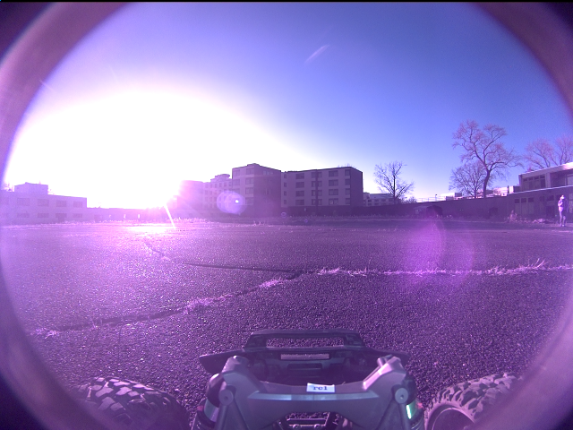

**scene_type:** urban · **regiões canônicas:** 0 (0 publicadas, 0 contexto estrutural) · **relações:** 0 · **falhas de interpretação:** 0 · **audit:** ✅ pass (0 warnings)

## corridor-02-08628

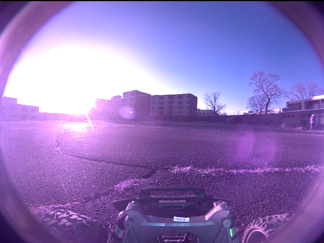

**scene_type:** open field · **regiões canônicas:** 0 (0 publicadas, 0 contexto estrutural) · **relações:** 0 · **falhas de interpretação:** 0 · **audit:** ✅ pass (0 warnings)

## corridor-02-08636

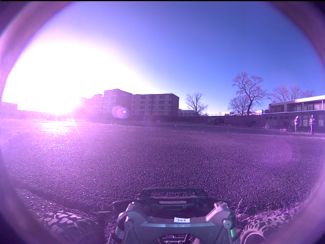

**scene_type:** urban · **regiões canônicas:** 0 (0 publicadas, 0 contexto estrutural) · **relações:** 0 · **falhas de interpretação:** 0 · **audit:** ✅ pass (0 warnings)

## corridor-02-08644

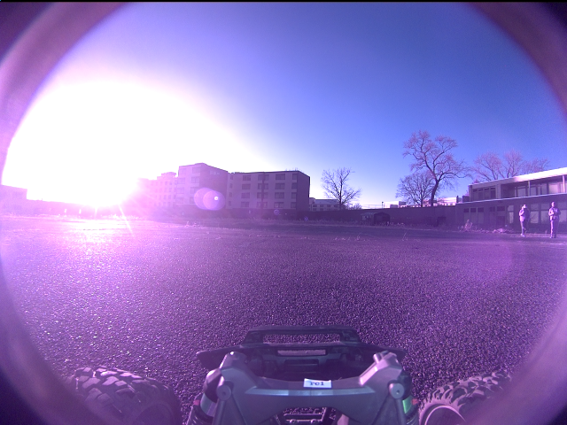

**scene_type:** park · **regiões canônicas:** 0 (0 publicadas, 0 contexto estrutural) · **relações:** 0 · **falhas de interpretação:** 0 · **audit:** ✅ pass (0 warnings)

## corridor-02-08652

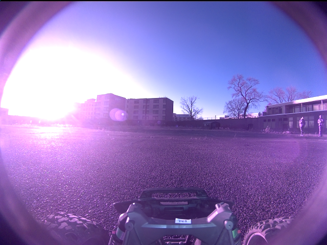

**scene_type:** urban · **regiões canônicas:** 0 (0 publicadas, 0 contexto estrutural) · **relações:** 0 · **falhas de interpretação:** 0 · **audit:** ✅ pass (0 warnings)

## corridor-02-08660

**scene_type:** urban · **regiões canônicas:** 0 (0 publicadas, 0 contexto estrutural) · **relações:** 0 · **falhas de interpretação:** 0 · **audit:** ✅ pass (0 warnings)

## corridor-02-08668

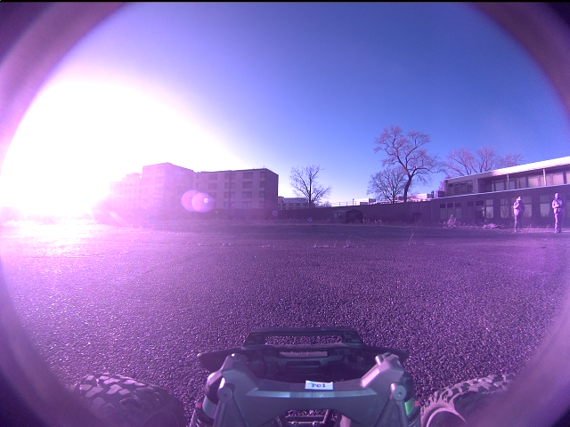

**scene_type:** urban · **regiões canônicas:** 0 (0 publicadas, 0 contexto estrutural) · **relações:** 0 · **falhas de interpretação:** 0 · **audit:** ✅ pass (0 warnings)

## corridor-02-08676

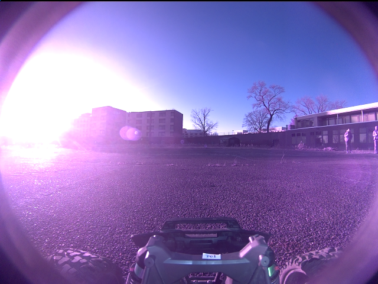

**scene_type:** urban · **regiões canônicas:** 0 (0 publicadas, 0 contexto estrutural) · **relações:** 0 · **falhas de interpretação:** 0 · **audit:** ✅ pass (0 warnings)

## corridor-02-08684

**scene_type:** urban · **regiões canônicas:** 0 (0 publicadas, 0 contexto estrutural) · **relações:** 0 · **falhas de interpretação:** 0 · **audit:** ✅ pass (0 warnings)

## corridor-02-08693

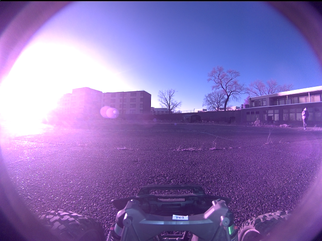

**scene_type:** urban · **regiões canônicas:** 0 (0 publicadas, 0 contexto estrutural) · **relações:** 0 · **falhas de interpretação:** 0 · **audit:** ✅ pass (0 warnings)

## corridor-02-08700

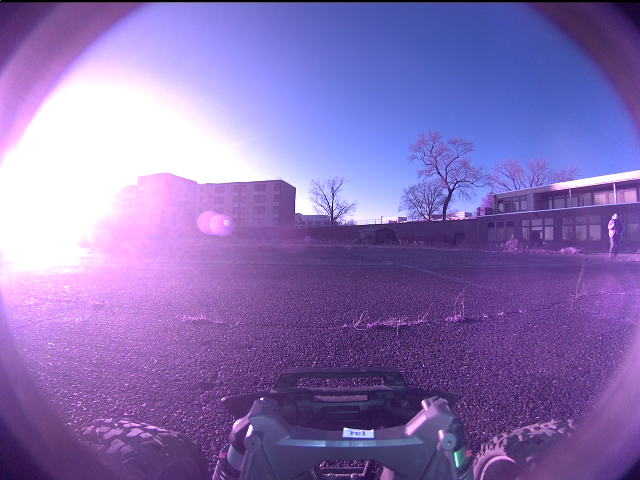

**scene_type:** urban · **regiões canônicas:** 0 (0 publicadas, 0 contexto estrutural) · **relações:** 0 · **falhas de interpretação:** 0 · **audit:** ✅ pass (0 warnings)

## corridor-02-08708

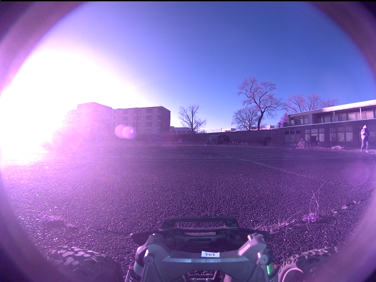

**scene_type:** urban · **regiões canônicas:** 0 (0 publicadas, 0 contexto estrutural) · **relações:** 0 · **falhas de interpretação:** 0 · **audit:** ✅ pass (0 warnings)

## corridor-02-08716

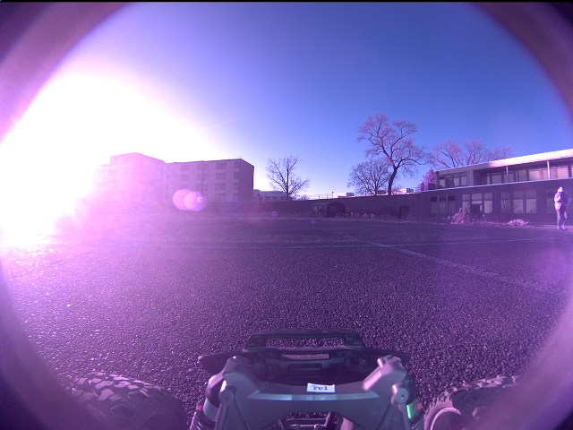

**scene_type:** park · **regiões canônicas:** 0 (0 publicadas, 0 contexto estrutural) · **relações:** 0 · **falhas de interpretação:** 0 · **audit:** ✅ pass (0 warnings)

## corridor-02-08724

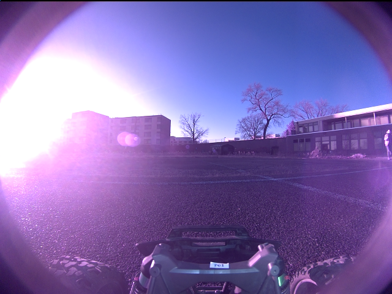

**scene_type:** urban · **regiões canônicas:** 0 (0 publicadas, 0 contexto estrutural) · **relações:** 0 · **falhas de interpretação:** 0 · **audit:** ✅ pass (0 warnings)

## corridor-02-08732

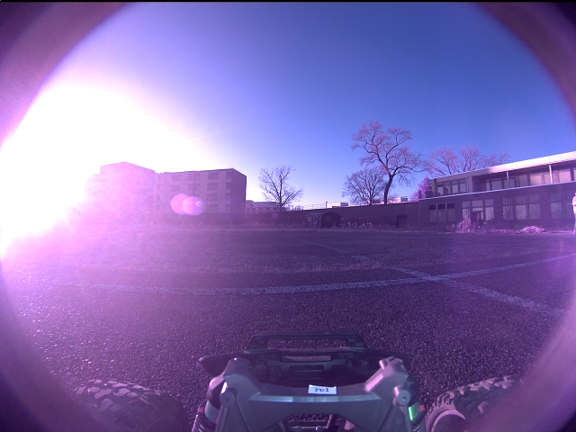

**scene_type:** urban · **regiões canônicas:** 0 (0 publicadas, 0 contexto estrutural) · **relações:** 0 · **falhas de interpretação:** 0 · **audit:** ✅ pass (0 warnings)

## corridor-02-08740

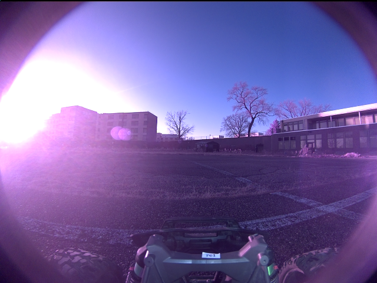

**scene_type:** urban · **regiões canônicas:** 0 (0 publicadas, 0 contexto estrutural) · **relações:** 0 · **falhas de interpretação:** 0 · **audit:** ✅ pass (0 warnings)

## corridor-02-08748

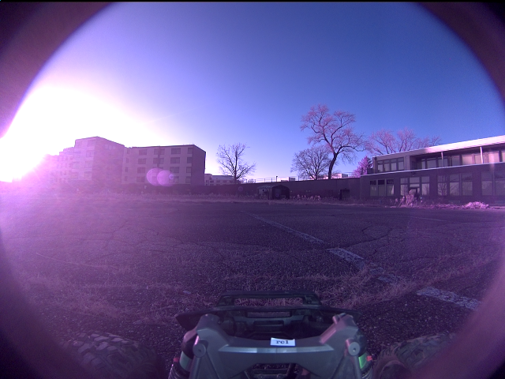

**scene_type:** urban · **regiões canônicas:** 0 (0 publicadas, 0 contexto estrutural) · **relações:** 0 · **falhas de interpretação:** 0 · **audit:** ✅ pass (0 warnings)

## corridor-02-08756

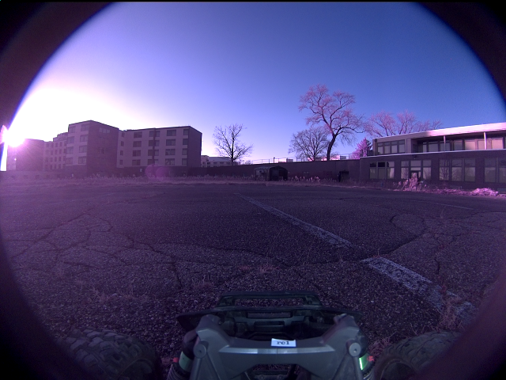

**scene_type:** urban · **regiões canônicas:** 0 (0 publicadas, 0 contexto estrutural) · **relações:** 0 · **falhas de interpretação:** 0 · **audit:** ✅ pass (0 warnings)

## corridor-02-08764

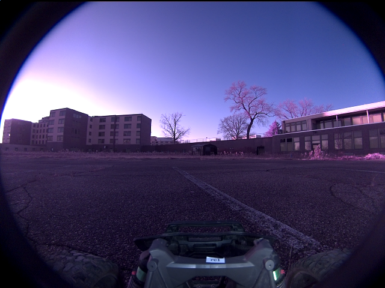

**scene_type:** urban · **regiões canônicas:** 0 (0 publicadas, 0 contexto estrutural) · **relações:** 0 · **falhas de interpretação:** 0 · **audit:** ✅ pass (0 warnings)

## corridor-02-08772

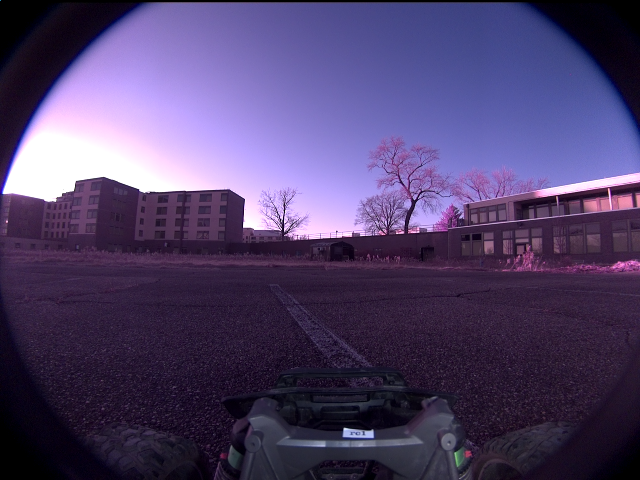

**scene_type:** urban · **regiões canônicas:** 0 (0 publicadas, 0 contexto estrutural) · **relações:** 0 · **falhas de interpretação:** 0 · **audit:** ✅ pass (0 warnings)

## corridor-02-08781

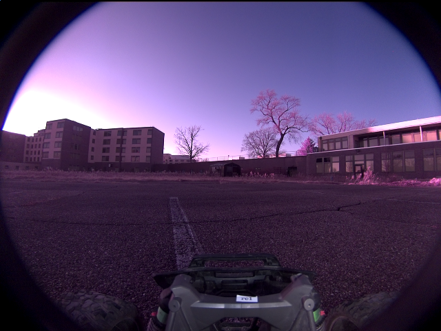

**scene_type:** urban · **regiões canônicas:** 0 (0 publicadas, 0 contexto estrutural) · **relações:** 0 · **falhas de interpretação:** 0 · **audit:** ✅ pass (0 warnings)

## corridor-02-08788

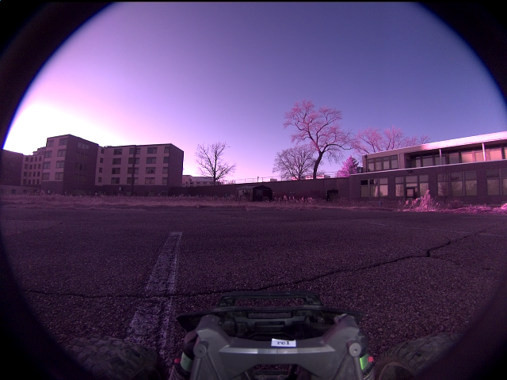

**scene_type:** urban · **regiões canônicas:** 0 (0 publicadas, 0 contexto estrutural) · **relações:** 0 · **falhas de interpretação:** 0 · **audit:** ✅ pass (0 warnings)

## corridor-02-08796

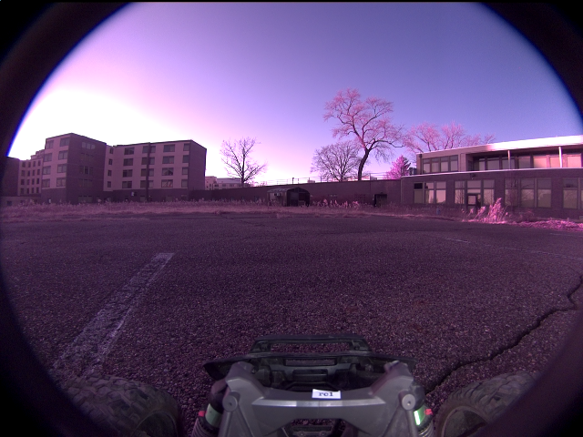

**scene_type:** urban · **regiões canônicas:** 0 (0 publicadas, 0 contexto estrutural) · **relações:** 0 · **falhas de interpretação:** 0 · **audit:** ✅ pass (0 warnings)

## corridor-02-08804

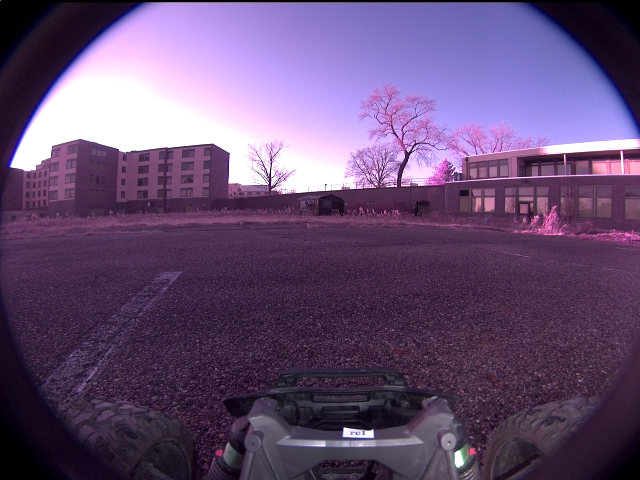

**scene_type:** urban · **regiões canônicas:** 0 (0 publicadas, 0 contexto estrutural) · **relações:** 0 · **falhas de interpretação:** 0 · **audit:** ✅ pass (0 warnings)

## corridor-02-08812

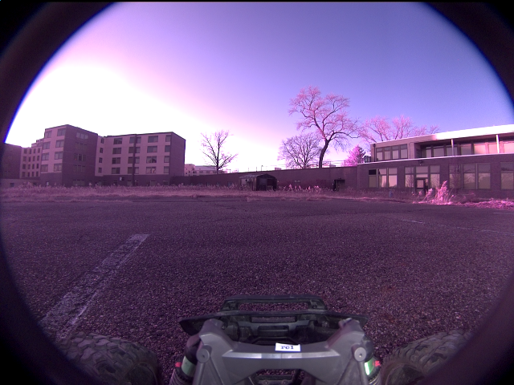

**scene_type:** urban · **regiões canônicas:** 0 (0 publicadas, 0 contexto estrutural) · **relações:** 0 · **falhas de interpretação:** 0 · **audit:** ✅ pass (0 warnings)

## corridor-02-08820

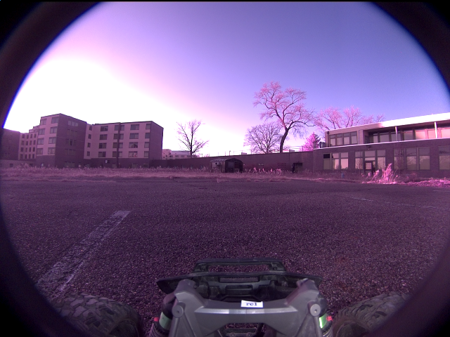

**scene_type:** urban · **regiões canônicas:** 0 (0 publicadas, 0 contexto estrutural) · **relações:** 0 · **falhas de interpretação:** 0 · **audit:** ✅ pass (0 warnings)
