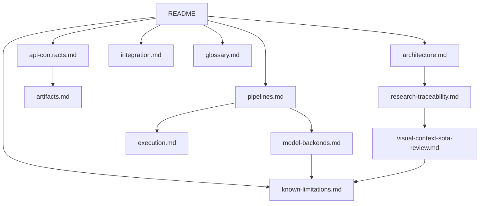

# Documentação de Visual Perception

`visual-perception` transforma uma observação RGB canônica em uma `VisualObservation`
estruturada, semântica, auditável e pronta para consumidores downstream.

A documentação foi organizada para permitir sair de uma intenção concreta e chegar ao
arquivo, contract ou estágio responsável, sem precisar primeiro percorrer todo o código.

## O módulo em uma linha

```text
RGB canônico
    -> regiões 2D
    -> features e embeddings
    -> claims semânticos
    -> relações candidatas
    -> VisualObservation + AuditResult
```

O módulo termina no domínio visual 2D. Associação com LiDAR, fusão temporal/3D, mapa,
memória espacial, scene graph e reasoning contextual pertencem aos módulos downstream.

## Por onde começar

| Quero entender | Comece por |
| --- | --- |
| o pipeline completo e onde alterar cada comportamento | [pipelines.md](pipelines.md) |
| onde cada responsabilidade pertence | [architecture.md](architecture.md) |
| os tipos que atravessam a API pública | [api-contracts.md](api-contracts.md) |
| como integrar entrada e consumidores downstream | [integration.md](integration.md) |
| quais modelos reais são usados e por quê | [model-backends.md](model-backends.md) |
| lifecycle, cache, fingerprints e runtime | [execution.md](execution.md) |
| serialização, embeddings e persistência | [artifacts.md](artifacts.md) |
| relação entre papers, decisões e implementação | [research-traceability.md](research-traceability.md) |
| a auditoria que motivou a arquitetura contextual atual | [visual-context-sota-review.md](visual-context-sota-review.md) |
| significado preciso dos termos | [glossary.md](glossary.md) |
| o que ainda falha, medido em run real | [known-limitations.md](known-limitations.md) |

## Rotas de leitura

### Quero modificar o pipeline

1. [pipelines.md](pipelines.md)
2. [architecture.md](architecture.md)
3. [api-contracts.md](api-contracts.md)

### Quero trocar ou testar um modelo

1. [model-backends.md](model-backends.md)
2. [execution.md](execution.md)
3. [pipelines.md](pipelines.md)

### Quero integrar outro módulo

1. [integration.md](integration.md)
2. [api-contracts.md](api-contracts.md)
3. [artifacts.md](artifacts.md)

### Quero justificar uma decisão no trabalho acadêmico

1. [research-traceability.md](research-traceability.md)
2. [model-backends.md](model-backends.md)
3. benchmark/avaliação que sustenta a afirmação

## Referência por necessidade

| Necessidade | Página | Seção útil |
| --- | --- | --- |
| encontrar o arquivo que controla um comportamento | [pipelines.md](pipelines.md) | `Quero mudar X` |
| decidir onde colocar código novo | [architecture.md](architecture.md) | `Quero adicionar X` |
| entender `ObservedRegion`, claims e confidence | [api-contracts.md](api-contracts.md) | contracts individuais |
| adaptar `CanonicalObservation` RGB | [integration.md](integration.md) | entrada vinda de adapters |
| conectar `sensor-association` | [integration.md](integration.md) | saída para `sensor-association` |
| trocar checkpoint/backend | [model-backends.md](model-backends.md) | índice operacional + capability |
| diagnosticar OOM/cache/runtime | [execution.md](execution.md) | `Quero diagnosticar X` |
| entender o que é persistido | [artifacts.md](artifacts.md) | tipos de artifact + ciclo de vida |
| saber se uma ideia veio de paper ou é decisão própria | [research-traceability.md](research-traceability.md) | mapa de influência + decisões próprias |
| saber se um comportamento estranho já é conhecido | [known-limitations.md](known-limitations.md) | item correspondente + issue dona |
| entender por que os estágios contextuais existem | [visual-context-sota-review.md](visual-context-sota-review.md) | o que foi medido antes de escrever código |

## Mapa da documentação



## Estado atual do módulo

O pipeline canônico, fakes determinísticos e adapters reais estão implementados.

A configuração real de referência para a RTX 3060 8GB foi selecionada pelo benchmark
#174:

| Capability | Referência atual |
| --- | --- |
| Region discovery | SAM ViT-H |
| Dense features | DINOv2-base |
| Language embedding | CLIP ViT-L/14 |
| Multimodal reasoning | Qwen2.5-VL-3B-Instruct em 4-bit |

O uso padrão continua sendo `backend="fake"`, portanto desenvolvimento e testes básicos
não exigem GPU.

A seleção de referência não é uma afirmação de ótimo universal. Ela representa o melhor
resultado observado sob o hardware, dataset e proxies usados no benchmark documentado.
Consulte [model-backends.md](model-backends.md) antes de comparar ou trocar checkpoints.

## Regra de manutenção da documentação

Quando uma mudança relevante for feita:

- mudança na ordem/semântica dos estágios, atualize `pipelines.md`;
- mudança de responsabilidade ou fronteira, atualize `architecture.md`;
- mudança de contract público, atualize `api-contracts.md`;
- mudança de integração downstream, atualize `integration.md`;
- mudança de backend/checkpoint, atualize `model-backends.md`;
- mudança de lifecycle/cache/fingerprint, atualize `execution.md`;
- mudança de serialização/persistência, atualize `artifacts.md`;
- mudança motivada por pesquisa ou benchmark, atualize `research-traceability.md`;
- falha observada em run real que continue aberta, registre em `known-limitations.md`,
  e só a remova de lá quando outro run real mostrar que ela deixou de ocorrer.

A documentação deve descrever o código atual. Não preserve instruções antigas apenas
porque já foram verdadeiras em uma versão anterior.
