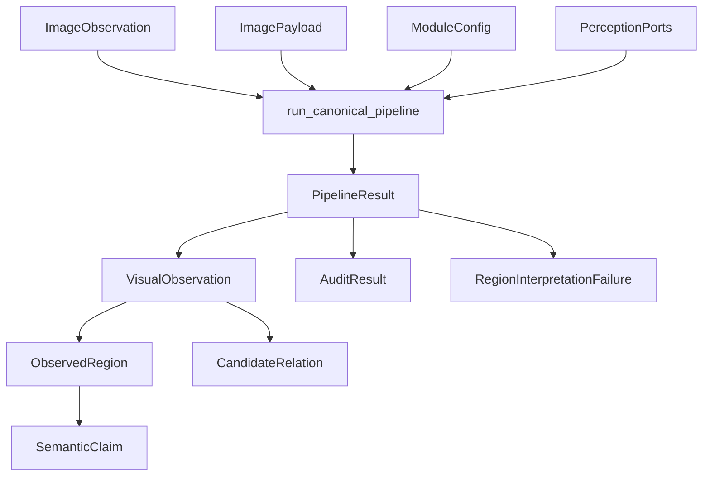

# API pública e contracts

Este documento explica **quais tipos atravessam a fronteira pública, quem os cria, quem
os consome e o que cada um realmente significa**.

Consumidores externos devem importar a superfície estável a partir de
`visual_perception`, não de `application/`, `domain/` ou `infrastructure/`. A lista
autoritativa de exports está em
[`src/visual_perception/__init__.py`](../src/visual_perception/__init__.py).

## Fluxo dos contracts



A regra principal é que cada tipo possui uma semântica específica. Não use um campo para
representar algo que pertence a outro contract.

## Entrada e composição

| Símbolo público | Papel | Criado por |
| --- | --- | --- |
| `ImageObservation` | Metadados canônicos da imagem e proveniência. | adapter/aplicação |
| `ImagePayload` | Pixels RGB resolvidos com shape `(H, W, 3)`. | adapter/aplicação |
| `ModuleConfig` | Configuração validada dos estágios e backends. | composition root |
| `QualityProfile` | Intenção de execução, como `research_quality` ou `reduced_cost`. | aplicação/perfil |
| `PerceptionPorts` | Capacidades concretas injetadas no pipeline. | `create_perception_ports` ou composição manual |
| `create_perception_ports` | Compõe fakes ou adapters reais conforme a configuração. | infraestrutura pública do módulo |

### `ImageObservation`

Representa **o que é a observação e de onde ela veio**, sem acoplar o contract a uma
biblioteca de imagem.

Contém dimensões, encoding, referência ao artifact e `ObservationReference`.

Código dono:
[`domain/image_observation.py`](../src/visual_perception/domain/image_observation.py)

Quem cria:

- adapters;
- aplicação que já possua uma imagem resolvida;
- fronteira `to_canonical_input` para observações RGB canônicas.

Quem consome:

- `run_canonical_pipeline`;
- estágios que precisam preservar identidade, frame, timestamp ou proveniência.

O que **não** significa:

- não contém necessariamente os bytes/pixels da imagem;
- não é uma entidade visual detectada;
- não deve ter timestamp ou frame reconstruídos posteriormente por heurística.

### `ImagePayload`

Representa os pixels usados na inferência.

Código dono:
[`domain/image_payload.py`](../src/visual_perception/domain/image_payload.py)

Invariantes principais:

- `numpy.ndarray`;
- shape `(height, width, 3)`;
- dimensões compatíveis com `ImageObservation`;
- conteúdo RGB validado antes do processamento.

A separação entre `ImageObservation` e `ImagePayload` permite manter metadados e
proveniência independentes da biblioteca usada para carregar pixels.

### `ModuleConfig`

É a configuração reproduzível do módulo. Parâmetros que alteram o resultado de um
estágio devem participar do fingerprint relevante.

Código dono:
[`config.py`](../src/visual_perception/config.py)

Não use configuração de aplicação para esconder parâmetros algorítmicos que mudam a
saída do pipeline.

### `PerceptionPorts`

Agrupa as quatro capacidades substituíveis usadas pelo pipeline:

```text
RegionDiscoverer
DenseFeatureExtractor
LanguageAlignedEncoder
MultimodalReasoner
```

A composição padrão acontece em
[`infrastructure/adapters/factory.py`](../src/visual_perception/infrastructure/adapters/factory.py).

O pipeline conhece os ports, não os checkpoints ou bibliotecas concretas.

## Execução e `PipelineResult`

```python
from visual_perception import (
    ImageObservation,
    ImagePayload,
    ModuleConfig,
    create_perception_ports,
    run_canonical_pipeline,
)

config = ModuleConfig()
ports = create_perception_ports(config)
result = run_canonical_pipeline(image, payload, config, ports)
```

`run_canonical_pipeline(...) -> PipelineResult` devolve:

- `observation: VisualObservation`;
- `region_interpretation_failures`, falhas locais e recuperáveis de interpretação;
- `audit: AuditResult`.

Uma falha de backend ou configuração não deve ser representada como claim semântico.
Essas falhas usam a hierarquia definida em
[`domain/errors.py`](../src/visual_perception/domain/errors.py).

## `VisualObservation`

`VisualObservation` é a saída canônica do módulo.

Código dono:
[`domain/visual_observation.py`](../src/visual_perception/domain/visual_observation.py)

Ela contém:

- `source` e proveniência compartilhada;
- dimensões da imagem;
- convenção de coordenadas;
- contexto de cena;
- regiões observadas;
- relações candidatas;
- versão de schema.

Quem cria:

- `application/pipeline.py`.

Quem consome:

- `sensor-association`;
- persistência;
- mapping runtime;
- ferramentas de auditoria e visualização.

O que **não** significa:

- não é um mapa 3D;
- não representa fusão temporal entre observações;
- não garante que um label seja verdadeiro no mundo;
- não confirma relações espaciais em 3D.

## `ObservedRegion`

Código dono:
[`domain/regions.py`](../src/visual_perception/domain/regions.py)

Uma `ObservedRegion` é uma **região visual 2D consolidada**. Ela pode conter:

- mask;
- bounding box;
- `geometric_confidence`;
- propostas geométricas contribuintes;
- claims semânticos;
- referência para embedding visual;
- referência para embedding alinhado à linguagem.

Fluxo conceitual:

```text
RegionProposal
    -> merge/consolidação
    -> ObservedRegion
    -> interpretação semântica
    -> SemanticClaim[]
```

Uma região não é automaticamente um objeto. Superfícies podem gerar várias regiões e um
objeto pode ser dividido em partes.

## `SemanticClaim`

Código dono:
[`domain/semantics.py`](../src/visual_perception/domain/semantics.py)

Um `SemanticClaim` é uma **hipótese auditável** associada à evidência visual. Ele pode
representar label, atributo, material, condição ou outro tipo semântico suportado.

Um claim preserva:

- tipo;
- valor;
- confiança opcional;
- evidência;
- proveniência de modelo.

Claims conflitantes podem coexistir. A estrutura não exige que o módulo reduza todas as
hipóteses a um único vencedor.

### Confiança ausente

`SemanticClaim.confidence` é `ConfidenceScore | None`.

```text
None
    = o produtor não forneceu score

ConfidenceScore(0.0)
    = o produtor forneceu explicitamente um score zero
```

Esses estados não são equivalentes.

A política canônica de ordenação vive em `most_confident_claim`
([`domain/semantics.py`](../src/visual_perception/domain/semantics.py)):

- uma claim pontuada sempre vence uma claim não pontuada;
- uma claim com score baixo continua sendo informação mensurável;
- se nenhuma claim foi pontuada, não existe vencedor por confiança;
- claims sem score continuam preservadas para auditoria.

Não converta `None` em `0`, `1.0` ou outro número arbitrário.

Essa regra evita a regressão histórica em que ausência de score era transformada em
confiança máxima artificial.

## `RegionKind`

Código dono:
[`domain/semantics.py`](../src/visual_perception/domain/semantics.py)

`RegionKind` descreve a natureza visual da região:

- `thing`;
- `stuff`;
- `part`;
- `unknown`.

Ele é independente do label em linguagem natural.

Exemplos conceituais:

```text
label = "door"
kind = thing

label = "floor"
kind = stuff

label = "door handle"
kind = part
```

A ausência de `kind` em uma resposta do VLM vira `unknown`, não `thing`.

## `CandidateRelation`

Código dono:
[`domain/relations.py`](../src/visual_perception/domain/relations.py)

Representa uma relação **candidata entre regiões da mesma observação 2D**.

Pode vir de:

- predicados geométricos determinísticos sobre masks/boxes;
- inferência multimodal.

Mesmo quando a fonte é `geometric_2d`, a relação não deve ser promovida automaticamente
para uma relação 3D. Validação espacial pertence aos módulos downstream.

Uma relação só pode referenciar regiões presentes na mesma `VisualObservation`.

## `AuditResult`

Código dono:
[`domain/audit.py`](../src/visual_perception/domain/audit.py)

`AuditResult` contém achados determinísticos da auditoria:

- `passed`;
- `errors`;
- `warnings`.

Semântica operacional:

```text
ERROR
    -> observação estruturalmente inválida para consumo normal

WARNING
    -> observação preservada, mas existe inconsistência ou condição relevante
```

Auditoria não substitui reasoning 3D e não transforma um claim em verdade confirmada.

## `ModelProvenance`

Código dono:
[`domain/references.py`](../src/visual_perception/domain/references.py)

Registra a origem de evidência produzida por modelo, como backend, checkpoint e versão de
prompt quando aplicável.

`ModelProvenance` não substitui `ObservationReference`. Os dois respondem a perguntas
diferentes:

```text
ObservationReference
    -> de onde veio a observação física

ModelProvenance
    -> qual modelo produziu esta interpretação/evidência
```

## O que não confundir

| Conceitos | Diferença |
| --- | --- |
| `RegionProposal` vs `ObservedRegion` | proposta geométrica candidata vs região consolidada |
| `ObservedRegion` vs entidade 3D | evidência 2D vs entidade espacial confirmada |
| `geometric_confidence` vs `SemanticClaim.confidence` | qualidade/confiança geométrica vs certeza semântica |
| `confidence=None` vs `confidence=0` | ausência de score vs score explicitamente informado |
| `CandidateRelation` vs relação 3D | hipótese 2D vs relação espacial validada downstream |
| `ImageObservation` vs `ImagePayload` | metadados/proveniência vs pixels usados na inferência |
| `AuditResult` vs semantic reasoning | validação estrutural/inconsistências vs interpretação do mundo |

## Ports de extensão

Uma implementação alternativa deve satisfazer um `Protocol` em
[`ports/`](../src/visual_perception/ports/):

| Port | Responsabilidade |
| --- | --- |
| `RegionDiscoverer` | produzir propostas geométricas 2D |
| `DenseFeatureExtractor` | produzir `FeatureMap` espacial |
| `LanguageAlignedEncoder` | produzir embeddings alinhados a texto/imagem |
| `MultimodalReasoner` | produzir respostas estruturadas para cena e regiões |

Uma implementação concreta deve devolver apenas contracts do módulo. Não exponha tensors,
classes de framework ou exceptions específicas de biblioteca.

Para substituir um backend, injete outra implementação em `PerceptionPorts`. Não altere
a assinatura de `run_canonical_pipeline` e não crie outra estratégia apenas para trocar
checkpoint.

Consulte [model-backends.md](model-backends.md) para as implementações reais disponíveis.

## Quero mudar um contract: onde mexo?

| Quero alterar | Código dono | Também revisar |
| --- | --- | --- |
| entrada da imagem | `domain/image_observation.py`, `domain/image_payload.py` | integração RGB, testes e API pública |
| geometria de região | `domain/geometry.py`, `domain/regions.py` | merge, pooling, serialização e `sensor-association` |
| semântica/claims | `domain/semantics.py` | parser, auditoria, fusão e testes |
| relação candidata | `domain/relations.py` | geração de relações, auditoria e downstream |
| estrutura de `VisualObservation` | `domain/visual_observation.py` | pipeline, serialização, persistência e schema |
| política de auditoria | `domain/audit.py`, `application/quality_audit.py` | consumidores de `audit.passed` |
| proveniência de modelo | `domain/references.py` | adapters, fingerprints e serialização |
| port de ML | `ports/` | fake, adapter real, factory, configuração e benchmark |

Mudanças em contracts públicos devem ser tratadas como alterações de interface. Se o
payload persistido deixar de ser retrocompatível, avalie o versionamento de schema em
[artifacts.md](artifacts.md).
