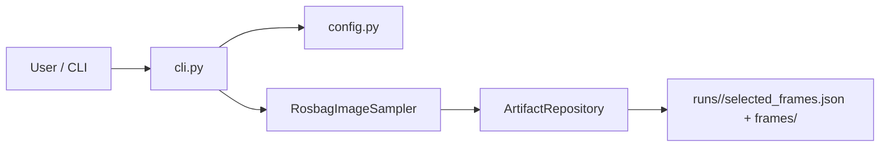

# Architecture

## Estado atual

As pipelines `ImageContextPipeline` (baseline) e `RegionFirstContextPipeline`
(region-first) foram removidas na issue
[#4](https://github.com/Alexandre-Tortoza/image-context/issues/4). O que resta é a
infraestrutura genérica que o módulo canônico do epic
[#3](https://github.com/Alexandre-Tortoza/image-context/issues/3) vai reutilizar:

- `src/image_context/cli.py`: expõe só o subcomando `sample`.
- `src/image_context/config.py`: `PipelineConfig` reduzido a `dataset`,
  `output_directory` e `run_id`.
- `src/image_context/adapters/rosbag_sampler.py`: decodifica imagens RGB de um ROS bag
  de forma reprodutível (`sampling.py`).
- `src/image_context/artifacts.py`: `ArtifactRepository` reduzido à inicialização do
  manifesto e ao registro da seleção de frames.
- `src/image_context/models.py`: contratos genéricos que sobrevivem à limpeza,
  `ImageSample` e `BoundingBox`.

## Arquitetura-alvo

O desenho completo do módulo canônico — percepção panoptic open-vocabulary, features
densas, raciocínio semântico local/global, relações estruturadas, incerteza e
proveniência — está no epic [#3](https://github.com/Alexandre-Tortoza/image-context/issues/3)
(diagrama de arquitetura e schema `ImageContext`) e é detalhado issue a issue em #5–#14.
Esta página será reescrita para descrever a arquitetura real assim que a issue
[#14](https://github.com/Alexandre-Tortoza/image-context/issues/14) compuser a pipeline
canônica end-to-end.
