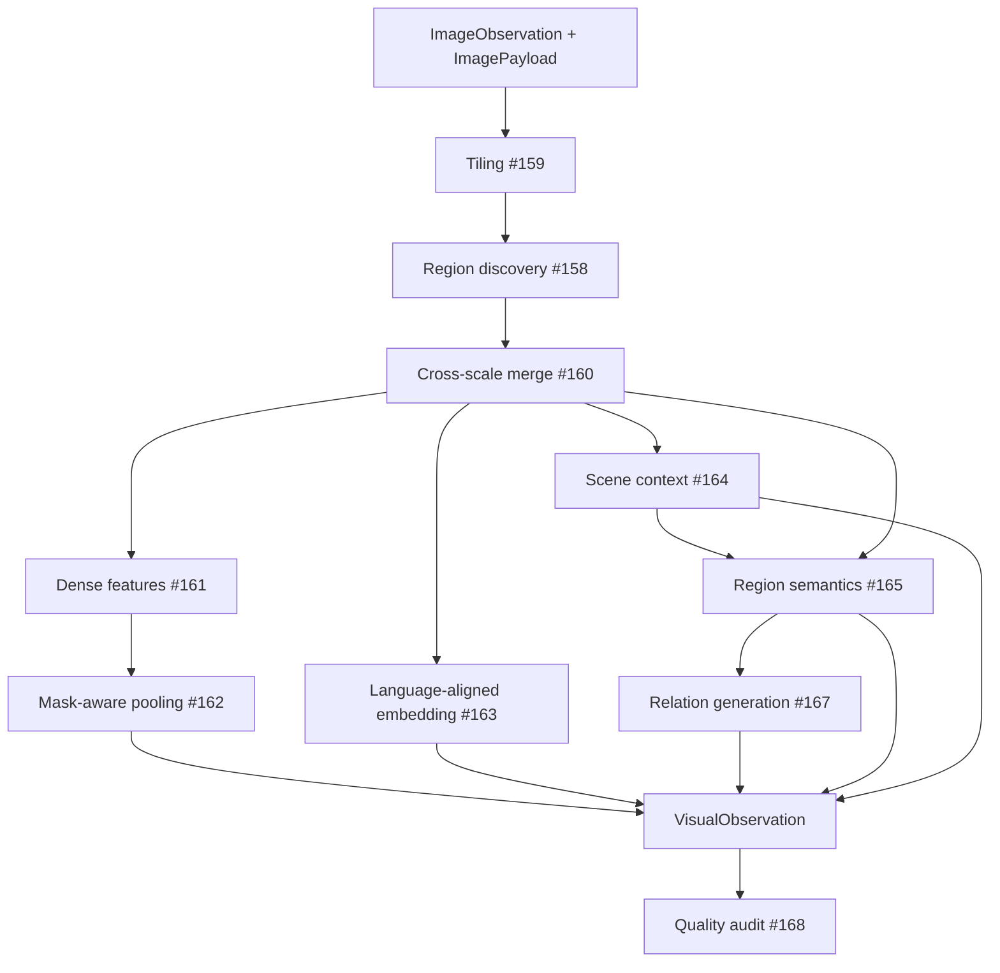

# Architecture

## Responsibility

`visual-perception` turns one canonical RGB image observation into a structured, auditable
visual observation: discovered regions with masks and boxes, dense and language-aligned
region embeddings, scene- and region-level semantic claims, candidate image-level
relations, and a quality audit — all with model/configuration provenance attached.

## Non-responsibilities

- reading datasets, ROS bags, or any transport/file layout directly (owned by
  `[adapters]`, see [pipelines.md](pipelines.md) and issue #151);
- calibration, cross-sensor projection, or LiDAR matching (owned by
  `sensor-association`, issue #137);
- persistent geometric or semantic map construction (`geometric-map`, `semantic-map`);
- verifying candidate relations in 3D or building a scene graph
  (`context-reasoning`, `scene-graph`).

## Layers

```text
src/visual_perception/
├── domain/           # implementation-agnostic contracts and invariants
├── ports/            # replaceable boundaries (Protocols) for heavyweight backends
├── application/       # stage orchestration, pure of any concrete backend
├── infrastructure/
│   ├── fakes/         # GPU-free adapters used by every test
│   ├── adapters/      # real backend adapters (#186-#189) — stubs until GPU hardware
│   ├── integration/   # boundaries to sibling modules/applications (#177-#180)
│   └── serialization.py
└── config.py          # validated, fingerprintable module configuration (#157)
```

This mirrors the repository's capability-oriented, ports-and-adapters style (see
`/docs/engineering-principles.md`).

## Shared vs. module-owned contracts

`visual-perception` depends on the repository-wide `contextual_mapping_contracts`
package (`contracts/`) for `ObservationReference`, `SourceArtifactReference`, `FrameId`,
and `Timestamp` (#99, #100, #101): identity, timing, frame, and source-artifact
references are a repository-wide concept, not owned by this module.

Everything specific to visual perception — region/mask geometry, semantic claims,
relations, embeddings, `ModelProvenance` (which *model/stage* produced a claim, distinct
from the shared `Provenance`, which links a derived item back to its *source
observations*) — is defined locally under `domain/`.

## Image-coordinate invariants (issue #155)

Binding for every mask, box, and transform in this module:

- the pixel origin `(0, 0)` is the **top-left** corner;
- `x` increases right, `y` increases down;
- a `BoundingBox` is `(x_min, y_min, x_max, y_max)`, **half-open**: min is inclusive, max
  is exclusive — matching `array[y_min:y_max, x_min:x_max]`;
- a `Mask` is a boolean array shaped `(height, width)`, always tagged with the image
  resolution it was computed against;
- `CoordinateTransform` is the only way scale/tile-local geometry becomes global: it maps
  `global = local * scale + offset` and is invertible in both directions.

`VisualObservation.coordinate_convention` records this convention explicitly so a
downstream consumer never has to guess it.

## The canonical pipeline (issue #169)



`application/pipeline.run_canonical_pipeline` is the single production entry point
(`PerceptionPorts` bundles the four replaceable backends). It never requires choosing a
legacy strategy, tolerates isolated region-interpretation failures (the region keeps its
geometry and whatever claims other stages attached; see #165), and always ends by running
the quality auditor (#168) over its own output.

## Integration boundaries

- **Upstream** (#177): consumes `contextual_mapping_adapters.CanonicalObservation`
  (kind `"rgb"`) plus an already-resolved pixel array — decoding the source artifact URI
  stays outside this module.
- **Downstream** (#178): `sensor-association` consumes masks, boxes, timestamp, frame id,
  and coordinate convention through `infrastructure/integration/sensor_association_contract.py`,
  never a private type.
- **Composition** (#179): `mapping-runtime` calls `run_canonical_pipeline` through
  `visual_perception`'s public package root only; module failures surface as a
  `RuntimeDiagnostic`, never a raw backend exception.
- **Persistence** (#180): `infrastructure/integration/persistence_integration.py` defines
  the minimal `EvidencePersistencePort` this module needs from repository persistence.

## Configuration and reproducibility

`config.ModuleConfig` (#157) owns every stage's backend identifier, checkpoint,
resolution, and threshold; it validates incompatible combinations (e.g. the
`reduced_cost` profile cannot enable multi-scale tiling) and produces a stable SHA-256
fingerprint used by the stage cache (#170, see [execution.md](execution.md)).
