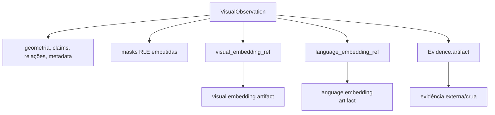
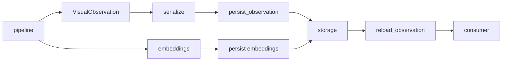

# Artifacts

Este documento explica **o que é persistido, o que fica referenciado, como os artifacts
se relacionam e o que deve invalidar ou versionar cada representação**.

## Visão geral

`visual-perception` produz uma `VisualObservation` canônica, mas nem todo dado pesado
fica embutido nela.



A regra é preservar no payload canônico aquilo que define a observação e referenciar
artifacts pesados ou com ciclo de vida independente.

## Tipos de artifact

| Artifact | Papel | Persistência | Identidade |
| --- | --- | --- | --- |
| `VisualObservation` serializada | produto canônico do módulo | `persist_observation` | schema + conteúdo/proveniência |
| mask de região | geometria necessária para interpretar a região | embutida como RLE | parte da observação |
| visual embedding | representação pooled da região | separado | `visual_embedding_ref` |
| language embedding | representação alinhada à linguagem | separado | `language_embedding_ref` |
| `Evidence.artifact` | evidência externa/crua produzida ou usada por modelo | separado/referenciado | `SourceArtifactReference` |
| cache de estágio | otimização intermediária de execução | diretório de cache | `(stage_name, fingerprint)` |
| sample de benchmark | inspeção e rastreabilidade experimental | `benchmarks/results/` | run id + manifest |

## Serialização canônica

[`infrastructure/serialization.py`](../src/visual_perception/infrastructure/serialization.py)
serializa `VisualObservation` para um dict JSON-able e faz o caminho inverso.

O round-trip deve preservar a semântica da observação.

### Masks

Masks são embutidas usando run-length encoding booleano.

Motivação:

- a geometria da região é necessária para interpretar a própria observação;
- RLE mantém a representação autocontida;
- não exige um armazenamento externo apenas para reconstruir a mask.

### Embeddings

Vetores de embedding não ficam dentro do payload canônico.

```text
ObservedRegion
    +--> visual_embedding_ref ------> vetor visual
    +--> language_embedding_ref ----> vetor language-aligned
```

Isso evita transformar toda `VisualObservation` em um payload grande e permite que
consumidores carreguem embeddings somente quando necessário.

### Evidência externa

`Evidence.artifact` usa `SourceArtifactReference` para apontar para evidência que não
precisa ser copiada para o JSON canônico.

A referência deve preservar a identidade do artifact original. Não substitua a URI ou
referência por paths locais ad hoc durante a serialização.

## Schema e compatibilidade

Cada payload carrega:

- `schema_version`;
- `coordinate_convention`.

Uma versão não suportada deve falhar com `UnsupportedSchemaVersionError`, em vez de ser
interpretada silenciosamente sob regras novas.

Ao alterar `VisualObservation`, pergunte:

```text
a mudança é apenas aditiva e retrocompatível?
    -> possivelmente manter schema

a mudança altera significado, formato ou invariantes?
    -> avaliar bump de schema
```

Mudanças em máscaras, coordenadas, semântica de confidence ou referências de embedding
merecem atenção especial porque podem produzir payloads sintaticamente válidos com
interpretação errada se o schema não refletir a incompatibilidade.

## Persistência

A fronteira está em:

[`infrastructure/integration/persistence_integration.py`](../src/visual_perception/infrastructure/integration/persistence_integration.py)

Ela define `EvidencePersistencePort`, com uma interface opaca de armazenamento:

```text
put(id, payload) -> reference
get(reference)   -> payload
```

O módulo não conhece detalhes como:

- filesystem;
- bucket;
- banco;
- cliente remoto;
- path físico de armazenamento.

Esses detalhes pertencem à implementação concreta da persistência.

## Operações de persistência

### Observação completa

```text
VisualObservation
    -> persist_observation
    -> EvidencePersistencePort
    -> reference

reference
    -> reload_observation
    -> VisualObservation
```

O round-trip deve preservar a observação canônica.

### Embeddings visuais

```text
pooled visual embeddings
    -> persist_visual_embeddings
    -> referências estáveis
    -> ObservedRegion.visual_embedding_ref
```

### Embeddings alinhados à linguagem

```text
language embeddings
    -> persist_language_embeddings
    -> referências estáveis
    -> ObservedRegion.language_embedding_ref
```

Os testes usam
`infrastructure/fakes/fake_evidence_store.InMemoryEvidenceStore` para validar essa
fronteira sem depender de um backend externo.

## Cache de estágio

`application/cache.StageCache` não usa o mesmo contract da persistência canônica.

```text
StageCache
    -> cache de execução
    -> descartável/recomputável
    -> indexado por fingerprint

VisualObservation persistida
    -> produto canônico
    -> usada entre processos/consumidores
    -> versionada por schema
```

O cache grava um registro JSON por `(stage_name, fingerprint)` sob um diretório escolhido
pelo chamador.

Consulte [execution.md](execution.md#cache-de-estágio) para regras de invalidação.

## Fingerprints

Artifacts intermediários que dependem de configuração devem estar ligados ao fingerprint
que representa aquela execução ou estágio.

Exemplos de alterações que devem invalidar resultados dependentes:

- troca de checkpoint;
- mudança de threshold;
- mudança de prompt version;
- alteração de tiling;
- alteração da regra de merge;
- mudança na implementação que altera a saída.

Um artifact sem ligação clara com sua configuração experimental perde valor de
rastreabilidade.

## Artifacts de benchmark e validação

A validação end-to-end gera samples em:

```text
benchmarks/results/samples/<run-id>/
```

O conjunto de referência pode conter:

- `VisualObservation` serializada;
- overlay das masks/labels;
- `manifest.json`;
- configuração completa;
- git revision;
- métricas do `ModelLifecycleManager`.

Esses artifacts têm finalidade diferente da persistência operacional. Eles existem para
inspeção, reprodução e comparação experimental.

## Ciclo de vida



O consumidor decide quando resolver as referências de embedding. Recarregar a observação
não deve exigir carregar todos os vetores automaticamente.

## Quero mudar X: onde mexo?

| Quero alterar | Arquivo principal | Também revisar |
| --- | --- | --- |
| formato JSON da observação | [`serialization.py`](../src/visual_perception/infrastructure/serialization.py) | schema, round-trip e testes |
| estrutura de `VisualObservation` | [`domain/visual_observation.py`](../src/visual_perception/domain/visual_observation.py) | pipeline, serialização e consumidores |
| encoding de mask | `serialization.py` + `domain/geometry.py` | compatibilidade de schema |
| referência de embeddings | `domain/regions.py` | persistência e consumidores |
| backend de persistência | implementação de `EvidencePersistencePort` | não altere contracts públicos sem necessidade |
| regra de cache | [`application/cache.py`](../src/visual_perception/application/cache.py) | fingerprints e execution docs |
| artifact de benchmark | `benchmarks/` | manifest e protocolo experimental |
| schema version | serialização + domain | loaders antigos, testes e migration policy |

## O que não fazer

- embutir tensors ou objetos de framework no JSON canônico;
- transformar path local em contract público de armazenamento;
- reutilizar cache de fingerprint incompatível;
- remover `schema_version` ou `coordinate_convention` do payload;
- persistir embeddings sem referência estável para reconectá-los à região;
- tratar artifacts de benchmark como se fossem o backend operacional de persistência;
- alterar o significado de um campo persistido sem avaliar compatibilidade de schema.

## Checklist para novo artifact

Antes de introduzir um novo artifact, defina:

- quem o produz;
- quem é dono da sua semântica;
- quem o consome;
- se é canônico ou recomputável;
- como é identificado;
- se depende de fingerprint;
- como é versionado;
- como é invalidado;
- como é recarregado;
- quais testes garantem round-trip ou compatibilidade.
