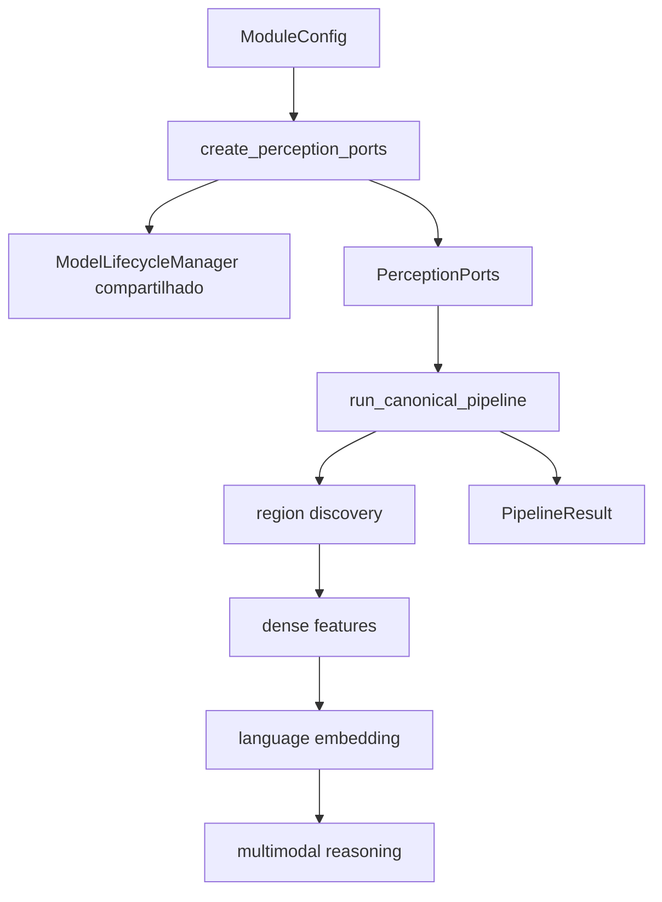

# Execução

Este documento explica **como o módulo é executado, como os modelos são carregados,
como cache e fingerprints funcionam e onde diagnosticar falhas de runtime**.

Para a ordem semântica dos estágios, consulte [pipelines.md](pipelines.md). Para seleção
de checkpoints, consulte [model-backends.md](model-backends.md).

## Modos de execução

Existem dois cenários principais:

```text
fake
    -> desenvolvimento, testes, integração e contracts
    -> sem GPU
    -> determinístico

real
    -> inferência dos backends selecionados
    -> GPU quando configurada
    -> lifecycle, métricas e artifacts de validação
```

`ModuleConfig()` usa fakes por padrão.

A configuração real de referência pode ser criada com:

```python
from visual_perception.application.execution_profile import research_quality_config

config = research_quality_config(real_backends=True)
```

A composição dos ports ocorre antes da chamada do pipeline:

```python
ports = create_perception_ports(config)
result = run_canonical_pipeline(image, payload, config, ports)
```

`run_canonical_pipeline` recebe backends já compostos. Ele não escolhe checkpoints nem
instancia adapters concretos por nome.

## Fluxo de execução



A ordem exata e as dependências entre todos os estágios estão em
[pipelines.md](pipelines.md#fluxo-canônico).

## Ciclo de vida dos modelos

[`application/lifecycle.py`](../src/visual_perception/application/lifecycle.py) define
`ModelLifecycleManager`.

Seu papel é:

- carregar um backend pesado somente quando necessário;
- registrar métricas do estágio;
- liberar a referência ao final do uso;
- evitar manter todos os modelos pesados residentes ao mesmo tempo.

A factory
[`create_perception_ports`](../src/visual_perception/infrastructure/adapters/factory.py)
recebe um manager opcional. Quando omitido, cria um manager e o compartilha entre os
ports compostos.

Essa distinção é importante:

```text
create_perception_ports(...)
    -> compõe adapters
    -> fornece/compartilha lifecycle manager

run_canonical_pipeline(...)
    -> recebe PerceptionPorts prontos
    -> não escolhe backends
```

## Execução sequencial e VRAM

Na configuração real de referência, os quatro modelos cabem individualmente em 8GB, mas
a soma dos picos excede esse orçamento. O comportamento esperado é conceitualmente:

```text
SAM
  -> load
  -> inferência
  -> métricas
  -> unload

DINOv2
  -> load
  -> inferência
  -> métricas
  -> unload

CLIP
  -> load
  -> inferência
  -> métricas
  -> unload

Qwen-VL
  -> load
  -> inferência
  -> métricas
  -> unload
```

Os valores medidos e a motivação da seleção estão em
[model-backends.md](model-backends.md#orçamento-de-vram-e-lifecycle).

## Métricas de estágio

`ModelLifecycleManager.metrics` registra informações úteis para auditoria de runtime.
Dependendo do ambiente e adapter, isso inclui:

- nome do estágio;
- backend/checkpoint;
- tempo de carregamento;
- tempo de inferência;
- pico de memória observado.

Em ambientes sem CUDA, memória de processo pode ser apenas uma proxy. Resultados de VRAM
usados para decisões de referência devem vir da validação real em GPU e registrar o
hardware utilizado.

## Cache de estágio

[`application/cache.py`](../src/visual_perception/application/cache.py) define
`StageCache`.

O cache grava um registro por estágio concluído, indexado por fingerprint.

O fingerprint de um estágio inclui:

- versão/configuração própria;
- fingerprints das dependências upstream relevantes.

Consequências:

```text
execução idêntica
    -> reutiliza cache válido

mudança em um estágio
    -> invalida o estágio
    -> invalida dependentes downstream
    -> não precisa invalidar irmãos independentes

execução interrompida
    -> próxima execução pode reutilizar estágios válidos
```

`CACHE_SCHEMA_VERSION` impede reutilização silenciosa de uma entrada escrita por uma
versão incompatível do cache.

## Cache não é persistência canônica

Não confunda:

```text
StageCache
    = otimização de execução
    = artefato intermediário por estágio

VisualObservation persistida
    = produto canônico serializável do módulo
    = contract entre processos/consumidores
```

Para persistência canônica, consulte [artifacts.md](artifacts.md).

## Fingerprints e reprodutibilidade

Uma mudança que altera resultado deve participar da cadeia de fingerprint apropriada.
Exemplos:

- checkpoint;
- threshold;
- versão de prompt;
- configuração de tiling;
- parâmetro de merge;
- implementação/versionamento de estágio quando aplicável.

O objetivo é evitar este erro:

```text
configuração mudou
    + fingerprint permaneceu igual
    -> cache antigo reutilizado como se fosse resultado novo
```

Artifacts de benchmark ou validação devem registrar configuração e revisão do código,
não apenas a saída visual.

## Falhas de runtime

A hierarquia de erros está em
[`domain/errors.py`](../src/visual_perception/domain/errors.py).

Fluxo esperado:

```text
dependência/checkpoint/device indisponível
    -> BackendUnavailableError

falha durante load ou inferência
    -> BackendExecutionError

resposta semântica malformada de uma região
    -> RegionInterpretationFailure
    -> restante da observação pode continuar
```

Não substitua silenciosamente backend real por fake quando ocorre uma falha.

## Auditoria da saída

Depois da execução, `PipelineResult.audit` contém `AuditResult`.

```python
result = run_canonical_pipeline(...)

if not result.audit.passed:
    handle_invalid_observation(result.audit.errors)

for warning in result.audit.warnings:
    record_warning(warning)
```

Warnings fazem parte da rastreabilidade. Um consumidor não deve descartá-los apenas
porque `passed=True`.

## Validação local sem GPU

No diretório do módulo:

```bash
python3.12 -m venv .venv
source .venv/bin/activate
pip install -e ".[dev]"
pytest
ruff check .
mypy
```

Os fakes permitem validar o pipeline e os contracts sem baixar modelos.

## Execução com backends reais

Instale as dependências de ML:

```bash
pip install -e ".[ml]"
```

Use a configuração de referência ou uma `ModuleConfig` explícita. Não esconda
checkpoint ou device em estado global.

Antes de tratar um resultado como comparável a outro, registre:

- git revision;
- `ModuleConfig` e fingerprint;
- checkpoints;
- device/hardware;
- dataset/subset;
- métricas de lifecycle;
- versão dos artifacts de saída.

## Benchmark de backends

Para comparar implementações concretas:

```text
benchmarks/run_backend_benchmark.py
benchmarks/backend_benchmark.py
benchmarks/candidates/
```

Resultados que orientam configuração de referência devem ser versionados e conter
contexto experimental suficiente para reprodução.

A seleção atual está documentada em [model-backends.md](model-backends.md).

## Validação end-to-end

A pipeline real de referência pode ser exercitada por:

```text
benchmarks/validate_reference_pipeline.py
```

A execução gera samples em:

```text
benchmarks/results/samples/<run-id>/
```

Os artifacts incluem observação serializada, overlay e manifest de execução. Eles são
úteis para inspeção qualitativa e diagnóstico, mas não substituem protocolos de avaliação
quantitativa específicos.

## Quero diagnosticar X: onde olhar?

| Sintoma | Primeiro local | Depois verificar |
| --- | --- | --- |
| OOM ao trocar de estágio | `application/lifecycle.py` | factory, `_runtime.py`, métricas e configuração |
| cache não invalida após mudança | `application/cache.py` | fingerprint do estágio e `ModuleConfig` |
| resultado antigo reaparece | `StageCache` | versão de cache e dependências upstream |
| backend real virou fake | `factory.py` | isso não deve ocorrer silenciosamente |
| erro ao carregar checkpoint | adapter concreto | `BackendUnavailableError` / `BackendExecutionError` |
| uma região falha mas pipeline continua | `application/region_semantics.py` | `region_interpretation_failures` |
| auditoria reprova resultado | `application/quality_audit.py` | `AuditResult.errors` |
| qualidade caiu após trocar modelo | benchmark da capability | configuração, dataset e proxy usado |
| VRAM aumentou | lifecycle metrics | checkpoint, dtype, quantização e sequência de load |

## Checklist de execução reproduzível

- use `ModuleConfig` explícita para experimentos;
- registre fingerprint;
- preserve git revision;
- registre checkpoint e versão de prompt;
- registre hardware e device;
- não reutilize cache incompatível;
- preserve `AuditResult` e warnings;
- mantenha artifacts de benchmark ligados ao dataset/subset usado;
- compare resultados somente sob protocolo equivalente.
