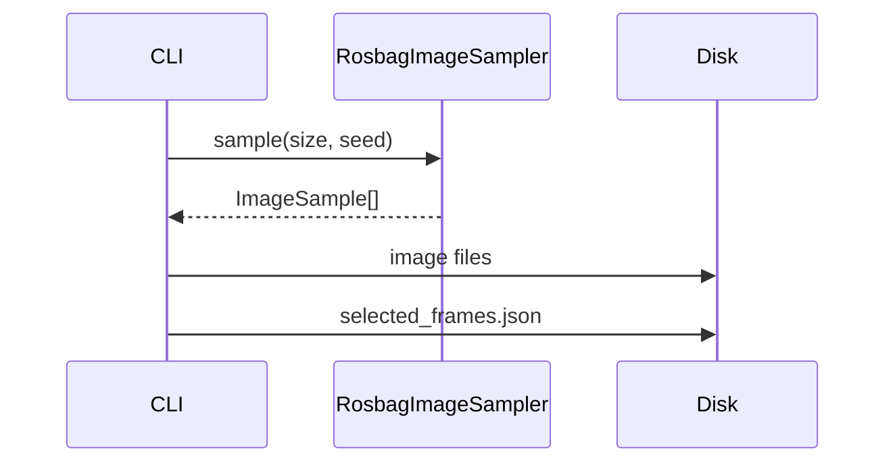

# Execution

Os comandos `run`, `reprocess` e `analyze` foram removidos junto com as pipelines
`baseline`/`region-first` (issue
[#4](https://github.com/Alexandre-Tortoza/image-context/issues/4)). Eles serão
recriados sobre o módulo canônico na issue
[#14](https://github.com/Alexandre-Tortoza/image-context/issues/14).

## `sample`

Extrai imagens do ROS bag conforme `sample_size` e `seed`, sem carregar nenhum modelo.

```bash
image-context sample --config config.yaml
```



## Fingerprint

A configuração de `dataset` é hasheada (SHA-256) e gravada em `manifest.json`. Rodar o
mesmo `run-id` com uma configuração diferente falha a menos que `--overwrite` seja
passado ou outro `run-id` seja usado.

## Qualidade

```bash
pytest
ruff check .
mypy
```
