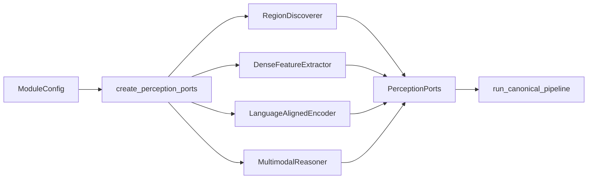

# Model Backends

Este documento explica **qual implementação concreta atende cada capability, por que ela
foi selecionada, onde alterá-la e quais limites precisam ser considerados**.

O pipeline canônico continua dependente apenas dos ports. Checkpoints, bibliotecas e
regras de runtime ficam isolados em `infrastructure/adapters/`.

## Visão geral

O módulo roda por padrão com `backend="fake"`. Os fakes são determinísticos, não exigem
GPU e exercitam contracts, pipeline, cache e integração.

A configuração real de referência foi escolhida por benchmark reproduzível na RTX 3060
8GB (#174):

| Capability | Port | Backend real | Checkpoint | Identificador |
| --- | --- | --- | --- | --- |
| Region discovery | `RegionDiscoverer` | SAM ViT-H | `facebook/sam-vit-huge` | `sam` |
| Dense feature extraction | `DenseFeatureExtractor` | DINOv2-base | `facebook/dinov2-base` | `dinov2` |
| Language-aligned embedding | `LanguageAlignedEncoder` | CLIP ViT-L/14 | `openai/clip-vit-large-patch14` | `clip` |
| Multimodal reasoning | `MultimodalReasoner` | Qwen2.5-VL-3B-Instruct 4-bit | `Qwen/Qwen2.5-VL-3B-Instruct` | `qwen_vl` |

`research_quality_config(real_backends=True)` em
[`application/execution_profile.py`](../src/visual_perception/application/execution_profile.py)
retorna a configuração de referência com os quatro backends reais.

## Quero mudar X: onde mexo?

| Quero alterar | Arquivo principal | Também revisar |
| --- | --- | --- |
| backend selecionado por capability | [`factory.py`](../src/visual_perception/infrastructure/adapters/factory.py) | `config.py`, testes e docs |
| checkpoint/configuração de referência | [`application/execution_profile.py`](../src/visual_perception/application/execution_profile.py) | `config.py`, benchmark e fingerprint |
| implementação de region discovery | [`region_discovery_backend.py`](../src/visual_perception/infrastructure/adapters/region_discovery_backend.py) | `ports/region_discovery.py` e testes GPU |
| implementação de dense features | [`feature_extraction_backend.py`](../src/visual_perception/infrastructure/adapters/feature_extraction_backend.py) | `ports/feature_extraction.py`, pooling e benchmark |
| implementação de language embedding | [`language_embedding_backend.py`](../src/visual_perception/infrastructure/adapters/language_embedding_backend.py) | `ports/language_embedding.py` e benchmark |
| modelo ou prompt do VLM | [`multimodal_reasoning_backend.py`](../src/visual_perception/infrastructure/adapters/multimodal_reasoning_backend.py) | parser de cena/região, fingerprint e testes |
| parsing de resposta de região | [`application/region_semantics.py`](../src/visual_perception/application/region_semantics.py) | `domain/semantics.py` e testes do parser |
| lifecycle e VRAM | [`application/lifecycle.py`](../src/visual_perception/application/lifecycle.py) | `factory.py`, `_runtime.py` e validação real |
| candidatos de benchmark | [`benchmarks/candidates/`](../benchmarks/candidates/) | `run_backend_benchmark.py` e resultados |
| execução real de referência | [`benchmarks/validate_reference_pipeline.py`](../benchmarks/validate_reference_pipeline.py) | overlays, manifests e samples |

## Instalação

O ambiente fake-only usa a instalação base/dev. Para os adapters reais:

```bash
pip install -e ".[ml]"
```

Uma configuração real deve declarar backend, checkpoint e device válidos.

Semântica dos erros:

```text
checkpoint ausente / dependência ausente / GPU solicitada indisponível
    -> BackendUnavailableError

falha durante load ou inferência
    -> BackendExecutionError
```

Nunca existe fallback silencioso de backend real para fake.

## Composição dos backends

A seleção concreta acontece em:

[`infrastructure/adapters/factory.py`](../src/visual_perception/infrastructure/adapters/factory.py)



`pipeline.py` não escolhe bibliotecas ou checkpoints. Para substituir uma implementação,
prefira manter o mesmo port e trocar somente o adapter/factory/configuração.

## Region discovery

### Responsabilidade

Produzir propostas geométricas 2D class-agnostic. O backend não atribui identidade
semântica final à região.

### Implementação atual

- port: `RegionDiscoverer`;
- adapter: `infrastructure/adapters/region_discovery_backend.py`;
- backend: `sam`;
- checkpoint: `facebook/sam-vit-huge`.

### Por que foi escolhido

No benchmark #174, SAM ViT-H apresentou IoU previsto médio de `0.956`, contra `0.937`
para SAM2.1-hiera-large e `0.585` para FastSAM-x. Todos cabiam individualmente no budget
de 8GB, então a seleção priorizou qualidade.

### Output esperado

O adapter deve produzir `RegionProposal` e respeitar o contract do port. Merge,
consolidação e semântica são etapas posteriores.

### Limites atuais

SAM pode over-segmentar superfícies repetitivas, como tetos em ladrilhos. O merge atual
atua por IoU/sobreposição e não une automaticamente regiões vizinhas não sobrepostas com
semântica semelhante.

## Dense feature extraction

### Responsabilidade

Produzir um `FeatureMap` espacial que preserve estrutura visual suficiente para pooling
por mask.

### Implementação atual

- port: `DenseFeatureExtractor`;
- adapter: `infrastructure/adapters/feature_extraction_backend.py`;
- backend: `dinov2`;
- checkpoint: `facebook/dinov2-base`.
- resolução de entrada do perfil real: maior aresta 448, preservando aspect ratio e
  alinhamento ao patch 14;
- candidato aprendido: `FeatUpDenseFeatureExtractionAdapter`, FeatUp/JBU sobre
  DINOv2-small, instalado pelo extra `feature-upsample`.

### Por que foi escolhido

No benchmark #174, DINOv2-base obteve `0.966` no proxy de coerência espacial do primeiro
componente PCA, contra `0.958` do DINOv2-large. O modelo maior não melhorou o proxy no
conjunto de referência e consumia mais recursos.

### Output esperado

Tensors internos, tokens e objetos de framework não atravessam o port. O adapter expõe
somente o `FeatureMap` definido pelo módulo.

### Relação com pooling

A transformação de feature map para embedding por região pertence a
[`application/pooling.py`](../src/visual_perception/application/pooling.py), não ao
adapter DINO.

O adapter FeatUp é uma implementação alternativa do mesmo port, não um stage escondido.
Sua revisão Git, checkpoint JBU, grade fonte, resolução efetiva e eventual fallback são
campos de provenance do `FeatureMap`. Como o JBU oficial usa DINOv2-small (384 canais),
seus vetores não são misturados ou comparados diretamente com DINOv2-base (768 canais).

## Language-aligned embedding

### Responsabilidade

Produzir embeddings em um espaço compartilhado entre imagem/região e linguagem.

### Implementação atual

- port: `LanguageAlignedEncoder`;
- adapter: `infrastructure/adapters/language_embedding_backend.py`;
- backend: `clip`;
- checkpoint: `openai/clip-vit-large-patch14`.

### Por que foi escolhido

No benchmark #174, CLIP ViT-L/14 apresentou margem top1/top2 de similaridade de cosseno
zero-shot `0.024`, contra `0.009` do SigLIP-base, usando o vocabulário indoor genérico do
benchmark.

### Output esperado

O espaço de embedding deve continuar compatível com a operação imagem-texto prevista
pelo port. A dimensão de referência do ViT-L/14 é 768.

## Multimodal reasoning

### Responsabilidade

Produzir respostas estruturadas para:

- contexto global da cena;
- interpretação semântica de regiões;
- relações multimodais candidatas quando solicitadas pelo pipeline.

### Implementação atual

- port: `MultimodalReasoner`;
- adapter: `infrastructure/adapters/multimodal_reasoning_backend.py`;
- backend: `qwen_vl`;
- checkpoint: `Qwen/Qwen2.5-VL-3B-Instruct`;
- execução de referência: 4-bit `bitsandbytes` NF4.

### Por que foi escolhido

O candidato 7B falhou em três tentativas na GPU de referência, por OOM no carregamento e
por incompatibilidade `bitsandbytes`/Transformers no vision tower fundido. O 3B em 4-bit
rodou com score de qualidade `1.0` no benchmark e pico aproximado de 2.5GB de VRAM.

A escolha é baseada na evidência do hardware de referência, não em uma afirmação de que o
3B seja universalmente superior ao 7B.

### Limites atuais

Em crops pequenos ou ambíguos, o VLM pode:

- retornar JSON malformado;
- usar o contexto global da cena em vez do conteúdo específico do crop;
- omitir score quando não consegue estimar confiança.

Medido: nos três frames de referência em `ebe211f`, o Qwen2.5-VL-3B **nunca** omitiu
`confidence` — 177 claims de label, 177 pontuadas. A distribuição é concentrada em
poucos valores âncora: 117 das 177 valem exatamente 0,90, e 138 ficam em 0,90 ou acima
(mínimo 0,05, máximo 0,98). O contract representa a ausência corretamente, mas este
backend não a exerce, e o score que ele emite parece mais um hábito de formatação do que
uma estimativa. Tratá-lo como confiança calibrada seria um erro; é para isso que existe
a calibração da #196, ainda bloqueada pela anotação humana da #210.

Cuidado ao ler os overlays: o número ao lado do label é a `geometric_confidence` da
região, não a confiança do claim.

Falhas locais de interpretação viram `RegionInterpretationFailure` e não precisam
invalidar toda a observação.

## Contract de resposta de região

A versão atual é `prompt_version = v4`. O schema da resposta é o mesmo desde `v2`; o que
mudou foi a entrada e o exemplo.

`v3` passou a receber um `RegionReasoningRequest` e a enviar ao VLM as views da região
como imagens numeradas e rotuladas pelo seu papel (foreground isolado, crop justo,
contexto), seguidas do contexto de cena como claims tipadas. Em `v2` ele mandava um único
recorte pelo bounding box e a primeira string de `scene_description`.

`v4` trocou o exemplo de formato por placeholders. **Medido em `0fda5cf`:** com o exemplo
concreto de `v3` (`"label": "door"`, `category "opening"`, alternativa `panel`,
`material "wood"`), 26 das 27 regiões rotuladas `door` em `corridor-02-000` reproduziam a
assinatura inteira do exemplo — inclusive a região que cobre o frame inteiro. A taxa de
eco saltou de 1/54 para 27/54 naquele frame e de 1/50 para 12/50 em `corridor-02-017`
quando a entrada passou a ser multi-imagem.

A lição é geral: **um exemplo de formato cujos valores formam uma resposta plausível vira
a resposta padrão quando a entrada fica mais difícil**, e `door` num corredor é plausível
o bastante para não parecer erro. O `v4` mantém a forma inequívoca com placeholders
`<...>`, e `parse_region_interpretation` recusa um label ainda em forma de placeholder
como `InvalidInterpretation` — de modo que o eco vira uma falha local visível em vez de um
claim silencioso. Um placeholder ecoado numa *alternativa* é descartado, porque a
alternativa é evidência opcional e não deve custar um label primário válido.

Ao comparar runs, a assinatura do eco (`category == "opening"` com alternativa `panel`) é
um diagnóstico barato, e vale medi-la junto com os labels.

O adapter pede um único objeto JSON por região:

```json
{
  "label": "door",
  "kind": "thing",
  "category": "opening",
  "confidence": 0.71,
  "alternatives": [
    {"label": "panel", "confidence": 0.2}
  ],
  "description": "...",
  "attributes": ["closed"],
  "condition": "worn",
  "material": "wood"
}
```

Semântica dos campos:

- `label`, open-vocabulary, singular e obrigatório;
- `kind`, `thing | stuff | part | unknown`; ausência vira `unknown`;
- `category`, string livre, sem taxonomia canônica versionada neste módulo;
- `confidence`, score informado pelo modelo; a chave deve ser omitida quando o modelo
  não sabe estimá-la;
- `alternatives`, hipóteses concorrentes que viram claims irmãos do principal.

O parsing é feito por `parse_region_interpretation` em
[`application/region_semantics.py`](../src/visual_perception/application/region_semantics.py).
O formato legado `{"labels": [...]}` é rejeitado com `InvalidInterpretation`.

`prompt_version` participa de `ModelProvenance` e do fingerprint de configuração, então
uma mudança de versão invalida cache dependente da resposta anterior.

## Política de confiança

Ausência de score é representada como `None`.

```text
confidence ausente
    -> None

confidence = 0.0
    -> score explicitamente fornecido
```

O adapter não deve inventar `1.0`, `0.0` ou outro valor para preencher ausência.
Consumidores usam a política canônica em `most_confident_claim`; consulte
[api-contracts.md](api-contracts.md#confiança-ausente).

## Orçamento de VRAM e lifecycle

Os picos observados na configuração de referência são aproximadamente:

| Backend | Pico de referência |
| --- | ---: |
| SAM ViT-H | 4.6 GB |
| DINOv2-base | 0.3 GB |
| CLIP ViT-L/14 | 1.6 GB |
| Qwen2.5-VL-3B 4-bit | 2.5 GB |

A soma aproximada excede 8GB. Por isso, os adapters reais compartilham um
[`ModelLifecycleManager`](../src/visual_perception/application/lifecycle.py).

`create_perception_ports(config, lifecycle=None)` cria um manager quando ele não é
fornecido e o compartilha entre os ports compostos. O pipeline recebe os ports já
construídos e não seleciona modelos por conta própria.

```text
SAM   -> inferência -> unload
DINO  -> inferência -> unload
CLIP  -> inferência -> unload
Qwen  -> inferência -> unload
```

`ModelLifecycleManager.metrics` registra métricas por estágio, incluindo identificação do
backend/checkpoint, tempo de load e pico de memória medido pelo runtime disponível.

## Benchmark de seleção (#174)

Resultados brutos:

```text
../benchmarks/results/benchmark-174-*.json
```

Candidatos e proxies:

```text
../benchmarks/candidates/
../benchmarks/run_backend_benchmark.py
../benchmarks/backend_benchmark.py
```

Conjunto de referência usado na seleção:

```text
18 frames de corridor-02
../benchmarks/prepare_corridor02_frames.py
```

Um resultado que altere a configuração de referência deve registrar pelo menos:

- dataset e subset;
- revisão do código;
- checkpoint;
- configuração;
- hardware;
- métrica/proxy;
- latência;
- consumo de memória;
- falhas de execução.

## Validação end-to-end reproduzível (#190/#212)

[`../benchmarks/validate_reference_pipeline.py`](../benchmarks/validate_reference_pipeline.py)
executa a configuração real sobre todos os frames, uma seleção explícita por `--frame-id`
ou um prefixo ordenado por `--limit`. Para o protocolo de três frames:

```bash
python benchmarks/validate_reference_pipeline.py \
  --frame-id corridor-02-000 \
  --frame-id corridor-02-008 \
  --frame-id corridor-02-017
```

Por frame, a validação produz:

- `VisualObservation` canônica serializada em `canonical/`;
- overlay de masks/labels canônicas;
- manifest com IDs ordenados, hashes de entrada, git revision, configuração e fingerprint;
- latência, VRAM, falhas, audit e cobertura por estado de cada slot;
- variante em `postprocessed/semantic-merge/` somente quando solicitada explicitamente.

Saída:

```text
../benchmarks/results/samples/<run-id>/
```

Esses artifacts servem para inspeção qualitativa e rastreabilidade. Métricas de pesquisa
mais fortes devem ser definidas em protocolos de avaliação específicos.

## Dívidas conhecidas

- `application/scene_context.py` e `application/relation_generation.py` ainda devem ser
  revisados para garantir a mesma política explícita de confiança ausente aplicada ao
  parser de regiões;
- relações `geometric_2d` podem usar `ConfidenceScore(1.0)` legitimamente quando o valor
  representa o resultado de um predicado determinístico, não ausência de score;
- over-segmentation de superfícies repetitivas não é resolvida apenas pela troca de
  checkpoint;
- crops semanticamente ambíguos ainda podem induzir o VLM a responder com contexto da
  cena em vez da região.

Quando uma dívida for resolvida, atualize este documento junto com os testes e o
benchmark que comprovam a mudança.
