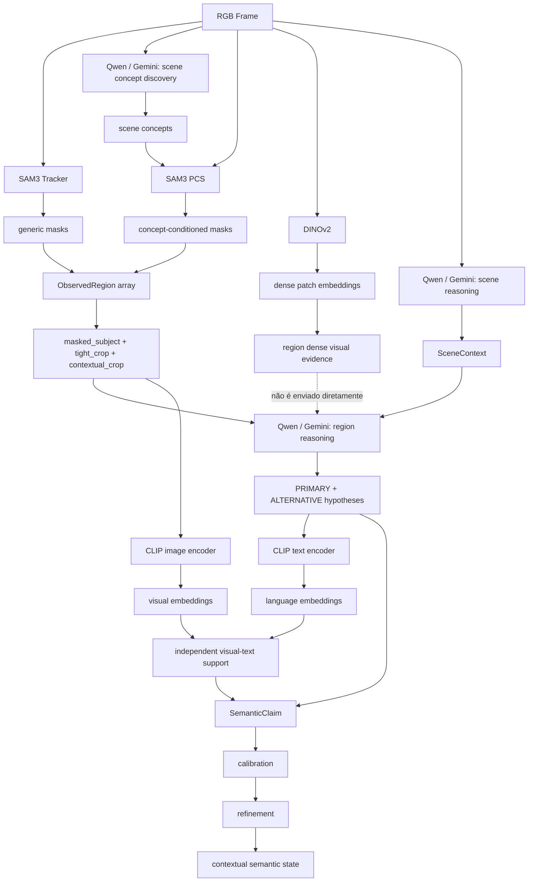
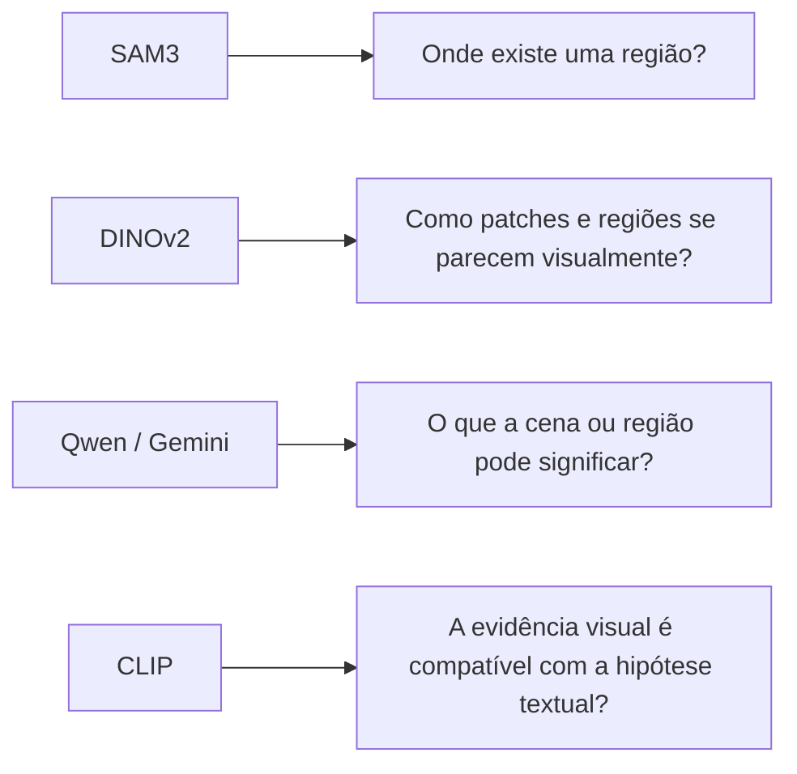
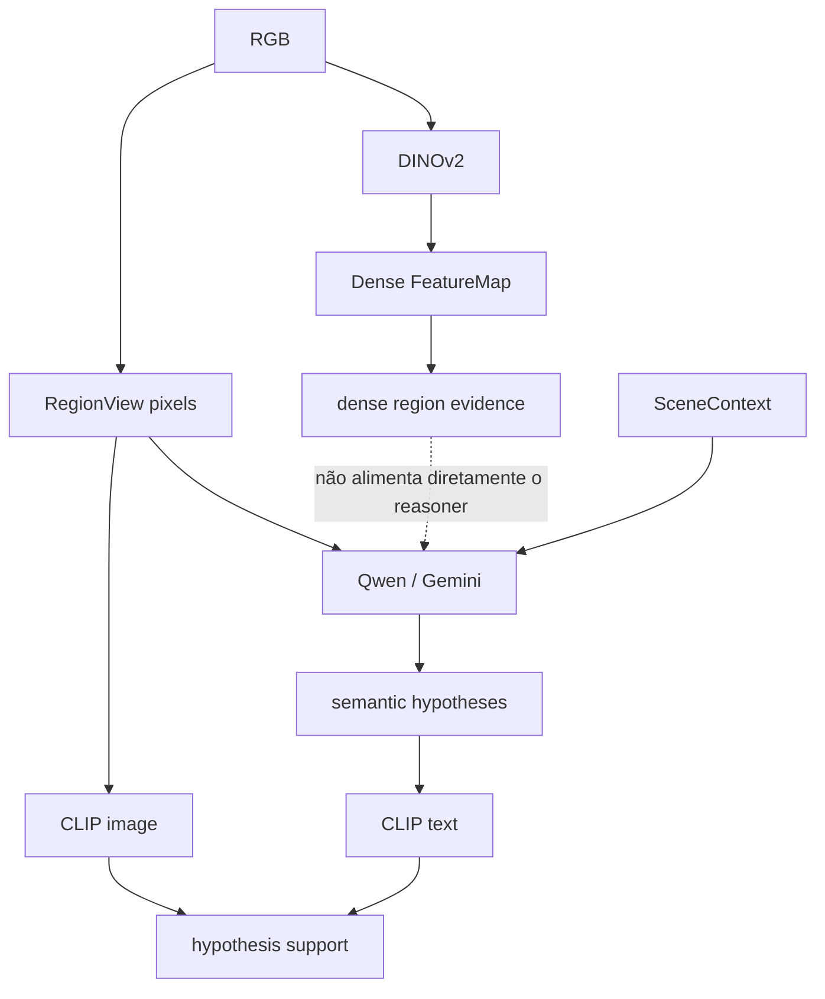

# Model Dataflow

Este documento detalha onde cada backend participa do fluxo e evita a interpretação incorreta de que a pipeline é simplesmente `SAM -> DINO -> VLM -> CLIP`.

## Fluxo por modelo

## Responsabilidade de cada modelo

## DINO e VLM são caminhos separados

DINO e CLIP podem ter a mesma dimensionalidade em uma configuração específica, mas vivem em espaços de representação diferentes e seus vetores não devem ser comparados diretamente.