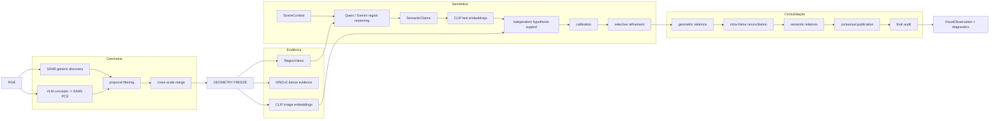
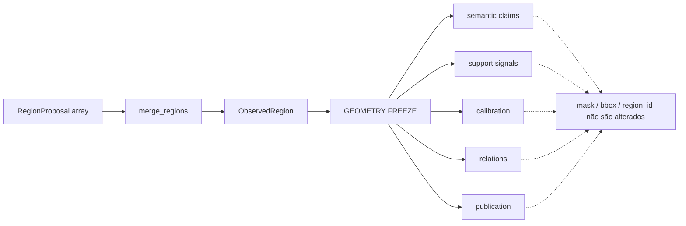
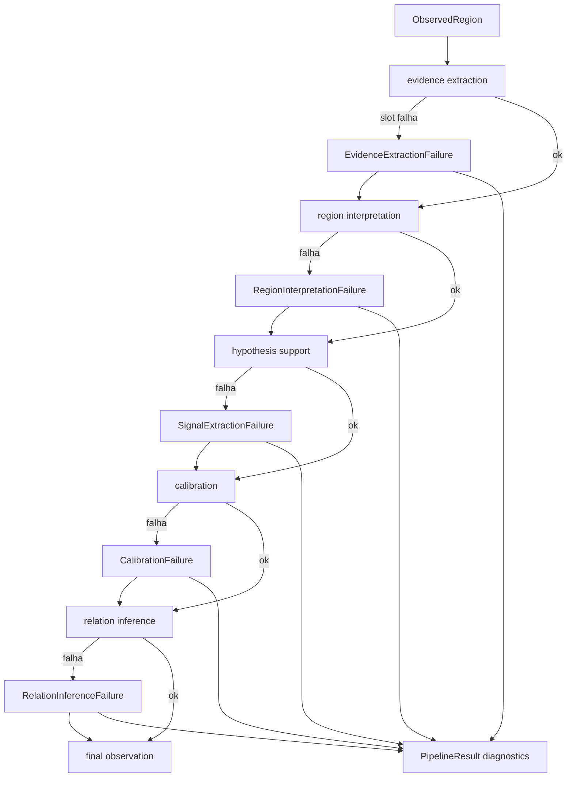

# Canonical Visual Perception Flow

Este documento representa o fluxo canônico de `visual-perception` com foco nas fronteiras entre geometria, evidência, semântica, consolidação e auditoria.

## Fluxo canônico completo

```mermaid
flowchart TD
    START([RGB frame]) --> INPUT[ImageObservation + ImagePayload]
    INPUT --> VALIDATE{mesma resolução?}
    VALIDATE -->|não| ERR[ValueError]
    VALIDATE -->|sim| AREA[Rasterize ImageAreaConfig]
    AREA --> VALID[valid area mask]
    AREA --> EGO[ego vehicle mask]
    VALID --> MASKS[ImageAreaMasks]
    EGO --> MASKS

    INPUT --> SCD{scene concept discovery enabled?}
    MASKS --> SCD
    SCD -->|sim| SVIEW[environmental scene view]
    SVIEW --> SCVLM[Qwen / Gemini: scene concept discovery]
    SCVLM --> RAW[entities + contextual features]
    RAW --> NORM[normalize + deduplicate]
    NORM --> SFILT[remove standalone wall / floor / ceiling]
    SFILT --> LIMIT[prioritize + max concepts]
    LIMIT --> CONCEPTS[SceneConceptSet]
    SCD -->|não| NOCONCEPTS[no scene concepts]

    CONCEPTS --> CG{concept grounding available?}
    CG -->|sim| PCSENC[SAM3 PCS: encode image once]
    PCSENC --> PCSLOOP[query each concept]
    PCSLOOP --> CPMASK[concept masks]
    CPMASK --> CPROP[concept RegionProposal array]
    CG -->|não| EMPTYCP[empty concept proposals]
    NOCONCEPTS --> EMPTYCP

    INPUT --> PASSES[build discovery passes]
    PASSES --> FULL[full-frame pass]
    PASSES --> TILES[overlapping tile passes]
    FULL --> SAMFULL[SAM3 tracker]
    SAMFULL --> FPROP[full-frame proposals]
    TILES --> SAMTILE[SAM3 tracker per tile]
    SAMTILE --> BORDER{border truncation policy}
    BORDER --> REMAP[remap tile mask to global coordinates]
    REMAP --> TPROP[tile proposals]
    FPROP --> GENERIC[generic proposals]
    TPROP --> GENERIC

    GENERIC --> UNION[union discovery proposals]
    CPROP --> UNION
    EMPTYCP --> UNION
    UNION --> DISCOVERED[discovered_proposals]

    DISCOVERED --> FILTER[filter_proposals]
    MASKS --> FILTER
    FILTER --> FGEOM[validate geometry]
    FGEOM --> FAREA[valid lens area]
    FAREA --> FEGO[ego / rig exclusion]
    FEGO --> FQUALITY[area + quality rules]
    FQUALITY --> ACCEPT[accepted proposals]
    FQUALITY --> REJECT[RejectedProposal array]

    ACCEPT --> MERGE[merge_regions: cross-scale merge]
    MERGE --> DEDUP[resolve overlaps / duplicates]
    DEDUP --> PROV[contributing_proposal_ids]
    PROV --> REGIONS[ObservedRegion array]

    REGIONS --> FREEZE[GEOMETRY FREEZE: mask + bbox + region_id]

    FREEZE --> VIEWS[build RegionView array]
    VIEWS --> SUBJECT[masked_subject]
    VIEWS --> TIGHT[tight_crop]
    VIEWS --> CONTEXT[contextual_crop]

    INPUT --> DINO[DINOv2 dense feature extraction]
    DINO --> FM[FeatureMap Hf x Wf x C]
    FM --> POOL[mask-aware region association / pooling]
    FREEZE --> POOL
    POOL --> DENSE[dense visual evidence]

    SUBJECT --> CIMG[CLIP image encoder]
    TIGHT --> CIMG
    CONTEXT --> CIMG
    CIMG --> VEMB[VisualEmbedding array]

    INPUT --> ENV[environmental scene view]
    MASKS --> ENV
    ENV --> SCENEQ[Qwen / Gemini scene reasoning]
    SCENEQ --> SCENE[SceneContext: type + environment + layout + lighting + visibility + navigability]

    FREEZE --> PRIOR{ScenePrior supplied?}
    VEMB --> PRIOR
    PRIOR -->|sim| MATCH[match_scene_prior]
    MATCH --> PASSIGN[PriorAssignment array]
    PRIOR -->|não| NOPRIOR[frame-independent semantics]

    SUBJECT --> RREQ[RegionReasoningRequest]
    TIGHT --> RREQ
    CONTEXT --> RREQ
    SCENE --> RREQ
    PASSIGN --> RREQ
    NOPRIOR --> RREQ
    RREQ --> RVLM[Qwen / Gemini region reasoning]
    RVLM --> PRIMARY[PRIMARY hypothesis]
    RVLM --> ALT[ALTERNATIVE hypotheses]
    RVLM --> CAT[category]
    RVLM --> KIND[region_kind]
    RVLM --> ATTR[attributes]
    PRIMARY --> CLAIMS[SemanticClaim array]
    ALT --> CLAIMS
    CAT --> CLAIMS
    KIND --> CLAIMS
    ATTR --> CLAIMS

    CLAIMS --> CTEXT[CLIP text encoder]
    CTEXT --> LEMB[LanguageEmbedding array]
    VEMB --> SUPPORT[attach_hypothesis_signals]
    LEMB --> SUPPORT
    SUPPORT --> SIGNALS[supports / contradicts / indistinguishable / unavailable]

    SIGNALS --> CAL[calibrate_observation_claims]
    SCENE --> CAL
    CAL --> CALSTATE[calibrated semantic state]

    CALSTATE --> STAGE[stage intermediate VisualObservation]
    STAGE --> REFINE[selective refinement]
    VIEWS --> REFINE
    REFINE --> RHIST[RefinementStep history]
    REFINE --> NEWSUPPORT[re-evaluate support for new hypotheses]
    NEWSUPPORT --> NEWCAL[recalibrate refined hypotheses]

    NEWCAL --> GEOREL[generate geometric relations]
    GEOREL --> RECON[reconcile_observation]
    RECON --> ENTITIES[ContextualEntityHypothesis + ReconciliationRecord]
    ENTITIES --> SEMREL[infer semantic relations]
    SCENE --> SEMREL
    SEMREL --> RELS[semantic relations]

    RELS --> PUB[partition_observation]
    PUB --> STRUCT{generic structural surface only?}
    STRUCT -->|não| PUBLIC[observation.regions]
    STRUCT -->|sim| SCTX[observation.structural_context]
    SCTX --> SUPP[SuppressedRegion record]
    PUBLIC --> OBS[Published VisualObservation]
    SCTX --> OBS

    OBS --> AUDIT[audit_observation]
    AUDIT --> ARES[AuditResult]

    OBS --> RESULT[PipelineResult]
    ARES --> RESULT
    DISCOVERED --> RESULT
    ACCEPT --> RESULT
    REJECT --> RESULT
    MASKS --> RESULT
    VEMB --> RESULT
    LEMB --> RESULT
    RHIST --> RESULT
    PASSIGN --> RESULT
    CONCEPTS --> RESULT
    SUPP --> RESULT
    RESULT --> OUT([visual-perception output])
```

## Fronteiras arquiteturais

## Regra de congelamento geométrico

## Tolerância a falhas

A regra é preservar a geometria e toda evidência já produzida quando uma falha isolada permite continuar a execução. O `PipelineResult` mantém os registros necessários para auditoria sem exigir uma nova inferência não determinística.