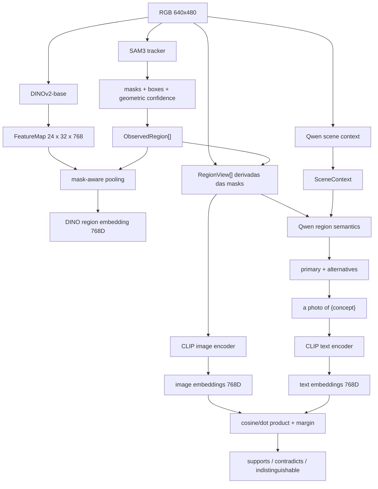

# Pipeline detalhada de Visual Perception

Esta página explica como a informação realmente atravessa `visual-perception`, quais modelos participam de cada etapa e quais sinais são independentes entre si.

A configuração `research_quality` atual usa:

| Capacidade | Modelo |
| --- | --- |
| descoberta de regiões | SAM3 tracker (segment everything), `facebook/sam3` |
| features visuais densas | DINOv2-base, `facebook/dinov2-base` |
| espaço imagem-texto | CLIP ViT-L/14, `openai/clip-vit-large-patch14` |
| raciocínio multimodal | Qwen2.5-VL-3B-Instruct, 4-bit |

O adapter de region discovery usa o pipeline `mask-generation` com o tracker do SAM3 e aceita checkpoints SAM/SAM2 para comparação. Os números de exemplo desta página vêm da reference run `20260910T115810Z`, anterior à troca, que usou SAM ViT-H.

## Visão geral



Os quatro modelos têm papéis diferentes:

```text
SAM
    define onde está uma região

DINO
    descreve visualmente patches e regiões

Qwen
    propõe o significado da cena e das regiões

CLIP
    mede se a evidência visual é compatível
    com os conceitos textuais propostos
```

## 1. RGB de entrada

Na reference run, o frame `corridor-02-000` possui:

```text
width: 640
height: 480
encoding: RGB
```

Neste ponto não existem objetos, labels nem XYZ. Existem apenas pixels e proveniência da observação.

```text
ImageObservation
    -> identidade, sensor, timestamp, frame

ImagePayload
    -> pixels RGB [480, 640, 3]
```

## 2. SAM encontra regiões, não classes

SAM recebe a imagem e produz máscaras binárias. Uma máscara pode ser pensada como uma matriz do tamanho da imagem:

```text
0 0 0 0 0 0
0 0 1 1 0 0
0 1 1 1 1 0
0 0 1 1 0 0
0 0 0 0 0 0
```

`1` significa que o pixel pertence à proposal.

Para cada proposal o módulo preserva:

```text
mask
bounding box
geometric_confidence
source
```

SAM não produz:

```text
"door"
"wall"
"refrigerator"
```

Ele produz, conceitualmente:

```text
"estes pixels parecem formar uma região coerente"
```

Na reference run `corridor-02-000`:

```text
75 proposals iniciais
47 proposals após filtros/merge intermediário
40 regiões canônicas
```

A máscara é importante porque passa a definir o sujeito visual para os estágios seguintes.

## 3. A máscara vira diferentes views em pixels

A máscara não é enviada literalmente ao Qwen como uma matriz booleana. `build_region_views()` usa a máscara e o RGB para produzir imagens auxiliares.

```text
SAM mask + RGB
        |
        +--> masked_subject
        |      sujeito preservado
        |      fundo neutralizado em cinza
        |
        +--> tight_crop
        |      bounding box justa
        |      configuração atual preserva o fundo interno
        |
        +--> contextual_crop
               bounding box expandida
               contexto preservado
               sujeito contornado em verde
```

A configuração `research_quality` também pode produzir `scene_conditioned` como evidência global, mas isso não significa que o primeiro passe do Qwen de região receba a imagem inteira.

O conjunto padrão de `MultimodalReasoningConfig.region_views` é exatamente:

```text
masked_subject
tight_crop
contextual_crop
```

Esses mesmos recortes são usados para produzir evidência CLIP, mantendo Qwen e CLIP geometricamente alinhados.

## 4. O que o Qwen recebe

Para cada região, o reasoner recebe um `RegionReasoningRequest`:

```text
region_id
region_box
image_width
image_height
views[]
scene_claims[]
```

O fluxo real é:

```text
masked_subject --------\
tight_crop -------------+--> Qwen region semantics
contextual_crop --------/

SceneContext claims -----> Qwen region semantics
```

O contexto de cena chega como claims estruturadas pelo canal textual `scene_context_mode=context_assisted`.

O Qwen não recebe diretamente o vetor DINO 768D na implementação atual.

Para `region-2c84165423b25fc3`, a resposta real inclui:

```json
{
  "label": "wooden panel",
  "confidence": 0.9,
  "alternatives": [
    {"label": "wooden door", "confidence": 0.8}
  ],
  "category": "door",
  "kind": "thing"
}
```

Isso vira claims auditáveis:

```text
PRIMARY:     wooden panel
ALTERNATIVE: wooden door
```

O score `0.9` é declarado pelo Qwen. Ele não é automaticamente uma probabilidade calibrada.

## 5. DINOv2 transforma a imagem em patches

DINO segue um caminho paralelo ao Qwen.

O checkpoint atual usa patches de `14 x 14` no espaço processado pelo modelo.

Para o frame real:

```text
imagem original: 640 x 480
long edge alvo:  448
imagem DINO:      448 x 336
patch:             14 x 14
```

Logo:

```text
448 / 14 = 32 patches na largura
336 / 14 = 24 patches na altura
```

DINOv2-base produz um vetor de `768` dimensões para cada patch espacial:

```text
FeatureMap.shape = [24, 32, 768]
```

Esse tensor 3D significa:

```text
altura de patches
x largura de patches
x dimensão do embedding
```

Não significa XYZ do mundo.

Um elemento pode ser imaginado como:

```text
FeatureMap[8, 17]
    = [0.031, -0.182, 0.044, ..., 0.092]
      <----------- 768 valores ----------->
```

Os valores acima são ilustrativos. O vetor representa características visuais aprendidas, não campos como `door=0.8`.

O adapter remove CLS/register tokens antes de reconstruir a grade espacial.

## 6. Como SAM e DINO se encontram

SAM conhece a geometria da região em pixels. DINO conhece a representação visual dos patches.

```text
SAM mask [480, 640]
        +
DINO FeatureMap [24, 32, 768]
        |
        v
mask-aware pooling
        |
        v
VisualEmbedding da região [768]
```

Exemplo conceitual:

```text
patch A -> vetor 768D
patch B -> vetor 768D
patch C -> vetor 768D

mask cobre A, B e C
        |
        v
pool(A, B, C)
        |
        v
embedding DINO da região [768]
```

Na região real de referência:

```text
mask_fill_ratio: 0.4477575758
```

Ou seja, menos da metade da bounding box pertence efetivamente à máscara. Isso mostra por que usar somente o retângulo não representa o mesmo sujeito.

DINO fornece evidência visual densa, não a label final.

## 7. CLIP cria um espaço comum para imagem e texto

CLIP possui dois encoders compatíveis:

```text
image encoder
    pixels -> vector[768]

text encoder
    texto -> vector[768]
```

As views da região já foram codificadas como imagens:

```text
masked_subject
    -> CLIP image encoder
    -> image_subject[768]

tight_crop
    -> CLIP image encoder
    -> image_tight[768]

contextual_crop
    -> CLIP image encoder
    -> image_context[768]
```

Depois o Qwen produz conceitos textuais. A configuração de hypothesis support aplica o template versionado:

```text
prompt_template: "a photo of {concept}"
template_version: align/v1
```

Então:

```text
wooden panel
    -> "a photo of wooden panel"
    -> CLIP text encoder
    -> text_panel[768]

wooden door
    -> "a photo of wooden door"
    -> CLIP text encoder
    -> text_door[768]
```

Como imagem e texto vivem no mesmo espaço CLIP, é possível medir similaridade.

Para vetores normalizados:

```text
similarity = image_vector @ text_vector
```

é equivalente à similaridade de cosseno.

## 8. Qwen propõe, CLIP mede suporte

Essa é uma relação central da pipeline.

```text
Qwen
    primary: wooden panel
    alternative: wooden door
        |
        v
CLIP text encoder
    "a photo of wooden panel"
    "a photo of wooden door"
        |
        v
comparação contra embeddings CLIP das views
```

Para a região real `region-2c84165423b25fc3`:

| hipótese | view | score CLIP | margem | interpretação |
| --- | --- | ---: | ---: | --- |
| `wooden panel` | `masked_subject` | 0.154144 | -0.039176 | contradicts |
| `wooden panel` | `tight_crop` | 0.224522 | -0.011447 | contradicts |
| `wooden panel` | `contextual_crop` | 0.194337 | 0.019575 | supports |
| `wooden door` | `masked_subject` | 0.193320 | 0.039176 | supports |
| `wooden door` | `tight_crop` | 0.235969 | 0.011447 | supports |
| `wooden door` | `contextual_crop` | 0.174762 | -0.019575 | contradicts |

A leitura é:

```text
sujeito isolado
    -> door combina melhor

tight crop
    -> door combina melhor

contexto mais amplo
    -> panel combina melhor
```

A divergência é preservada como evidência.

## 9. Como o status de suporte é decidido

O CLIP não troca a label do Qwen sozinho.

Para cada hipótese e slot, o pipeline calcula:

```text
margin(hypothesis)
 = score(hypothesis)
 - melhor score das concorrentes
```

A configuração atual usa:

```text
indistinguishable_margin: 0.01
```

Então:

```text
margin > +0.01
    -> supports

margin < -0.01
    -> contradicts

abs(margin) < 0.01
    -> indistinguishable
```

Também existe `unavailable` quando a comparação não pode ser produzida.

O score CLIP não é probabilidade. `0.23` não significa 23% de certeza.

## 10. Relação correta entre SAM, DINO, Qwen e CLIP

Uma forma curta de pensar no sistema é:

```text
SAM
    define ONDE olhar

DINO
    descreve COMO OS PATCHES SE PARECEM
    sem produzir nomes

Qwen
    interpreta O QUE A REGIÃO PODE SER
    e produz hipóteses textuais

CLIP
    pergunta SE A EVIDÊNCIA VISUAL COMBINA
    com as hipóteses do Qwen
```

Fluxo completo da região:

```text
SAM mask
   |
   +--> RegionView pixels -----------------> Qwen
   |                                          |
   |                                          v
   |                               primary + alternatives
   |                                          |
   |                                 a photo of {concept}
   |                                          |
   |                                   CLIP text encoder
   |                                          |
   +--> RegionView pixels --> CLIP image -----+
                                              |
                                              v
                                      similarity + margin
                                              |
                                              v
                                    hypothesis support

RGB ---------------------------> DINO FeatureMap
SAM mask ----------------------> mask-aware pooling
                                      |
                                      v
                             dense visual evidence
```

DINO e CLIP são evidências complementares. DINO não é hoje o mecanismo de validação linguística da label do Qwen. Essa função é do CLIP.

## 11. Por que separar DINO e CLIP

DINO é especialmente útil para:

```text
features densas por patch
correspondência visual
coerência entre regiões/frames
futura projeção de feature 2D para ponto 3D
representação sem vocabulário textual
```

CLIP é especialmente útil para:

```text
comparar imagem com conceito textual
arbitrar door vs panel
medir suporte das hipóteses do VLM
vocabulário aberto
```

Mesmo que ambos produzam vetores 768D na configuração atual:

```text
DINO vector[768]
    !=
CLIP vector[768]
```

Eles vivem em espaços diferentes e não devem ser comparados diretamente.

## 12. O que sai de Visual Perception

Ao final, `VisualObservation` reúne:

```text
VisualObservation
├── SceneContext
├── ObservedRegion[]
│   ├── mask + box
│   ├── DINO dense evidence
│   ├── CLIP image evidence
│   ├── Qwen semantic claims
│   └── CLIP hypothesis-support signals
├── candidate relations
└── entity hypotheses intra-frame
```

Ainda não existe XYZ nesse payload.

A geometria 3D entra depois:

```text
VisualObservation
        +
GeometryPoint + pose + calibration
        |
        v
sensor-association
        |
        v
PointVisualAssociation
```

É essa associação que permite levar evidência visual até pontos persistentes do mapa.

## Próxima leitura

- [02. Region Discovery](../../../docs/02-region-discovery.md)
- [04. Dense Feature Extraction](../../../docs/04-dense-features.md)
- [07. Language-Aligned Evidence](../../../docs/07-language-aligned-evidence.md)
- [09. Region Semantics](../../../docs/09-region-semantics.md)
- [10. Hypothesis Support](../../../docs/10-hypothesis-support.md)
- [14. VisualObservation](../../../docs/14-visual-observation.md)