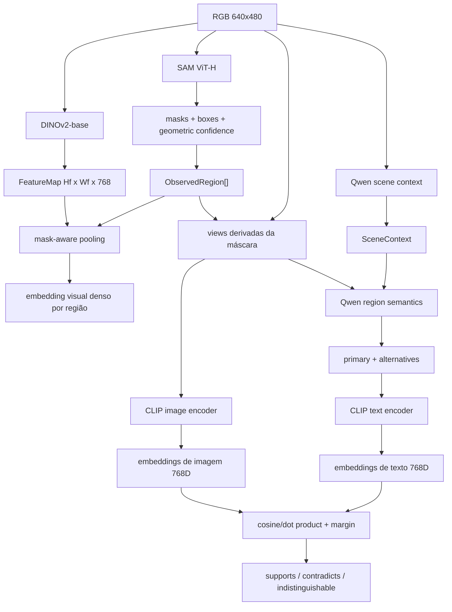

# Pipeline detalhada de Visual Perception

Esta página explica como a informação realmente atravessa `visual-perception`, quais modelos participam de cada etapa e, principalmente, quais sinais **não** são conectados diretamente entre si.

A configuração `research_quality` atual usa:

| Capacidade | Modelo |
| --- | --- |
| descoberta de regiões | SAM ViT-H, `facebook/sam-vit-huge` |
| features visuais densas | DINOv2-base, `facebook/dinov2-base` |
| espaço imagem-texto | CLIP ViT-L/14, `openai/clip-vit-large-patch14` |
| raciocínio multimodal | Qwen2.5-VL-3B-Instruct, 4-bit |

O adapter de region discovery é compatível com checkpoints SAM/SAM2 do pipeline `mask-generation`, mas a configuração de referência atual seleciona **SAM ViT-H**, não SAM2.

## Visão geral



Há quatro papéis diferentes:

- SAM decide **onde existe uma região visual coerente**;
- DINO descreve **como os patches daquela imagem se parecem visualmente**;
- Qwen propõe **o que uma região pode significar**;
- CLIP mede **se as imagens da região são compatíveis com os conceitos textuais propostos**.

## 1. RGB de entrada

Na reference run, o frame `corridor-02-000` possui:

```text
width: 640
height: 480
encoding: RGB
```

Neste ponto ainda não existem objetos, labels ou coordenadas 3D. O pipeline possui somente pixels e proveniência da observação.

## 2. SAM encontra regiões, não classes

O SAM recebe a imagem e produz máscaras binárias. Uma máscara pode ser pensada como uma matriz do tamanho da imagem:

```text
0 0 0 0 0 0
0 0 1 1 0 0
0 1 1 1 1 0
0 0 1 1 0 0
0 0 0 0 0 0
```

`1` significa "pixel pertencente à região proposta". `0` significa "fora da região".

Para cada proposal o módulo preserva, entre outros dados:

```text
mask
bounding box
geometric_confidence
source
```

SAM não diz:

```text
isto é uma porta
isto é uma parede
isto é uma geladeira
```

Ele diz apenas, conceitualmente:

```text
estes pixels parecem formar uma região coerente
```

Na reference run `corridor-02-000`:

```text
75 proposals iniciais
47 após filtros/merge intermediário
40 regiões canônicas
```

A máscara é importante para todos os estágios seguintes porque define **quais pixels representam o sujeito**.

## 3. A máscara não é enviada literalmente ao Qwen como uma matriz booleana

O pipeline usa a máscara para construir imagens auxiliares, chamadas `RegionView`.

Para uma região, podem existir views como:

```text
masked_subject
    apenas o sujeito permanece visualmente destacado

tight_crop
    recorte justo da região

contextual_crop
    recorte maior, mantendo o entorno
    com o contorno do sujeito desenhado

scene_conditioned
    imagem global da cena
```

Exemplo conceitual:

```text
imagem original
+ máscara SAM
        |
        +--> masked_subject
        |      fundo neutralizado
        |
        +--> tight_crop
        |      região recortada
        |
        +--> contextual_crop
               região + entorno
               sujeito demarcado por contorno
```

Essas views em pixels são compartilhadas entre o encoder CLIP e o reasoner Qwen. Isso evita que cada modelo veja um recorte geometricamente diferente da mesma região.

## 4. O que o Qwen recebe

Para semântica de região, o Qwen recebe um `RegionReasoningRequest` contendo:

```text
region_id
region_box
image_width / image_height
views[]
scene_claims[]
```

Portanto o Qwen recebe **imagens derivadas da máscara** e contexto estruturado da cena. Ele não recebe diretamente o vetor DINO como entrada do reasoner atual.

Exemplo simplificado:

```text
views:
  - masked_subject da região
  - tight_crop
  - contextual_crop

scene claims:
  environment: indoor
  scene_type: corridor
  lighting: dim
  navigability: moderate
```

E pode responder:

```json
{
  "label": "wooden panel",
  "confidence": 0.9,
  "alternatives": [
    {"label": "wooden door", "confidence": 0.8}
  ],
  "category": "door",
  "kind": "thing"
}
```

Esse exemplo é real da região `region-2c84165423b25fc3` da reference run.

A resposta do Qwen vira claims auditáveis. O `0.9` é o score declarado pelo próprio Qwen e não é considerado automaticamente uma probabilidade calibrada.

## 5. DINOv2 transforma a imagem em patches

DINO segue outro caminho paralelo.

O checkpoint atual é DINOv2-base. Ele usa patches de `14 x 14` pixels no espaço processado pelo modelo.

O frame original é `640 x 480`. A configuração atual limita a maior aresta processada a `448` pixels preservando aspect ratio e múltiplos de 14:

```text
original:   640 x 480
processado: 448 x 336
patch:       14 x 14
```

Logo a grade espacial é:

```text
448 / 14 = 32 patches na largura
336 / 14 = 24 patches na altura
```

DINOv2-base produz um vetor de dimensão `768` para cada posição da grade.

Assim, conceitualmente:

```text
FeatureMap.shape = [24, 32, 768]
```

Isso é o que chamamos de tensor 3D de features:

```text
altura de patches
x largura de patches
x dimensão do embedding
```

Por exemplo:

```text
FeatureMap[8, 17]
    = [0.031, -0.182, 0.044, ..., 0.092]
      <----------- 768 valores ----------->
```

Esse vetor não significa literalmente `[porta]` ou `[parede]`.

Ele representa características aprendidas daquela região visual. Patches visualmente semelhantes tendem a possuir vetores próximos no espaço de features.

## 6. Como a máscara do SAM encontra o DINO

A máscara existe na resolução da imagem. O DINO produz uma grade menor de patches.

O pooling faz aproximadamente:

```text
máscara SAM
    +
FeatureMap DINO [24, 32, 768]
    |
    v
selecionar posições DINO cobertas pela máscara
    |
    v
agregar os vetores
    |
    v
VisualEmbedding da região [768]
```

Exemplo simplificado, supondo que uma máscara cubra três patches:

```text
patch A -> vetor 768D
patch B -> vetor 768D
patch C -> vetor 768D

pool(A, B, C)
    -> vetor da região 768D
```

Na implementação real, o método é mask-aware e registra suporte, transformação, preprocessing e referência do artifact.

O DINO, portanto, fornece **evidência visual densa**, não a label final.

## 7. CLIP cria um espaço comum para imagem e texto

CLIP possui dois encoders compatíveis:

```text
image encoder: imagem -> vetor
text encoder:  texto   -> vetor
```

No checkpoint atual ambos produzem vetores de dimensão `768` no mesmo espaço.

Exemplo:

```text
masked_subject da região
    -> CLIP image encoder
    -> image_vector[768]

"wooden panel"
    -> CLIP text encoder
    -> text_vector_panel[768]

"wooden door"
    -> CLIP text encoder
    -> text_vector_door[768]
```

Como os vetores vivem no mesmo espaço, podemos medir similaridade.

Se normalizados:

```text
similarity = image_vector dot text_vector
```

é equivalente à similaridade de cosseno.

## 8. Qwen propõe, CLIP verifica o suporte visual

Esta é uma relação central da pipeline.

Qwen primeiro produz hipóteses:

```text
primary: wooden panel
alternative: wooden door
```

Depois o CLIP codifica esses textos e compara com os embeddings de imagem que **já tinham sido calculados** para cada view.

Para a região real `region-2c84165423b25fc3`:

| hipótese | view | score CLIP | margem | interpretação |
| --- | --- | ---: | ---: | --- |
| wooden panel | masked_subject | 0.154144 | -0.039176 | contradiz |
| wooden panel | tight_crop | 0.224522 | -0.011447 | contradiz |
| wooden panel | contextual_crop | 0.194337 | 0.019575 | suporta |
| wooden door | masked_subject | 0.193320 | 0.039176 | suporta |
| wooden door | tight_crop | 0.235969 | 0.011447 | suporta |
| wooden door | contextual_crop | 0.174762 | -0.019575 | contradiz |

Ou seja:

```text
Qwen:
    "acho que é wooden panel;
     também pode ser wooden door"

CLIP masked_subject:
    door combina melhor

CLIP tight_crop:
    door combina melhor

CLIP contextual_crop:
    panel combina melhor
```

A divergência não é descartada. Ela é preservada como evidência.

## 9. CLIP não está corrigindo o Qwen sozinho

O suporte CLIP não substitui a hipótese do Qwen diretamente.

O pipeline registra:

```text
supports
contradicts
indistinguishable
unavailable
```

A margem é calculada em relação às hipóteses concorrentes da própria região.

Exemplo:

```text
score(wooden door)  = 0.236
score(wooden panel) = 0.225

margin door = +0.011
margin panel = -0.011
```

Um valor pequeno pode ser classificado como `indistinguishable`, dependendo do threshold configurado.

Isso evita transformar pequenas diferenças numéricas em uma falsa certeza semântica.

## 10. Relação correta entre SAM, DINO, Qwen e CLIP

Uma forma curta de pensar no sistema é:

```text
SAM
    define ONDE olhar

DINO
    descreve visualmente O QUE HÁ NOS PATCHES
    sem produzir nomes

Qwen
    interpreta O QUE A REGIÃO PODE SER
    e produz hipóteses textuais

CLIP
    pergunta SE A EVIDÊNCIA VISUAL COMBINA
    com os textos produzidos pelo Qwen
```

Mais precisamente:

```text
SAM mask
   |
   +--> RegionView pixels -------------> Qwen ----> hypotheses
   |                                      |
   |                                      v
   |                                  text labels
   |                                      |
   +--> RegionView pixels --> CLIP image  |
                                          v
                                   CLIP text encoder
                                          |
                                          v
                                    similarity/margin
                                          |
                                          v
                                 hypothesis support

RGB --------------------------> DINO FeatureMap
SAM mask ---------------------> mask-aware pooling
                                          |
                                          v
                                visual dense evidence
```

DINO e CLIP são evidências complementares. O DINO não é hoje o mecanismo que valida linguisticamente a label do Qwen; essa função é do CLIP.

## 11. Por que separar DINO e CLIP

DINO é especialmente útil para:

- features densas por patch;
- correspondência visual;
- coerência entre regiões/frames;
- futura projeção de features 2D para pontos 3D;
- representação visual sem depender de um vocabulário textual.

CLIP é especialmente útil para:

- comparar imagem com conceito textual;
- arbitrar hipóteses como `door` vs `panel`;
- medir suporte de labels propostas pelo VLM;
- permitir consultas de vocabulário aberto.

Forçar DINO a fazer o papel do CLIP exigiria outra cabeça ou mecanismo de alinhamento com linguagem. Forçar CLIP a substituir toda a evidência densa do DINO reduziria a riqueza espacial disponível para associação futura com o mapa 3D.

## 12. O que chega à próxima parte do sistema

Ao final de `visual-perception`, temos `VisualObservation`:

```text
VisualObservation
├── SceneContext
├── ObservedRegion[]
│   ├── mask + box
│   ├── DINO dense evidence
│   ├── CLIP image evidence
│   ├── Qwen semantic claims
│   └── CLIP hypothesis-support signals
├── candidate relations
└── entity hypotheses intra-frame
```

Ainda não existe XYZ aqui.

A geometria 3D aparece depois:

```text
VisualObservation
        +
GeometryPoint + pose + calibration
        |
        v
sensor-association
        |
        v
PointVisualAssociation
```

É essa associação que permite levar a evidência visual até pontos persistentes do mapa.

## Próxima leitura

- [Region Discovery](../../../docs/02-region-discovery.md)
- [Dense Feature Extraction](../../../docs/04-dense-features.md)
- [Language-Aligned Evidence](../../../docs/07-language-aligned-evidence.md)
- [Region Semantics](../../../docs/09-region-semantics.md)
- [Hypothesis Support](../../../docs/10-hypothesis-support.md)