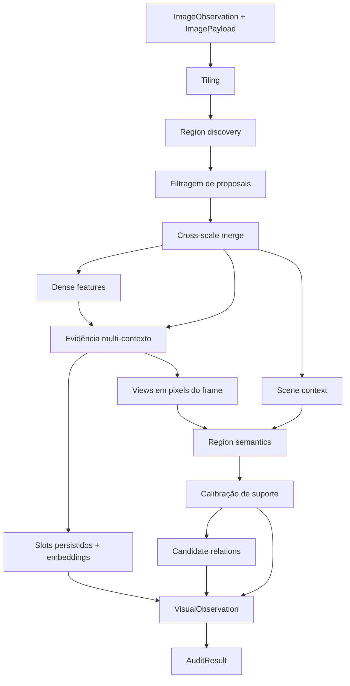

# Pipeline canônico

Este documento é o ponto de entrada para entender **o que o módulo `visual-perception`
faz, como o pipeline funciona e em quais arquivos alterar cada comportamento**.

## Visão geral do módulo

`visual-perception` é responsável por transformar uma observação RGB canônica em uma
representação visual 2D estruturada, semântica e auditável.

A entrada não é um arquivo de dataset, uma ROS bag ou uma imagem sem contexto. O módulo
recebe uma `ImageObservation`, que identifica a observação, sensor, timestamp, frame e
proveniência, junto com um `ImagePayload`, que contém os pixels RGB validados.

A saída principal é uma `VisualObservation`. Ela reúne, para a mesma imagem:

- contexto global da cena;
- regiões 2D com `mask`, `bounding box` e confiança geométrica;
- embeddings visuais obtidos a partir de features densas;
- embeddings alinhados à linguagem;
- claims semânticos sobre as regiões, como label, atributos, material e condição;
- relações 2D candidatas entre regiões;
- proveniência dos modelos e configurações que produziram cada evidência.

O pipeline retorna essa observação dentro de `PipelineResult`, junto com falhas isoladas
de interpretação de regiões e o resultado da auditoria de qualidade.

Em termos simples:

```text
imagem RGB canônica
        |
        v
propostas geométricas 2D
        |
        v
regiões visuais consolidadas
        |
        +--> features e embeddings
        |
        +--> contexto global da cena
        |
        +--> interpretação semântica por região
        |
        +--> relações 2D candidatas
        |
        v
VisualObservation
        |
        v
auditoria de qualidade
```

Uma distinção importante é que **uma proposta de região não é automaticamente uma
entidade semântica do mundo**. O backend de region discovery é class-agnostic: ele
propõe geometria visual. Uma superfície pode gerar várias propostas, e um objeto pode
ser dividido em partes. A semântica é adicionada posteriormente pelo pipeline.

Portanto, o fluxo conceitual é:

```text
RegionProposal
    = evidência geométrica candidata

ObservedRegion
    = região 2D consolidada

SemanticClaim
    = interpretação semântica anexada à região
```

O módulo termina no domínio visual 2D. Ele não é responsável por projetar regiões no
LiDAR, associar pixels a pontos 3D, estimar pose, construir o mapa persistente ou fundir
semântica entre observações espaciais. Essas responsabilidades pertencem aos módulos
downstream, especialmente `sensor-association`, `semantic-fusion` e `semantic-map`.

## Ponto de entrada do pipeline

O ponto de entrada de produção é:

[`application/pipeline.py`](../src/visual_perception/application/pipeline.py)

A função principal é:

```python
run_canonical_pipeline(
    image: ImageObservation,
    payload: ImagePayload,
    config: ModuleConfig,
    ports: PerceptionPorts,
) -> PipelineResult
```

Ela é a orquestradora do módulo. Alterações na **ordem dos estágios**, na forma como os
resultados de um estágio alimentam o próximo ou na construção final da
`VisualObservation` devem começar nesse arquivo.

`PerceptionPorts` agrupa os quatro backends substituíveis usados pelo pipeline:

- `RegionDiscoverer`;
- `DenseFeatureExtractor`;
- `LanguageAlignedEncoder`;
- `MultimodalReasoner`.

O pipeline conhece apenas essas interfaces. Escolha de biblioteca, checkpoint, modelo
real ou fake fica fora da orquestração.

## Como o código está dividido

| Local | Responsabilidade |
| --- | --- |
| [`domain/`](../src/visual_perception/domain/) | Tipos e invariantes do módulo: geometria, regiões, embeddings, claims, relações, observações, erros e auditoria. |
| [`application/`](../src/visual_perception/application/) | Fluxo e regras do pipeline: tiling, merge, pooling, interpretação, relações, auditoria, cache, lifecycle e extensões. |
| [`ports/`](../src/visual_perception/ports/) | Interfaces mínimas que os backends de ML precisam implementar. |
| [`infrastructure/adapters/`](../src/visual_perception/infrastructure/adapters/) | Implementações reais dos ports e composição dos modelos selecionados. |
| [`infrastructure/fakes/`](../src/visual_perception/infrastructure/fakes/) | Implementações determinísticas sem GPU usadas em testes e desenvolvimento. |
| [`infrastructure/integration/`](../src/visual_perception/infrastructure/integration/) | Fronteiras entre `visual-perception` e adapters, mapping runtime, persistência e consumidores downstream. |
| [`config.py`](../src/visual_perception/config.py) | Configuração validada de todos os estágios, backends e checkpoints. |
| [`tests/`](../tests/) | Testes unitários e de integração do módulo. |
| [`benchmarks/`](../benchmarks/) | Benchmarks de backends e execução end-to-end da pipeline de referência. |

A regra prática é:

```text
conceito e invariantes       -> domain/
regra ou transformação       -> application/
interface de modelo          -> ports/
modelo/biblioteca concreta   -> infrastructure/adapters/
integração com outro módulo  -> infrastructure/integration/
```

## Quero mudar X: em qual arquivo mexo?

Esta tabela é o índice operacional do módulo. Use-a antes de procurar pelo código inteiro.

| Quero alterar | Arquivo principal | Arquivos relacionados / testes |
| --- | --- | --- |
| Ordem ou composição do pipeline | [`application/pipeline.py`](../src/visual_perception/application/pipeline.py) | [`tests/test_pipeline.py`](../tests/test_pipeline.py) |
| Como a imagem é dividida em tiles | [`application/tiling.py`](../src/visual_perception/application/tiling.py) | [`tests/test_tiling.py`](../tests/test_tiling.py), [`config.py`](../src/visual_perception/config.py) |
| Como regiões candidatas são descobertas | [`ports/region_discovery.py`](../src/visual_perception/ports/region_discovery.py) | [`infrastructure/adapters/region_discovery_backend.py`](../src/visual_perception/infrastructure/adapters/region_discovery_backend.py), [`tests/test_region_discovery_fake.py`](../tests/test_region_discovery_fake.py) |
| Modelo real usado para region discovery | [`infrastructure/adapters/region_discovery_backend.py`](../src/visual_perception/infrastructure/adapters/region_discovery_backend.py) | [`infrastructure/adapters/factory.py`](../src/visual_perception/infrastructure/adapters/factory.py), [`config.py`](../src/visual_perception/config.py), [`tests/test_real_adapters_gpu.py`](../tests/test_real_adapters_gpu.py) |
| Como propostas sobrepostas são consolidadas | [`application/region_merge.py`](../src/visual_perception/application/region_merge.py) | [`domain/regions.py`](../src/visual_perception/domain/regions.py), [`tests/test_region_merge.py`](../tests/test_region_merge.py) |
| Contrato de `mask`, `bounding box` ou coordenadas | [`domain/geometry.py`](../src/visual_perception/domain/geometry.py) | [`domain/regions.py`](../src/visual_perception/domain/regions.py), [`tests/test_geometry.py`](../tests/test_geometry.py) |
| Como features visuais densas são extraídas | [`ports/feature_extraction.py`](../src/visual_perception/ports/feature_extraction.py) | [`infrastructure/adapters/feature_extraction_backend.py`](../src/visual_perception/infrastructure/adapters/feature_extraction_backend.py), [`domain/feature_map.py`](../src/visual_perception/domain/feature_map.py) |
| Como uma mask vira embedding visual | [`application/pooling.py`](../src/visual_perception/application/pooling.py) | [`domain/embeddings.py`](../src/visual_perception/domain/embeddings.py), [`tests/test_pooling.py`](../tests/test_pooling.py) |
| Como uma região recebe embedding alinhado à linguagem | [`application/language_embedding.py`](../src/visual_perception/application/language_embedding.py) | [`ports/language_embedding.py`](../src/visual_perception/ports/language_embedding.py), [`infrastructure/adapters/language_embedding_backend.py`](../src/visual_perception/infrastructure/adapters/language_embedding_backend.py) |
| Como o contexto global da cena é produzido | [`application/scene_context.py`](../src/visual_perception/application/scene_context.py) | [`ports/multimodal_reasoning.py`](../src/visual_perception/ports/multimodal_reasoning.py), [`infrastructure/adapters/multimodal_reasoning_backend.py`](../src/visual_perception/infrastructure/adapters/multimodal_reasoning_backend.py), [`tests/test_scene_context.py`](../tests/test_scene_context.py) |
| Labels, descrições, atributos, material ou condição de uma região | [`application/region_semantics.py`](../src/visual_perception/application/region_semantics.py) | [`domain/semantics.py`](../src/visual_perception/domain/semantics.py), [`ports/multimodal_reasoning.py`](../src/visual_perception/ports/multimodal_reasoning.py), [`infrastructure/adapters/multimodal_reasoning_backend.py`](../src/visual_perception/infrastructure/adapters/multimodal_reasoning_backend.py), [`tests/test_region_semantics.py`](../tests/test_region_semantics.py) |
| Quais views (foreground, crop justo, contexto, cena) o reasoner recebe | [`config.py`](../src/visual_perception/config.py) (`MultimodalReasoningConfig.region_views`) | [`application/region_views.py`](../src/visual_perception/application/region_views.py), [`tests/test_config.py`](../tests/test_config.py) |
| Como cada view de região é recortada | [`application/region_views.py`](../src/visual_perception/application/region_views.py) | [`application/multi_context.py`](../src/visual_perception/application/multi_context.py), [`tests/test_multi_context_evidence.py`](../tests/test_multi_context_evidence.py) |
| Contract de entrada do raciocínio de região, ou quais claims de cena o alcançam | [`domain/region_reasoning.py`](../src/visual_perception/domain/region_reasoning.py) | [`application/region_semantics.py`](../src/visual_perception/application/region_semantics.py), [`tests/test_region_semantics.py`](../tests/test_region_semantics.py) |
| Formato da resposta do VLM ou prompts de cena/região | [`infrastructure/adapters/multimodal_reasoning_backend.py`](../src/visual_perception/infrastructure/adapters/multimodal_reasoning_backend.py) | [`ports/multimodal_reasoning.py`](../src/visual_perception/ports/multimodal_reasoning.py), [`application/scene_context.py`](../src/visual_perception/application/scene_context.py), [`application/region_semantics.py`](../src/visual_perception/application/region_semantics.py) |
| Validação da resposta de região do VLM, ou a política de confiança ausente | [`application/region_semantics.py`](../src/visual_perception/application/region_semantics.py) (`parse_region_interpretation`) | [`domain/semantics.py`](../src/visual_perception/domain/semantics.py) (`RegionKind`, `most_confident_claim`), [`tests/test_region_semantics_parser.py`](../tests/test_region_semantics_parser.py) |
| Relações 2D entre regiões | [`application/relation_generation.py`](../src/visual_perception/application/relation_generation.py) | [`domain/relations.py`](../src/visual_perception/domain/relations.py), [`tests/test_relation_generation.py`](../tests/test_relation_generation.py) |
| Estrutura final de `VisualObservation` | [`domain/visual_observation.py`](../src/visual_perception/domain/visual_observation.py) | [`tests/test_visual_observation.py`](../tests/test_visual_observation.py), [`application/pipeline.py`](../src/visual_perception/application/pipeline.py) |
| Regras de qualidade e inconsistências | [`application/quality_audit.py`](../src/visual_perception/application/quality_audit.py) | [`domain/audit.py`](../src/visual_perception/domain/audit.py), [`tests/test_quality_audit.py`](../tests/test_quality_audit.py) |
| Escolher entre backend fake e real | [`infrastructure/adapters/factory.py`](../src/visual_perception/infrastructure/adapters/factory.py) | [`config.py`](../src/visual_perception/config.py), [`tests/test_real_adapters.py`](../tests/test_real_adapters.py) |
| Checkpoints, thresholds e parâmetros dos estágios | [`config.py`](../src/visual_perception/config.py) | [`tests/test_config.py`](../tests/test_config.py) |
| Carregamento, descarregamento e uso de VRAM dos modelos | [`application/lifecycle.py`](../src/visual_perception/application/lifecycle.py) | [`infrastructure/adapters/_runtime.py`](../src/visual_perception/infrastructure/adapters/_runtime.py), [`tests/test_lifecycle.py`](../tests/test_lifecycle.py) |
| Cache e fingerprint de estágios caros | [`application/cache.py`](../src/visual_perception/application/cache.py) | [`application/support.py`](../src/visual_perception/application/support.py), [`tests/test_cache.py`](../tests/test_cache.py) |
| Converter entrada RGB dos adapters para o módulo | [`infrastructure/integration/rgb_adapter_boundary.py`](../src/visual_perception/infrastructure/integration/rgb_adapter_boundary.py) | [`tests/test_integration_boundaries.py`](../tests/test_integration_boundaries.py) |
| Integrar a execução ao mapping runtime | [`infrastructure/integration/mapping_runtime_integration.py`](../src/visual_perception/infrastructure/integration/mapping_runtime_integration.py) | [`tests/test_integration_boundaries.py`](../tests/test_integration_boundaries.py) |
| Contrato de saída para `sensor-association` | [`infrastructure/integration/sensor_association_contract.py`](../src/visual_perception/infrastructure/integration/sensor_association_contract.py) | [`docs/integration.md`](integration.md) |
| Persistir ou serializar a observação | [`infrastructure/integration/persistence_integration.py`](../src/visual_perception/infrastructure/integration/persistence_integration.py) | [`infrastructure/serialization.py`](../src/visual_perception/infrastructure/serialization.py), [`tests/test_serialization.py`](../tests/test_serialization.py) |
| Rodar a pipeline real sobre frames de referência | [`benchmarks/validate_reference_pipeline.py`](../benchmarks/validate_reference_pipeline.py) | [`benchmarks/frame_artifacts.py`](../benchmarks/frame_artifacts.py), [`benchmarks/render_overlay.py`](../benchmarks/render_overlay.py), [`docs/artifacts.md`](artifacts.md) |
| Camadas de inspeção desenhadas sobre um frame | [`benchmarks/render_layers.py`](../benchmarks/render_layers.py) | [`benchmarks/render_overlay.py`](../benchmarks/render_overlay.py), [`benchmarks/test_render_overlay.py`](../benchmarks/test_render_overlay.py) |
| Investigar a evidência que uma região entregou ao VLM | [`benchmarks/inspect_region.py`](../benchmarks/inspect_region.py) | [`application/region_views.py`](../src/visual_perception/application/region_views.py), [`docs/artifacts.md`](artifacts.md) |
| Estatística de colapso de labels e confiança de um frame | [`application/observation_diagnostics.py`](../src/visual_perception/application/observation_diagnostics.py) | [`tests/test_observation_diagnostics.py`](../tests/test_observation_diagnostics.py) |
| Se o contexto de cena alcança o raciocínio de região | [`config.py`](../src/visual_perception/config.py) (`MultimodalReasoningConfig.scene_context_mode`) | [`domain/region_reasoning.py`](../src/visual_perception/domain/region_reasoning.py) (`SceneContextMode`), [`tests/test_scene_context_modes.py`](../tests/test_scene_context_modes.py) |
| Comparar candidatos de backend | [`benchmarks/run_backend_benchmark.py`](../benchmarks/run_backend_benchmark.py) | [`benchmarks/backend_benchmark.py`](../benchmarks/backend_benchmark.py), [`benchmarks/candidates/`](../benchmarks/candidates/) |

## Backends usados pelo pipeline

A seleção dos backends acontece em
[`infrastructure/adapters/factory.py`](../src/visual_perception/infrastructure/adapters/factory.py),
não em `pipeline.py`.

A composição atual aceita:

| Capability | Port | Backend real configurável |
| --- | --- | --- |
| Region discovery | `RegionDiscoverer` | `sam` |
| Dense feature extraction | `DenseFeatureExtractor` | `dinov2` |
| Language-aligned embedding | `LanguageAlignedEncoder` | `clip` |
| Multimodal reasoning | `MultimodalReasoner` | `qwen_vl` |

Cada capability também possui um backend `fake` para testes determinísticos sem GPU.

Os adapters reais compartilham um `ModelLifecycleManager`. Isso permite que os ports
estejam todos compostos ao mesmo tempo sem exigir que todos os modelos pesados fiquem
residentes simultaneamente na VRAM.

## Fluxo canônico

`run_canonical_pipeline` recebe `ImageObservation`, `ImagePayload`, `ModuleConfig` e
`PerceptionPorts`, e devolve um `PipelineResult`. A assinatura e os tipos públicos estão
em [api-contracts.md](api-contracts.md).



A execução concreta segue esta ordem:

1. `build_tiles` divide a imagem conforme a configuração de tiling.
2. `RegionDiscoverer.discover` produz `RegionProposal` para cada tile.
3. `remap_to_global` converte a geometria local de cada tile para as coordenadas da imagem original.
4. `filter_proposals` descarta as propostas que não são evidência válida: fora da área
   útil do sensor, sobre o ego-veículo, ou com área implausível. Roda em coordenadas
   globais, sobre máscaras, e **nunca** altera os pixels de entrada. Cada descarte vira um
   `RejectedProposal` com motivo e medida, de modo que `proposal_count` e
   `merged_proposal_count` sempre fechem. Redundância geométrica **não** é decidida aqui:
   ela continua com `merge_regions`, que une duplicatas preservando os dois
   `contributing_proposal_ids` em vez de descartar uma delas.
5. `merge_regions` consolida propostas sobrepostas em `ObservedRegion`.
6. Se existirem regiões, o `DenseFeatureExtractor` produz o feature map da imagem.
   Um `fallback_reason` gravado pelo adapter sobe até `PipelineResult`, para que um
   fallback de backend nunca pareça a execução configurada.
7. `extract_region_evidence` produz os slots de evidência da região (foreground
   denso mask-aware, crop justo, crop contextual e cena), mais as `RegionView` em pixels
   do frame — o mesmo recorte que gerou cada slot.
8. `analyze_scene` descreve o **ambiente** como claims tipadas, sobre a área válida
   menos a área do ego — um recorte, nunca uma pintura.
9. `interpret_regions` interpreta cada região a partir de um `RegionReasoningRequest`:
   as views selecionadas por `multimodal_reasoning.region_views` e as claims de cena
   estruturadas, sem achatar nenhuma das duas.
10. `calibrate_observation_claims` anexa `SemanticSupport` a cada claim.
11. `generate_relations` produz relações 2D candidatas entre as regiões resultantes.
12. O pipeline monta a `VisualObservation` canônica.
13. `audit_observation` verifica consistência e contradições sem modificar a observação.

## Estágios

| Estágio | Entrada principal | Saída | Código dono |
| --- | --- | --- | --- |
| Tiling | `ImagePayload` | tiles com origem conhecida | [`application/tiling.py`](../src/visual_perception/application/tiling.py) |
| Region discovery | tile RGB | `RegionProposal` local | [`ports/region_discovery.py`](../src/visual_perception/ports/region_discovery.py), [`infrastructure/adapters/region_discovery_backend.py`](../src/visual_perception/infrastructure/adapters/region_discovery_backend.py) |
| Remapeamento | proposta local + tile | `RegionProposal` em coordenadas globais | [`application/tiling.py`](../src/visual_perception/application/tiling.py) |
| Filtragem de proposals | propostas globais + áreas declaradas | propostas válidas + `RejectedProposal` | [`application/proposal_filtering.py`](../src/visual_perception/application/proposal_filtering.py), [`domain/image_area.py`](../src/visual_perception/domain/image_area.py) |
| Cross-scale merge | propostas globais | `ObservedRegion` | [`application/region_merge.py`](../src/visual_perception/application/region_merge.py) |
| Dense features | imagem RGB | `FeatureMap` | [`ports/feature_extraction.py`](../src/visual_perception/ports/feature_extraction.py), [`infrastructure/adapters/feature_extraction_backend.py`](../src/visual_perception/infrastructure/adapters/feature_extraction_backend.py) |
| Evidência multi-contexto | regiões + imagem + feature map | slots de evidência, embeddings e views em pixels | [`application/multi_context.py`](../src/visual_perception/application/multi_context.py), [`application/region_views.py`](../src/visual_perception/application/region_views.py) |
| Scene context | imagem completa | `SceneContext` | [`application/scene_context.py`](../src/visual_perception/application/scene_context.py) |
| Region semantics | `RegionReasoningRequest` (views + claims de cena) | `SemanticClaim` anexado à região | [`application/region_semantics.py`](../src/visual_perception/application/region_semantics.py) |
| Calibração | claims + evidência de suporte | `SemanticSupport` por claim | [`application/semantic_calibration.py`](../src/visual_perception/application/semantic_calibration.py) |
| Relations | regiões interpretadas | relações 2D candidatas | [`application/relation_generation.py`](../src/visual_perception/application/relation_generation.py) |
| Observação final | todos os resultados anteriores | `VisualObservation` | [`application/pipeline.py`](../src/visual_perception/application/pipeline.py), [`domain/visual_observation.py`](../src/visual_perception/domain/visual_observation.py) |
| Auditoria | `VisualObservation` | `AuditResult` | [`application/quality_audit.py`](../src/visual_perception/application/quality_audit.py) |

## Comportamento em falhas

Sem regiões, o pipeline ainda analisa o contexto global da cena, produz uma
`VisualObservation` válida e executa a auditoria.

A interpretação semântica é isolada por região. Se o reasoner retornar uma resposta
inválida para uma região, a execução não descarta as demais regiões nem perde a
geometria já produzida. A falha aparece em
`PipelineResult.region_interpretation_failures`.

Isso significa que:

```text
falha de semântica em uma região
        !=
falha da observação inteira
```

A geometria, embeddings e evidências válidas produzidas pelos outros estágios continuam
disponíveis para inspeção e auditoria.

## Extensões pós-pipeline

As capacidades abaixo compõem sobre a saída canônica e não mudam a ordem nem a API de
`run_canonical_pipeline`:

- [`application/fusion.py`](../src/visual_perception/application/fusion.py) funde propostas e claims de múltiplas fontes, preservando proveniência e contradições;
- [`application/refinement.py`](../src/visual_perception/application/refinement.py) reinterpreta seletivamente regiões incertas;
- [`application/execution_profile.py`](../src/visual_perception/application/execution_profile.py) seleciona um candidato de pesquisa sujeito ao orçamento de memória.

Elas são APIs de capability, não etapas obrigatórias. Um consumidor que apenas precisa
de uma observação visual deve chamar o pipeline canônico e decidir explicitamente se
alguma extensão é necessária.

## Pipelines legadas

Os pipelines do laboratório histórico `image-context` não fazem parte deste módulo e
não são selecionáveis em produção. Seu status e as condições para uma comparação futura
estão em [`../benchmarks/legacy/README.md`](../benchmarks/legacy/README.md).

A ausência deliberada de um seletor de estratégia evita que aplicações escolham uma
baseline que não é reproduzível neste repositório. O código de produção deve convergir
para `run_canonical_pipeline` como caminho único de percepção visual.