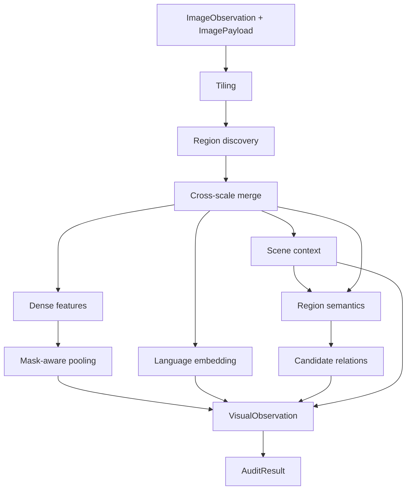

# Pipeline canônico

`run_canonical_pipeline` é o único caminho de produção do módulo. Ele recebe
`ImageObservation`, `ImagePayload`, `ModuleConfig` e `PerceptionPorts`, e devolve um
`PipelineResult`. A assinatura e os tipos públicos estão em
[api-contracts.md](api-contracts.md).

## Estágios

| Estágio | Responsabilidade | Código dono |
| --- | --- | --- |
| Tiling | Divide a imagem e remapeia propostas locais para coordenadas globais. | [`application/tiling.py`](../src/visual_perception/application/tiling.py) |
| Region discovery | Propõe geometria class-agnostic para cada tile. | [`ports/region_discovery.py`](../src/visual_perception/ports/region_discovery.py) |
| Merge | Consolida propostas sobrepostas de tiles ou escalas. | [`application/region_merge.py`](../src/visual_perception/application/region_merge.py) |
| Dense features e pooling | Produz feature map e embedding visual por máscara. | [`ports/feature_extraction.py`](../src/visual_perception/ports/feature_extraction.py), [`application/pooling.py`](../src/visual_perception/application/pooling.py) |
| Language embedding | Gera uma representação de região alinhada com texto. | [`application/language_embedding.py`](../src/visual_perception/application/language_embedding.py) |
| Contexto e semântica | Produz claims de cena e região a partir do reasoner multimodal. | [`application/scene_context.py`](../src/visual_perception/application/scene_context.py), [`application/region_semantics.py`](../src/visual_perception/application/region_semantics.py) |
| Relações | Deriva relações 2D candidatas entre regiões. | [`application/relation_generation.py`](../src/visual_perception/application/relation_generation.py) |
| Auditoria | Reporta inconsistências e contradições sem alterar a observação. | [`application/quality_audit.py`](../src/visual_perception/application/quality_audit.py) |

Sem regiões, o pipeline ainda analisa o contexto de cena, gera uma observação válida e a
audita. Se a interpretação de uma região falhar isoladamente, a geometria e os dados
anexados por outros estágios são preservados; a falha aparece em
`PipelineResult.region_interpretation_failures`.

## Extensões pós-pipeline

As capacidades abaixo compõem sobre a saída canônica e não mudam a ordem nem a API de
`run_canonical_pipeline`:

- [`application/fusion.py`](../src/visual_perception/application/fusion.py) funde
  propostas e claims de múltiplas fontes, preservando proveniência e contradições;
- [`application/refinement.py`](../src/visual_perception/application/refinement.py)
  reinterpreta seletivamente regiões incertas;
- [`application/execution_profile.py`](../src/visual_perception/application/execution_profile.py)
  seleciona um candidato de pesquisa sujeito ao orçamento de memória.

Elas são APIs de capability, não etapas obrigatórias. Um consumidor que apenas precisa
de uma observação visual deve chamar o pipeline canônico e decidir explicitamente se
alguma extensão é necessária.

## Pipelines legadas

Os pipelines do laboratório histórico `image-context` não fazem parte deste módulo e
não são selecionáveis em produção. Seu status e as condições para uma comparação futura
estão em [`../benchmarks/legacy/README.md`](../benchmarks/legacy/README.md). A ausência
deliberada de um seletor de estratégia evita que aplicações escolham uma baseline que
não é reproduzível neste repositório.
