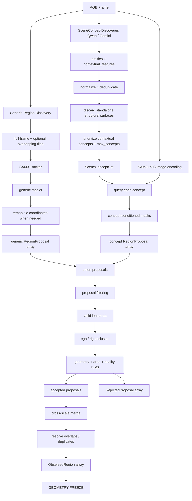
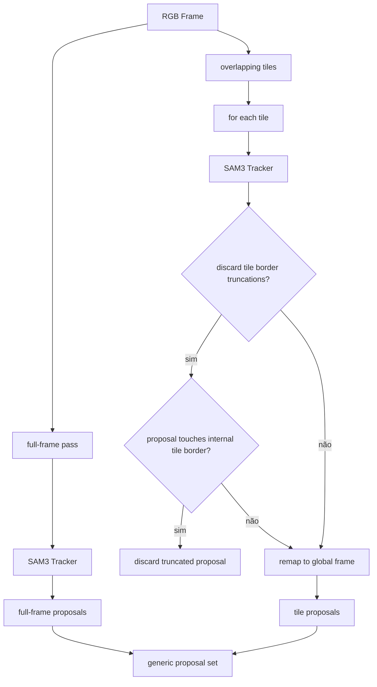
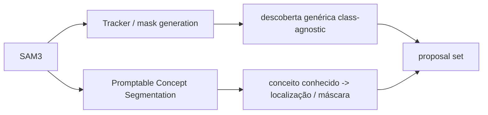

# Region Discovery Flow

Este documento detalha os dois caminhos de descoberta geométrica que convergem antes da filtragem e do merge: discovery genérico e concept-conditioned grounding.

## Discovery genérico + grounding por conceito

## Tiling

## SAM3 em dois papéis

O grounding semântico adiciona proposals ao discovery genérico. Ele não substitui o caminho class-agnostic. Ambos passam pelas mesmas políticas de área e pelo mesmo merge geométrico.