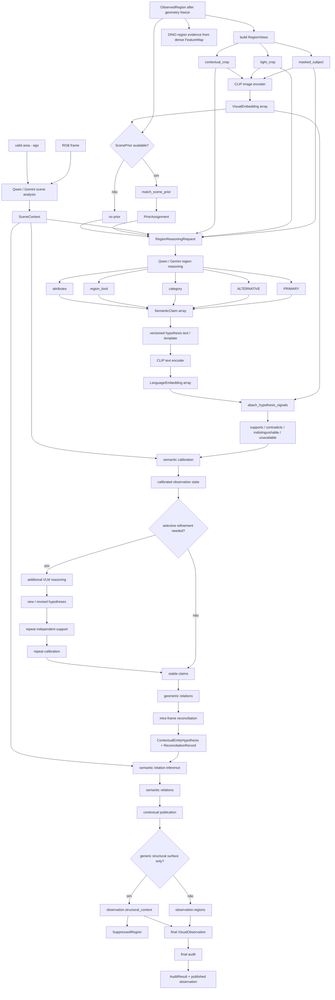
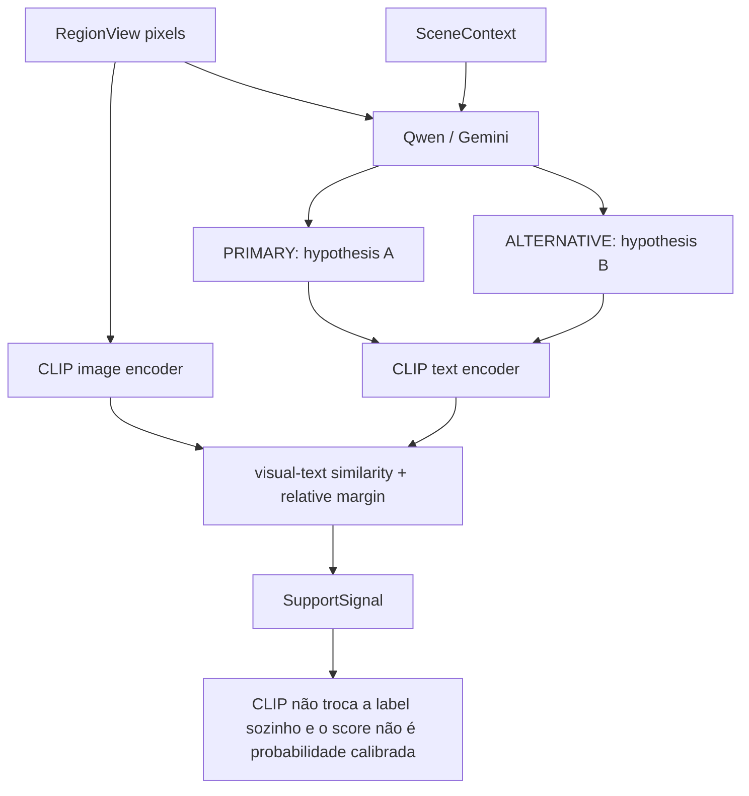
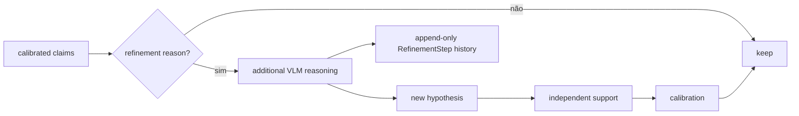
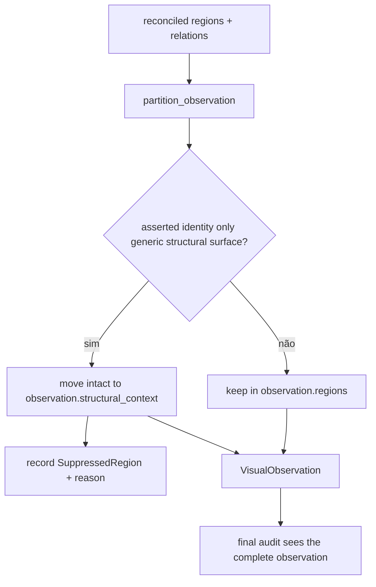

# Semantic Reasoning Flow

Este documento começa na região cuja geometria já foi consolidada. A partir do geometry freeze, os estágios semânticos acrescentam evidência, claims, sinais, grupos e relações, sem alterar `mask`, `bbox` ou `region_id`.

## Fluxo semântico completo

## Qwen propõe, CLIP mede suporte

## Refinamento preserva os mesmos crivos

## Publicação contextual

A publicação decide o que é exposto como região contextual relevante. Ela não apaga a observação estrutural e não redefine sua geometria.